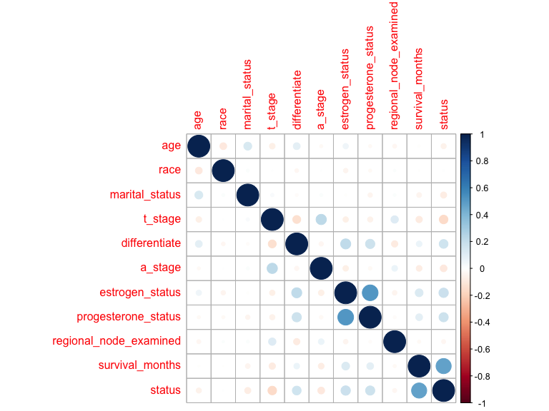

Final Project
================

``` r
library(gtsummary)
library(tidyverse)
```

    ## ── Attaching core tidyverse packages ──────────────────────── tidyverse 2.0.0 ──
    ## ✔ dplyr     1.1.3     ✔ readr     2.1.4
    ## ✔ forcats   1.0.0     ✔ stringr   1.5.0
    ## ✔ ggplot2   3.4.3     ✔ tibble    3.2.1
    ## ✔ lubridate 1.9.2     ✔ tidyr     1.3.0
    ## ✔ purrr     1.0.2     
    ## ── Conflicts ────────────────────────────────────────── tidyverse_conflicts() ──
    ## ✖ dplyr::filter() masks stats::filter()
    ## ✖ dplyr::lag()    masks stats::lag()
    ## ℹ Use the conflicted package (<http://conflicted.r-lib.org/>) to force all conflicts to become errors

``` r
library(car)
```

    ## Loading required package: carData
    ## 
    ## Attaching package: 'car'
    ## 
    ## The following object is masked from 'package:dplyr':
    ## 
    ##     recode
    ## 
    ## The following object is masked from 'package:purrr':
    ## 
    ##     some

``` r
library(caret)
```

    ## Loading required package: lattice
    ## 
    ## Attaching package: 'caret'
    ## 
    ## The following object is masked from 'package:purrr':
    ## 
    ##     lift

``` r
library(corrplot)
```

    ## corrplot 0.92 loaded

``` r
library(broom)


knitr::opts_chunk$set(
    echo = TRUE,
    warning = FALSE,
    fig.width = 8, 
  fig.height = 6,
  out.width = "90%"
)

options(
  ggplot2.continuous.colour = "viridis",
  ggplot2.continuous.fill = "viridis"
)

scale_colour_discrete = scale_colour_viridis_d
scale_fill_discrete = scale_fill_viridis_d

theme_set(theme_minimal() + theme(legend.position = "bottom"))
```

``` r
data = read_csv("./data/data.csv") |>
  janitor::clean_names()
```

    ## Rows: 4024 Columns: 16
    ## ── Column specification ────────────────────────────────────────────────────────
    ## Delimiter: ","
    ## chr (11): Race, Marital Status, T Stage, N Stage, 6th Stage, differentiate, ...
    ## dbl  (5): Age, Tumor Size, Regional Node Examined, Reginol Node Positive, Su...
    ## 
    ## ℹ Use `spec()` to retrieve the full column specification for this data.
    ## ℹ Specify the column types or set `show_col_types = FALSE` to quiet this message.

``` r
summary(data)
```

    ##       age            race           marital_status       t_stage         
    ##  Min.   :30.00   Length:4024        Length:4024        Length:4024       
    ##  1st Qu.:47.00   Class :character   Class :character   Class :character  
    ##  Median :54.00   Mode  :character   Mode  :character   Mode  :character  
    ##  Mean   :53.97                                                           
    ##  3rd Qu.:61.00                                                           
    ##  Max.   :69.00                                                           
    ##    n_stage           x6th_stage        differentiate         grade          
    ##  Length:4024        Length:4024        Length:4024        Length:4024       
    ##  Class :character   Class :character   Class :character   Class :character  
    ##  Mode  :character   Mode  :character   Mode  :character   Mode  :character  
    ##                                                                             
    ##                                                                             
    ##                                                                             
    ##    a_stage            tumor_size     estrogen_status    progesterone_status
    ##  Length:4024        Min.   :  1.00   Length:4024        Length:4024        
    ##  Class :character   1st Qu.: 16.00   Class :character   Class :character   
    ##  Mode  :character   Median : 25.00   Mode  :character   Mode  :character   
    ##                     Mean   : 30.47                                         
    ##                     3rd Qu.: 38.00                                         
    ##                     Max.   :140.00                                         
    ##  regional_node_examined reginol_node_positive survival_months
    ##  Min.   : 1.00          Min.   : 1.000        Min.   :  1.0  
    ##  1st Qu.: 9.00          1st Qu.: 1.000        1st Qu.: 56.0  
    ##  Median :14.00          Median : 2.000        Median : 73.0  
    ##  Mean   :14.36          Mean   : 4.158        Mean   : 71.3  
    ##  3rd Qu.:19.00          3rd Qu.: 5.000        3rd Qu.: 90.0  
    ##  Max.   :61.00          Max.   :46.000        Max.   :107.0  
    ##     status         
    ##  Length:4024       
    ##  Class :character  
    ##  Mode  :character  
    ##                    
    ##                    
    ## 

``` r
str(data)
```

    ## spc_tbl_ [4,024 × 16] (S3: spec_tbl_df/tbl_df/tbl/data.frame)
    ##  $ age                   : num [1:4024] 68 50 58 58 47 51 51 40 40 69 ...
    ##  $ race                  : chr [1:4024] "White" "White" "White" "White" ...
    ##  $ marital_status        : chr [1:4024] "Married" "Married" "Divorced" "Married" ...
    ##  $ t_stage               : chr [1:4024] "T1" "T2" "T3" "T1" ...
    ##  $ n_stage               : chr [1:4024] "N1" "N2" "N3" "N1" ...
    ##  $ x6th_stage            : chr [1:4024] "IIA" "IIIA" "IIIC" "IIA" ...
    ##  $ differentiate         : chr [1:4024] "Poorly differentiated" "Moderately differentiated" "Moderately differentiated" "Poorly differentiated" ...
    ##  $ grade                 : chr [1:4024] "3" "2" "2" "3" ...
    ##  $ a_stage               : chr [1:4024] "Regional" "Regional" "Regional" "Regional" ...
    ##  $ tumor_size            : num [1:4024] 4 35 63 18 41 20 8 30 103 32 ...
    ##  $ estrogen_status       : chr [1:4024] "Positive" "Positive" "Positive" "Positive" ...
    ##  $ progesterone_status   : chr [1:4024] "Positive" "Positive" "Positive" "Positive" ...
    ##  $ regional_node_examined: num [1:4024] 24 14 14 2 3 18 11 9 20 21 ...
    ##  $ reginol_node_positive : num [1:4024] 1 5 7 1 1 2 1 1 18 12 ...
    ##  $ survival_months       : num [1:4024] 60 62 75 84 50 89 54 14 70 92 ...
    ##  $ status                : chr [1:4024] "Alive" "Alive" "Alive" "Alive" ...
    ##  - attr(*, "spec")=
    ##   .. cols(
    ##   ..   Age = col_double(),
    ##   ..   Race = col_character(),
    ##   ..   `Marital Status` = col_character(),
    ##   ..   `T Stage` = col_character(),
    ##   ..   `N Stage` = col_character(),
    ##   ..   `6th Stage` = col_character(),
    ##   ..   differentiate = col_character(),
    ##   ..   Grade = col_character(),
    ##   ..   `A Stage` = col_character(),
    ##   ..   `Tumor Size` = col_double(),
    ##   ..   `Estrogen Status` = col_character(),
    ##   ..   `Progesterone Status` = col_character(),
    ##   ..   `Regional Node Examined` = col_double(),
    ##   ..   `Reginol Node Positive` = col_double(),
    ##   ..   `Survival Months` = col_double(),
    ##   ..   Status = col_character()
    ##   .. )
    ##  - attr(*, "problems")=<externalptr>

``` r
# Check for missing data
colSums(is.na(data))
```

    ##                    age                   race         marital_status 
    ##                      0                      0                      0 
    ##                t_stage                n_stage             x6th_stage 
    ##                      0                      0                      0 
    ##          differentiate                  grade                a_stage 
    ##                      0                      0                      0 
    ##             tumor_size        estrogen_status    progesterone_status 
    ##                      0                      0                      0 
    ## regional_node_examined  reginol_node_positive        survival_months 
    ##                      0                      0                      0 
    ##                 status 
    ##                      0

``` r
# Convert character to factor for regression analysis
clean_data = data |>
  mutate(
    race = as.numeric(factor(race, levels = c("White", "Black", "Other"))) - 1,
    marital_status = as.numeric(factor(marital_status, levels = c("Married", "Single", "Divorced", "Widowed", "Separated"))) - 1,
    t_stage = as.numeric(factor(t_stage, levels = c("T1", "T2", "T3", "T4"))) - 1,
    n_stage = as.numeric(factor(n_stage, levels = c("N1", "N2", "N3"))) - 1,
    x6th_stage = as.numeric(factor(x6th_stage, levels = c("IIA", "IIB", "IIIA", "IIIB", "IIIC"))) - 1,
    differentiate = as.numeric(factor(differentiate, levels = c("Undifferentiated", "Poorly differentiated", "Moderately differentiated", "Well differentiated"))) - 1,
    grade = as.numeric(factor(grade, levels = c("1", "2", "3", "anaplastic; Grade IV"))),
    a_stage = as.numeric(factor(a_stage, levels = c("Regional", "Distant"))) - 1,
    estrogen_status = as.numeric(factor(estrogen_status, levels = c("Negative", "Positive"))) - 1,
    progesterone_status = as.numeric(factor(progesterone_status, levels = c("Negative", "Positive"))) - 1,
    status = as.numeric(factor(status, levels = c("Dead", "Alive"))) - 1)|>
  rename(regional_node_positive = reginol_node_positive)

summary(clean_data)
```

    ##       age             race        marital_status      t_stage      
    ##  Min.   :30.00   Min.   :0.0000   Min.   :0.0000   Min.   :0.0000  
    ##  1st Qu.:47.00   1st Qu.:0.0000   1st Qu.:0.0000   1st Qu.:0.0000  
    ##  Median :54.00   Median :0.0000   Median :0.0000   Median :1.0000  
    ##  Mean   :53.97   Mean   :0.2314   Mean   :0.6143   Mean   :0.7848  
    ##  3rd Qu.:61.00   3rd Qu.:0.0000   3rd Qu.:1.0000   3rd Qu.:1.0000  
    ##  Max.   :69.00   Max.   :2.0000   Max.   :4.0000   Max.   :3.0000  
    ##     n_stage         x6th_stage    differentiate       grade      
    ##  Min.   :0.0000   Min.   :0.000   Min.   :0.000   Min.   :1.000  
    ##  1st Qu.:0.0000   1st Qu.:0.000   1st Qu.:1.000   1st Qu.:2.000  
    ##  Median :0.0000   Median :1.000   Median :2.000   Median :2.000  
    ##  Mean   :0.4384   Mean   :1.322   Mean   :1.849   Mean   :2.151  
    ##  3rd Qu.:1.0000   3rd Qu.:2.000   3rd Qu.:2.000   3rd Qu.:3.000  
    ##  Max.   :2.0000   Max.   :4.000   Max.   :3.000   Max.   :4.000  
    ##     a_stage          tumor_size     estrogen_status  progesterone_status
    ##  Min.   :0.00000   Min.   :  1.00   Min.   :0.0000   Min.   :0.0000     
    ##  1st Qu.:0.00000   1st Qu.: 16.00   1st Qu.:1.0000   1st Qu.:1.0000     
    ##  Median :0.00000   Median : 25.00   Median :1.0000   Median :1.0000     
    ##  Mean   :0.02286   Mean   : 30.47   Mean   :0.9332   Mean   :0.8265     
    ##  3rd Qu.:0.00000   3rd Qu.: 38.00   3rd Qu.:1.0000   3rd Qu.:1.0000     
    ##  Max.   :1.00000   Max.   :140.00   Max.   :1.0000   Max.   :1.0000     
    ##  regional_node_examined regional_node_positive survival_months     status      
    ##  Min.   : 1.00          Min.   : 1.000         Min.   :  1.0   Min.   :0.0000  
    ##  1st Qu.: 9.00          1st Qu.: 1.000         1st Qu.: 56.0   1st Qu.:1.0000  
    ##  Median :14.00          Median : 2.000         Median : 73.0   Median :1.0000  
    ##  Mean   :14.36          Mean   : 4.158         Mean   : 71.3   Mean   :0.8469  
    ##  3rd Qu.:19.00          3rd Qu.: 5.000         3rd Qu.: 90.0   3rd Qu.:1.0000  
    ##  Max.   :61.00          Max.   :46.000         Max.   :107.0   Max.   :1.0000

``` r
str(clean_data)
```

    ## tibble [4,024 × 16] (S3: tbl_df/tbl/data.frame)
    ##  $ age                   : num [1:4024] 68 50 58 58 47 51 51 40 40 69 ...
    ##  $ race                  : num [1:4024] 0 0 0 0 0 0 0 0 0 0 ...
    ##  $ marital_status        : num [1:4024] 0 0 2 0 0 1 0 0 2 0 ...
    ##  $ t_stage               : num [1:4024] 0 1 2 0 1 0 0 1 3 3 ...
    ##  $ n_stage               : num [1:4024] 0 1 2 0 0 0 0 0 2 2 ...
    ##  $ x6th_stage            : num [1:4024] 0 2 4 0 1 0 0 1 4 4 ...
    ##  $ differentiate         : num [1:4024] 1 2 2 1 1 2 3 2 1 3 ...
    ##  $ grade                 : num [1:4024] 3 2 2 3 3 2 1 2 3 1 ...
    ##  $ a_stage               : num [1:4024] 0 0 0 0 0 0 0 0 0 1 ...
    ##  $ tumor_size            : num [1:4024] 4 35 63 18 41 20 8 30 103 32 ...
    ##  $ estrogen_status       : num [1:4024] 1 1 1 1 1 1 1 1 1 1 ...
    ##  $ progesterone_status   : num [1:4024] 1 1 1 1 1 1 1 1 1 1 ...
    ##  $ regional_node_examined: num [1:4024] 24 14 14 2 3 18 11 9 20 21 ...
    ##  $ regional_node_positive: num [1:4024] 1 5 7 1 1 2 1 1 18 12 ...
    ##  $ survival_months       : num [1:4024] 60 62 75 84 50 89 54 14 70 92 ...
    ##  $ status                : num [1:4024] 1 1 1 1 1 1 1 0 1 1 ...

``` r
colSums(is.na(clean_data))
```

    ##                    age                   race         marital_status 
    ##                      0                      0                      0 
    ##                t_stage                n_stage             x6th_stage 
    ##                      0                      0                      0 
    ##          differentiate                  grade                a_stage 
    ##                      0                      0                      0 
    ##             tumor_size        estrogen_status    progesterone_status 
    ##                      0                      0                      0 
    ## regional_node_examined regional_node_positive        survival_months 
    ##                      0                      0                      0 
    ##                 status 
    ##                      0

\#Figure 1

``` r
proj2 = data |>
tbl_summary(by="status",
  missing_text = "(Missing)", # counts missing values
  statistic = list(all_continuous() ~ "mean={mean} (min={min}, max={max}, sd={sd})",
                   all_categorical() ~ "n={n} (p={p}%)") # stats for categorical
 # specify variables to include
  ) |>
bold_labels()  |>
italicize_levels()
```

\#Find correlation

``` r
corplot=cor(clean_data)
corrplot(corplot)
```


``` r
#tumor_size vs t_stage = 0.801
#grade=differentiate =>1
#n_stage = x6th_stage => 0.881
#n_stage = regional positive status =>0.838073333
selected_data = clean_data |>
  select(-tumor_size, -grade,-n_stage,-regional_node_positive,-x6th_stage)

corplot=cor(selected_data)
corrplot(corplot)
```



\#Model fitting

``` r
colnames(selected_data)
```

    ##  [1] "age"                    "race"                   "marital_status"        
    ##  [4] "t_stage"                "differentiate"          "a_stage"               
    ##  [7] "estrogen_status"        "progesterone_status"    "regional_node_examined"
    ## [10] "survival_months"        "status"

``` r
null_model = glm(status ~ 1, family = binomial(link = "logit"), data = selected_data)

model = glm(status ~ (factor(marital_status)*factor(race)*age +factor(t_stage) + factor(differentiate) + factor(a_stage) + factor(estrogen_status)+factor(progesterone_status) +regional_node_examined),
             family = binomial(link = "logit"), data = selected_data)

step_modelF = step(null_model, scope = list(lower = null_model, upper = model), 
                   direction = "forward")
```

    ## Start:  AIC=3446.68
    ## status ~ 1
    ## 
    ##                               Df Deviance    AIC
    ## + factor(progesterone_status)  1   3335.1 3339.1
    ## + factor(estrogen_status)      1   3338.7 3342.7
    ## + factor(differentiate)        3   3337.3 3345.3
    ## + factor(t_stage)              3   3349.2 3357.2
    ## + factor(a_stage)              1   3415.7 3419.7
    ## + factor(race)                 2   3418.9 3424.9
    ## + factor(marital_status)       4   3419.2 3429.2
    ## + age                          1   3432.0 3436.0
    ## + regional_node_examined       1   3439.9 3443.9
    ## <none>                             3444.7 3446.7
    ## 
    ## Step:  AIC=3339.06
    ## status ~ factor(progesterone_status)
    ## 
    ##                           Df Deviance    AIC
    ## + factor(t_stage)          3   3248.1 3258.1
    ## + factor(differentiate)    3   3260.4 3270.4
    ## + factor(estrogen_status)  1   3304.1 3310.1
    ## + factor(a_stage)          1   3308.4 3314.4
    ## + factor(race)             2   3311.4 3319.4
    ## + factor(marital_status)   4   3313.9 3325.9
    ## + age                      1   3323.6 3329.6
    ## + regional_node_examined   1   3331.0 3337.0
    ## <none>                         3335.1 3339.1
    ## 
    ## Step:  AIC=3258.09
    ## status ~ factor(progesterone_status) + factor(t_stage)
    ## 
    ##                           Df Deviance    AIC
    ## + factor(differentiate)    3   3191.0 3207.0
    ## + factor(estrogen_status)  1   3221.1 3233.1
    ## + factor(race)             2   3223.8 3237.8
    ## + age                      1   3232.6 3244.6
    ## + factor(marital_status)   4   3229.3 3247.3
    ## + factor(a_stage)          1   3240.9 3252.9
    ## <none>                         3248.1 3258.1
    ## + regional_node_examined   1   3246.9 3258.9
    ## 
    ## Step:  AIC=3206.97
    ## status ~ factor(progesterone_status) + factor(t_stage) + factor(differentiate)
    ## 
    ##                           Df Deviance    AIC
    ## + age                      1   3168.2 3186.2
    ## + factor(race)             2   3171.0 3191.0
    ## + factor(estrogen_status)  1   3174.9 3192.9
    ## + factor(marital_status)   4   3172.3 3196.3
    ## + factor(a_stage)          1   3183.9 3201.9
    ## <none>                         3191.0 3207.0
    ## + regional_node_examined   1   3190.6 3208.6
    ## 
    ## Step:  AIC=3186.15
    ## status ~ factor(progesterone_status) + factor(t_stage) + factor(differentiate) + 
    ##     age
    ## 
    ##                           Df Deviance    AIC
    ## + factor(estrogen_status)  1   3148.4 3168.4
    ## + factor(race)             2   3148.3 3170.3
    ## + factor(marital_status)   4   3152.5 3178.5
    ## + factor(a_stage)          1   3160.5 3180.5
    ## <none>                         3168.2 3186.2
    ## + regional_node_examined   1   3167.6 3187.6
    ## 
    ## Step:  AIC=3168.38
    ## status ~ factor(progesterone_status) + factor(t_stage) + factor(differentiate) + 
    ##     age + factor(estrogen_status)
    ## 
    ##                          Df Deviance    AIC
    ## + factor(race)            2   3128.8 3152.7
    ## + factor(marital_status)  4   3132.6 3160.6
    ## + factor(a_stage)         1   3141.7 3163.7
    ## <none>                        3148.4 3168.4
    ## + regional_node_examined  1   3148.1 3170.1
    ## 
    ## Step:  AIC=3152.75
    ## status ~ factor(progesterone_status) + factor(t_stage) + factor(differentiate) + 
    ##     age + factor(estrogen_status) + factor(race)
    ## 
    ##                          Df Deviance    AIC
    ## + factor(a_stage)         1   3121.8 3147.8
    ## + factor(marital_status)  4   3116.5 3148.5
    ## <none>                        3128.8 3152.8
    ## + regional_node_examined  1   3128.4 3154.4
    ## + factor(race):age        2   3127.6 3155.6
    ## 
    ## Step:  AIC=3147.85
    ## status ~ factor(progesterone_status) + factor(t_stage) + factor(differentiate) + 
    ##     age + factor(estrogen_status) + factor(race) + factor(a_stage)
    ## 
    ##                          Df Deviance    AIC
    ## + factor(marital_status)  4   3110.0 3144.0
    ## <none>                        3121.8 3147.8
    ## + regional_node_examined  1   3121.7 3149.7
    ## + factor(race):age        2   3121.0 3151.0
    ## 
    ## Step:  AIC=3143.97
    ## status ~ factor(progesterone_status) + factor(t_stage) + factor(differentiate) + 
    ##     age + factor(estrogen_status) + factor(race) + factor(a_stage) + 
    ##     factor(marital_status)
    ## 
    ##                                       Df Deviance    AIC
    ## <none>                                     3110.0 3144.0
    ## + regional_node_examined               1   3109.8 3145.8
    ## + factor(race):age                     2   3109.1 3147.1
    ## + factor(marital_status):age           4   3107.0 3149.0
    ## + factor(marital_status):factor(race)  8   3099.0 3149.0

``` r
step_model = step(model, direction = "backward")
```

    ## Start:  AIC=3156.39
    ## status ~ (factor(marital_status) * factor(race) * age + factor(t_stage) + 
    ##     factor(differentiate) + factor(a_stage) + factor(estrogen_status) + 
    ##     factor(progesterone_status) + regional_node_examined)
    ## 
    ##                                           Df Deviance    AIC
    ## - regional_node_examined                   1   3076.6 3154.6
    ## <none>                                         3076.4 3156.4
    ## - factor(marital_status):factor(race):age  8   3093.2 3157.2
    ## - factor(a_stage)                          1   3082.6 3160.6
    ## - factor(estrogen_status)                  1   3095.4 3173.4
    ## - factor(progesterone_status)              1   3098.2 3176.2
    ## - factor(differentiate)                    3   3124.5 3198.5
    ## - factor(t_stage)                          3   3129.9 3203.9
    ## 
    ## Step:  AIC=3154.58
    ## status ~ factor(marital_status) + factor(race) + age + factor(t_stage) + 
    ##     factor(differentiate) + factor(a_stage) + factor(estrogen_status) + 
    ##     factor(progesterone_status) + factor(marital_status):factor(race) + 
    ##     factor(marital_status):age + factor(race):age + factor(marital_status):factor(race):age
    ## 
    ##                                           Df Deviance    AIC
    ## <none>                                         3076.6 3154.6
    ## - factor(marital_status):factor(race):age  8   3093.4 3155.5
    ## - factor(a_stage)                          1   3083.0 3159.0
    ## - factor(estrogen_status)                  1   3095.8 3171.8
    ## - factor(progesterone_status)              1   3098.2 3174.3
    ## - factor(differentiate)                    3   3125.3 3197.3
    ## - factor(t_stage)                          3   3131.0 3203.0

``` r
summary(step_model)
```

    ## 
    ## Call:
    ## glm(formula = status ~ factor(marital_status) + factor(race) + 
    ##     age + factor(t_stage) + factor(differentiate) + factor(a_stage) + 
    ##     factor(estrogen_status) + factor(progesterone_status) + factor(marital_status):factor(race) + 
    ##     factor(marital_status):age + factor(race):age + factor(marital_status):factor(race):age, 
    ##     family = binomial(link = "logit"), data = selected_data)
    ## 
    ## Coefficients:
    ##                                             Estimate Std. Error z value
    ## (Intercept)                                1.271e+00  6.485e-01   1.961
    ## factor(marital_status)1                    6.317e-01  9.289e-01   0.680
    ## factor(marital_status)2                   -1.037e+00  9.951e-01  -1.042
    ## factor(marital_status)3                    2.227e+00  2.146e+00   1.037
    ## factor(marital_status)4                   -3.781e+00  2.901e+00  -1.303
    ## factor(race)1                             -7.677e-02  1.722e+00  -0.045
    ## factor(race)2                              4.380e-01  1.535e+00   0.285
    ## age                                       -2.783e-02  7.322e-03  -3.801
    ## factor(t_stage)1                          -5.459e-01  1.098e-01  -4.973
    ## factor(t_stage)2                          -8.556e-01  1.420e-01  -6.025
    ## factor(t_stage)3                          -1.333e+00  2.605e-01  -5.119
    ## factor(differentiate)1                     9.677e-01  5.045e-01   1.918
    ## factor(differentiate)2                     1.451e+00  5.037e-01   2.880
    ## factor(differentiate)3                     2.044e+00  5.286e-01   3.867
    ## factor(a_stage)1                          -6.856e-01  2.643e-01  -2.594
    ## factor(estrogen_status)1                   7.602e-01  1.725e-01   4.407
    ## factor(progesterone_status)1               6.004e-01  1.253e-01   4.792
    ## factor(marital_status)1:factor(race)1     -2.678e+00  2.297e+00  -1.166
    ## factor(marital_status)2:factor(race)1      6.069e+00  3.872e+00   1.567
    ## factor(marital_status)3:factor(race)1     -3.501e+00  5.635e+00  -0.621
    ## factor(marital_status)4:factor(race)1      1.215e+00  6.719e+00   0.181
    ## factor(marital_status)1:factor(race)2     -4.330e+00  2.834e+00  -1.528
    ## factor(marital_status)2:factor(race)2     -8.131e+00  4.002e+00  -2.032
    ## factor(marital_status)3:factor(race)2     -2.275e+00  9.713e+00  -0.234
    ## factor(marital_status)4:factor(race)2     -5.236e+02  9.455e+03  -0.055
    ## factor(marital_status)1:age               -1.122e-02  1.691e-02  -0.664
    ## factor(marital_status)2:age                1.432e-02  1.770e-02   0.809
    ## factor(marital_status)3:age               -3.794e-02  3.421e-02  -1.109
    ## factor(marital_status)4:age                5.435e-02  5.585e-02   0.973
    ## factor(race)1:age                         -4.100e-04  3.180e-02  -0.013
    ## factor(race)2:age                          4.408e-03  2.893e-02   0.152
    ## factor(marital_status)1:factor(race)1:age  3.459e-02  4.344e-02   0.796
    ## factor(marital_status)2:factor(race)1:age -1.112e-01  6.680e-02  -1.665
    ## factor(marital_status)3:factor(race)1:age  4.799e-02  9.152e-02   0.524
    ## factor(marital_status)4:factor(race)1:age -3.582e-02  1.299e-01  -0.276
    ## factor(marital_status)1:factor(race)2:age  6.900e-02  5.543e-02   1.245
    ## factor(marital_status)2:factor(race)2:age  1.644e-01  8.578e-02   1.916
    ## factor(marital_status)3:factor(race)2:age  1.378e-02  1.537e-01   0.090
    ## factor(marital_status)4:factor(race)2:age  1.214e+01  2.182e+02   0.056
    ##                                           Pr(>|z|)    
    ## (Intercept)                               0.049937 *  
    ## factor(marital_status)1                   0.496498    
    ## factor(marital_status)2                   0.297407    
    ## factor(marital_status)3                   0.299569    
    ## factor(marital_status)4                   0.192475    
    ## factor(race)1                             0.964437    
    ## factor(race)2                             0.775404    
    ## age                                       0.000144 ***
    ## factor(t_stage)1                          6.61e-07 ***
    ## factor(t_stage)2                          1.69e-09 ***
    ## factor(t_stage)3                          3.08e-07 ***
    ## factor(differentiate)1                    0.055100 .  
    ## factor(differentiate)2                    0.003972 ** 
    ## factor(differentiate)3                    0.000110 ***
    ## factor(a_stage)1                          0.009482 ** 
    ## factor(estrogen_status)1                  1.05e-05 ***
    ## factor(progesterone_status)1              1.65e-06 ***
    ## factor(marital_status)1:factor(race)1     0.243624    
    ## factor(marital_status)2:factor(race)1     0.117019    
    ## factor(marital_status)3:factor(race)1     0.534456    
    ## factor(marital_status)4:factor(race)1     0.856488    
    ## factor(marital_status)1:factor(race)2     0.126482    
    ## factor(marital_status)2:factor(race)2     0.042193 *  
    ## factor(marital_status)3:factor(race)2     0.814799    
    ## factor(marital_status)4:factor(race)2     0.955836    
    ## factor(marital_status)1:age               0.506909    
    ## factor(marital_status)2:age               0.418311    
    ## factor(marital_status)3:age               0.267417    
    ## factor(marital_status)4:age               0.330444    
    ## factor(race)1:age                         0.989713    
    ## factor(race)2:age                         0.878918    
    ## factor(marital_status)1:factor(race)1:age 0.425893    
    ## factor(marital_status)2:factor(race)1:age 0.095947 .  
    ## factor(marital_status)3:factor(race)1:age 0.600024    
    ## factor(marital_status)4:factor(race)1:age 0.782737    
    ## factor(marital_status)1:factor(race)2:age 0.213238    
    ## factor(marital_status)2:factor(race)2:age 0.055323 .  
    ## factor(marital_status)3:factor(race)2:age 0.928552    
    ## factor(marital_status)4:factor(race)2:age 0.955638    
    ## ---
    ## Signif. codes:  0 '***' 0.001 '**' 0.01 '*' 0.05 '.' 0.1 ' ' 1
    ## 
    ## (Dispersion parameter for binomial family taken to be 1)
    ## 
    ##     Null deviance: 3444.7  on 4023  degrees of freedom
    ## Residual deviance: 3076.6  on 3985  degrees of freedom
    ## AIC: 3154.6
    ## 
    ## Number of Fisher Scoring iterations: 13

``` r
summary(model)
```

    ## 
    ## Call:
    ## glm(formula = status ~ (factor(marital_status) * factor(race) * 
    ##     age + factor(t_stage) + factor(differentiate) + factor(a_stage) + 
    ##     factor(estrogen_status) + factor(progesterone_status) + regional_node_examined), 
    ##     family = binomial(link = "logit"), data = selected_data)
    ## 
    ## Coefficients:
    ##                                             Estimate Std. Error z value
    ## (Intercept)                                1.311e+00  6.553e-01   2.000
    ## factor(marital_status)1                    6.278e-01  9.291e-01   0.676
    ## factor(marital_status)2                   -1.033e+00  9.954e-01  -1.038
    ## factor(marital_status)3                    2.227e+00  2.146e+00   1.038
    ## factor(marital_status)4                   -3.822e+00  2.903e+00  -1.317
    ## factor(race)1                             -7.385e-02  1.722e+00  -0.043
    ## factor(race)2                              4.289e-01  1.535e+00   0.279
    ## age                                       -2.790e-02  7.325e-03  -3.808
    ## factor(t_stage)1                          -5.425e-01  1.101e-01  -4.928
    ## factor(t_stage)2                          -8.503e-01  1.425e-01  -5.967
    ## factor(t_stage)3                          -1.331e+00  2.604e-01  -5.110
    ## factor(differentiate)1                     9.687e-01  5.051e-01   1.918
    ## factor(differentiate)2                     1.451e+00  5.043e-01   2.877
    ## factor(differentiate)3                     2.040e+00  5.292e-01   3.854
    ## factor(a_stage)1                          -6.778e-01  2.647e-01  -2.560
    ## factor(estrogen_status)1                   7.568e-01  1.727e-01   4.383
    ## factor(progesterone_status)1               6.018e-01  1.253e-01   4.802
    ## regional_node_examined                    -2.482e-03  5.718e-03  -0.434
    ## factor(marital_status)1:factor(race)1     -2.679e+00  2.297e+00  -1.166
    ## factor(marital_status)2:factor(race)1      5.980e+00  3.870e+00   1.545
    ## factor(marital_status)3:factor(race)1     -3.459e+00  5.635e+00  -0.614
    ## factor(marital_status)4:factor(race)1      1.253e+00  6.717e+00   0.187
    ## factor(marital_status)1:factor(race)2     -4.322e+00  2.830e+00  -1.527
    ## factor(marital_status)2:factor(race)2     -8.151e+00  4.010e+00  -2.033
    ## factor(marital_status)3:factor(race)2     -2.267e+00  9.723e+00  -0.233
    ## factor(marital_status)4:factor(race)2     -5.241e+02  9.440e+03  -0.056
    ## factor(marital_status)1:age               -1.118e-02  1.691e-02  -0.661
    ## factor(marital_status)2:age                1.426e-02  1.770e-02   0.806
    ## factor(marital_status)3:age               -3.793e-02  3.421e-02  -1.109
    ## factor(marital_status)4:age                5.514e-02  5.588e-02   0.987
    ## factor(race)1:age                         -5.037e-04  3.181e-02  -0.016
    ## factor(race)2:age                          4.579e-03  2.894e-02   0.158
    ## factor(marital_status)1:factor(race)1:age  3.461e-02  4.344e-02   0.797
    ## factor(marital_status)2:factor(race)1:age -1.096e-01  6.680e-02  -1.640
    ## factor(marital_status)3:factor(race)1:age  4.738e-02  9.152e-02   0.518
    ## factor(marital_status)4:factor(race)1:age -3.648e-02  1.299e-01  -0.281
    ## factor(marital_status)1:factor(race)2:age  6.894e-02  5.535e-02   1.246
    ## factor(marital_status)2:factor(race)2:age  1.649e-01  8.596e-02   1.918
    ## factor(marital_status)3:factor(race)2:age  1.348e-02  1.538e-01   0.088
    ## factor(marital_status)4:factor(race)2:age  1.215e+01  2.179e+02   0.056
    ##                                           Pr(>|z|)    
    ## (Intercept)                               0.045470 *  
    ## factor(marital_status)1                   0.499255    
    ## factor(marital_status)2                   0.299276    
    ## factor(marital_status)3                   0.299489    
    ## factor(marital_status)4                   0.187997    
    ## factor(race)1                             0.965794    
    ## factor(race)2                             0.779987    
    ## age                                       0.000140 ***
    ## factor(t_stage)1                          8.31e-07 ***
    ## factor(t_stage)2                          2.42e-09 ***
    ## factor(t_stage)3                          3.22e-07 ***
    ## factor(differentiate)1                    0.055119 .  
    ## factor(differentiate)2                    0.004009 ** 
    ## factor(differentiate)3                    0.000116 ***
    ## factor(a_stage)1                          0.010457 *  
    ## factor(estrogen_status)1                  1.17e-05 ***
    ## factor(progesterone_status)1              1.57e-06 ***
    ## regional_node_examined                    0.664228    
    ## factor(marital_status)1:factor(race)1     0.243529    
    ## factor(marital_status)2:factor(race)1     0.122311    
    ## factor(marital_status)3:factor(race)1     0.539294    
    ## factor(marital_status)4:factor(race)1     0.851984    
    ## factor(marital_status)1:factor(race)2     0.126692    
    ## factor(marital_status)2:factor(race)2     0.042056 *  
    ## factor(marital_status)3:factor(race)2     0.815622    
    ## factor(marital_status)4:factor(race)2     0.955722    
    ## factor(marital_status)1:age               0.508740    
    ## factor(marital_status)2:age               0.420393    
    ## factor(marital_status)3:age               0.267549    
    ## factor(marital_status)4:age               0.323792    
    ## factor(race)1:age                         0.987365    
    ## factor(race)2:age                         0.874308    
    ## factor(marital_status)1:factor(race)1:age 0.425519    
    ## factor(marital_status)2:factor(race)1:age 0.100931    
    ## factor(marital_status)3:factor(race)1:age 0.604679    
    ## factor(marital_status)4:factor(race)1:age 0.778767    
    ## factor(marital_status)1:factor(race)2:age 0.212913    
    ## factor(marital_status)2:factor(race)2:age 0.055112 .  
    ## factor(marital_status)3:factor(race)2:age 0.930158    
    ## factor(marital_status)4:factor(race)2:age 0.955524    
    ## ---
    ## Signif. codes:  0 '***' 0.001 '**' 0.01 '*' 0.05 '.' 0.1 ' ' 1
    ## 
    ## (Dispersion parameter for binomial family taken to be 1)
    ## 
    ##     Null deviance: 3444.7  on 4023  degrees of freedom
    ## Residual deviance: 3076.4  on 3984  degrees of freedom
    ## AIC: 3156.4
    ## 
    ## Number of Fisher Scoring iterations: 13

``` r
summary(step_modelF)
```

    ## 
    ## Call:
    ## glm(formula = status ~ factor(progesterone_status) + factor(t_stage) + 
    ##     factor(differentiate) + age + factor(estrogen_status) + factor(race) + 
    ##     factor(a_stage) + factor(marital_status), family = binomial(link = "logit"), 
    ##     data = selected_data)
    ## 
    ## Coefficients:
    ##                               Estimate Std. Error z value Pr(>|z|)    
    ## (Intercept)                   1.247325   0.585633   2.130 0.033182 *  
    ## factor(progesterone_status)1  0.604273   0.124155   4.867 1.13e-06 ***
    ## factor(t_stage)1             -0.555291   0.109031  -5.093 3.52e-07 ***
    ## factor(t_stage)2             -0.860916   0.141159  -6.099 1.07e-09 ***
    ## factor(t_stage)3             -1.322137   0.257347  -5.138 2.78e-07 ***
    ## factor(differentiate)1        0.958536   0.497718   1.926 0.054122 .  
    ## factor(differentiate)2        1.434966   0.496810   2.888 0.003873 ** 
    ## factor(differentiate)3        2.013723   0.521610   3.861 0.000113 ***
    ## age                          -0.026101   0.005468  -4.774 1.81e-06 ***
    ## factor(estrogen_status)1      0.742459   0.170666   4.350 1.36e-05 ***
    ## factor(race)1                -0.514662   0.156597  -3.287 0.001014 ** 
    ## factor(race)2                 0.413410   0.199001   2.077 0.037762 *  
    ## factor(a_stage)1             -0.684124   0.259946  -2.632 0.008494 ** 
    ## factor(marital_status)1      -0.152737   0.131011  -1.166 0.243681    
    ## factor(marital_status)2      -0.259068   0.136832  -1.893 0.058314 .  
    ## factor(marital_status)3      -0.285691   0.185757  -1.538 0.124054    
    ## factor(marital_status)4      -1.010059   0.353149  -2.860 0.004234 ** 
    ## ---
    ## Signif. codes:  0 '***' 0.001 '**' 0.01 '*' 0.05 '.' 0.1 ' ' 1
    ## 
    ## (Dispersion parameter for binomial family taken to be 1)
    ## 
    ##     Null deviance: 3444.7  on 4023  degrees of freedom
    ## Residual deviance: 3110.0  on 4007  degrees of freedom
    ## AIC: 3144
    ## 
    ## Number of Fisher Scoring iterations: 5

``` r
anova(model,step_model,test="Chisq")
```

    ## Analysis of Deviance Table
    ## 
    ## Model 1: status ~ (factor(marital_status) * factor(race) * age + factor(t_stage) + 
    ##     factor(differentiate) + factor(a_stage) + factor(estrogen_status) + 
    ##     factor(progesterone_status) + regional_node_examined)
    ## Model 2: status ~ factor(marital_status) + factor(race) + age + factor(t_stage) + 
    ##     factor(differentiate) + factor(a_stage) + factor(estrogen_status) + 
    ##     factor(progesterone_status) + factor(marital_status):factor(race) + 
    ##     factor(marital_status):age + factor(race):age + factor(marital_status):factor(race):age
    ##   Resid. Df Resid. Dev Df Deviance Pr(>Chi)
    ## 1      3984     3076.4                     
    ## 2      3985     3076.6 -1 -0.18784   0.6647

``` r
#step_F better than step
```

# Pairs plot

# Use `windows` for windows system / `quartz` for macos system

# Use `quartz(width = 12, height = 12)` to open the window

# Use `dev.off()` to close the window

``` r
if (!dir.exists("plots")) {
    dir.create("plots")
}

png("plots/pairs_plot.png", 
    width = 12 * 600, 
    height = 12 * 600, 
    res = 600)

pairs(clean_data)
```

# Corr plot

``` r
png("plots/corr_plot.png", 
    width = 12 * 600, 
    height = 12 * 600, 
    res = 600)

corrplot(cor(clean_data), type = "upper", diag = FALSE)
```

# Plotting boxplot

``` r
plot_boxplot = function(data_vector, main_title, x_label = "") {
  boxplot(data_vector, 
          main = main_title, 
          xlab = x_label, 
          col = "lightblue")
}

png("plots/box_plot.png", 
    width = 12 * 600, 
    height = 12 * 600, 
    res = 600)

par(mar = c(2, 2, 2, 2))
par(mfrow = c(4, 4))


column_names = names(clean_data)
for (col_name in column_names) {
  plot_boxplot(clean_data[[col_name]], 
               main_title = col_name, 
               x_label = col_name)
}


dev.off()
```

    ## quartz_off_screen 
    ##                 2

# plotting histogram

``` r
plot_histogram = 
  function(data_vector, main_title, x_label = "") {
  hist(data_vector, 
       main = main_title, 
       xlab = x_label, 
       col = "blue")
}


png("plots/histogram_plot.png", 
    width = 12 * 600, 
    height = 12 * 600, res = 600)

par(mar = c(2, 2, 2, 2))
par(mfrow = c(4, 4))


column_names = names(clean_data)
for (col_name in column_names) {
  plot_histogram(clean_data[[col_name]], 
                 main_title = col_name, 
                 x_label = col_name)
}

dev.off()
```

    ## quartz_off_screen 
    ##                 2

# Building a logistic regression model

We start by computing an example of logistic regression model using the
PimaIndiansDiabetes2 \[mlbench package\], introduced in Chapter
@ref(classification-in-r), for predicting the probability of diabetes
test positivity based on clinical variables.

``` r
# Fit the logistic regression model
model2 <-  glm(status ~., data = selected_data, 
               family = binomial)
# Predict the probability (p) of diabete positivity
probabilities <- predict(model2, type = "response")
predicted.classes <- ifelse(probabilities > 0.5, "Alive", "Dead")
head(predicted.classes)
```

    ##       1       2       3       4       5       6 
    ## "Alive" "Alive" "Alive" "Alive" "Alive" "Alive"

# Check binary logistic regression assumptions

Binary logistic regression relies on underlying assumptions to be true:

1.The outcome is a binary or dichotomous variable like yes vs no,
positive vs negative, 1 vs 0. 2.There is a linear relationship between
the logit of the outcome and each predictor variables. Recall that the
logit function is logit(p) = log(p/(1-p)), where p is the probabilities
of the outcome. 3.There is no influential values (extreme values or
outliers) in the continuous predictors 4.There is no high
intercorrelations (i.e. multicollinearity) among the predictors.

## Logistic regression diagnostics

### Linearity assumption

Here, we’ll check the linear relationship between continuous predictor
variables and the logit of the outcome. This can be done by visually
inspecting the scatter plot between each predictor and the logit values.

1.  Remove qualitative variables from the original data frame and bind
    the logit values to the data:

``` r
# Select only numeric predictors
mydata <- selected_data %>%
  dplyr::select_if(is.numeric) 
predictors <- colnames(mydata)
# Bind the logit and tidying the data for plot
mydata <- mydata %>%
  mutate(logit = log(probabilities/(1-probabilities))) %>%
  gather(key = "predictors", value = "predictor.value", -logit)
```

2.  Create the scatter plots:

``` r
ggplot(mydata, aes(logit, predictor.value))+
  geom_point(size = 0.5, alpha = 0.5) +
  geom_smooth(method = "loess") + 
  theme_bw() + 
  facet_wrap(~predictors, scales = "free_y")
```

    ## `geom_smooth()` using formula = 'y ~ x'


A graphical check of linearity can be performed using a best fit “loess”
line. This is on the probability scale, so it is not going to be
straight. But it should be monotonic - it should only ever go up or
down.

### Influential values

Influential values are extreme individual data points that can alter the
quality of the logistic regression model.

The most extreme values in the data can be examined by visualizing the
Cook’s distance values. Here we label the top 3 largest values:

``` r
plot(model2, which = 4, id.n = 3)
```


Note that, not all outliers are influential observations. To check
whether the data contains potential influential observations, the
standardized residual error can be inspected. Data points with an
absolute standardized residuals above 3 represent possible outliers and
may deserve closer attention.

``` r
# Extract model results
model.data <- augment(model2) %>% 
  mutate(index = 1:n()) 

# The data for the top 3 largest values, according to the Cook’s distance, can be displayed as follow:
model.data %>% top_n(3, .cooksd)
```

    ## # A tibble: 3 × 18
    ##   status   age  race marital_status t_stage differentiate a_stage
    ##    <dbl> <dbl> <dbl>          <dbl>   <dbl>         <dbl>   <dbl>
    ## 1      0    66     0              0       3             2       1
    ## 2      0    43     2              0       2             2       0
    ## 3      1    57     0              0       3             1       1
    ## # ℹ 11 more variables: estrogen_status <dbl>, progesterone_status <dbl>,
    ## #   regional_node_examined <dbl>, survival_months <dbl>, .fitted <dbl>,
    ## #   .resid <dbl>, .hat <dbl>, .sigma <dbl>, .cooksd <dbl>, .std.resid <dbl>,
    ## #   index <int>

``` r
# Plot the standardized residuals:
ggplot(model.data, aes(index, .std.resid)) + 
  geom_point(aes(color = status), alpha = .5) +
  theme_bw()
```


``` r
# Filter potential influential data points with abs(.std.res) > 3:
model.data %>% 
  filter(abs(.std.resid) > 3)
```

    ## # A tibble: 5 × 18
    ##   status   age  race marital_status t_stage differentiate a_stage
    ##    <dbl> <dbl> <dbl>          <dbl>   <dbl>         <dbl>   <dbl>
    ## 1      0    51     0              0       1             2       0
    ## 2      0    51     0              0       0             2       0
    ## 3      0    66     0              0       0             3       0
    ## 4      0    53     0              0       0             2       0
    ## 5      0    68     0              0       0             2       0
    ## # ℹ 11 more variables: estrogen_status <dbl>, progesterone_status <dbl>,
    ## #   regional_node_examined <dbl>, survival_months <dbl>, .fitted <dbl>,
    ## #   .resid <dbl>, .hat <dbl>, .sigma <dbl>, .cooksd <dbl>, .std.resid <dbl>,
    ## #   index <int>

### Multicollinearity

Multicollinearity corresponds to a situation where the data contain
highly correlated predictor variables.

Multicollinearity is an important issue in regression analysis and
should be fixed by removing the concerned variables. It can be assessed
using the R function vif(), which computes the variance inflation
factors:

``` r
car::vif(model2)
```

    ##                    age                   race         marital_status 
    ##               1.067349               1.016116               1.021514 
    ##                t_stage          differentiate                a_stage 
    ##               1.073467               1.082668               1.050899 
    ##        estrogen_status    progesterone_status regional_node_examined 
    ##               1.407200               1.372034               1.019442 
    ##        survival_months 
    ##               1.022300

As a rule of thumb, a VIF value that exceeds 5 or 10 indicates a
problematic amount of collinearity. In our example, there is no
collinearity: all variables have a value of VIF well below 5.
