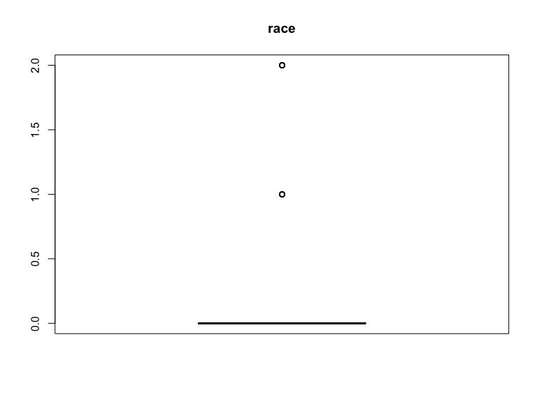
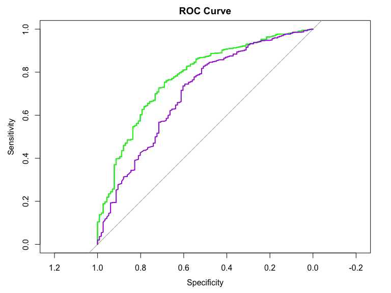

Final Project
================

``` r
library(gtsummary)
library(tidyverse)
```

    ## Warning: package 'tidyverse' was built under R version 4.1.3

    ## -- Attaching packages --------------------------------------- tidyverse 1.3.2 --
    ## v ggplot2 3.3.6     v purrr   1.0.1
    ## v tibble  3.2.1     v dplyr   1.1.2
    ## v tidyr   1.2.1     v stringr 1.4.0
    ## v readr   2.1.2     v forcats 1.0.0

    ## Warning: package 'ggplot2' was built under R version 4.1.3

    ## Warning: package 'tibble' was built under R version 4.1.3

    ## Warning: package 'tidyr' was built under R version 4.1.3

    ## Warning: package 'readr' was built under R version 4.1.3

    ## Warning: package 'purrr' was built under R version 4.1.3

    ## Warning: package 'dplyr' was built under R version 4.1.3

    ## Warning: package 'forcats' was built under R version 4.1.3

    ## -- Conflicts ------------------------------------------ tidyverse_conflicts() --
    ## x dplyr::filter() masks stats::filter()
    ## x dplyr::lag()    masks stats::lag()

``` r
library(car)
```

    ## Warning: package 'car' was built under R version 4.1.2

    ## Loading required package: carData
    ## 
    ## Attaching package: 'car'
    ## 
    ## The following object is masked from 'package:dplyr':
    ## 
    ##     recode
    ## 
    ## The following object is masked from 'package:purrr':
    ## 
    ##     some

``` r
library(caret)
```

    ## Warning: package 'caret' was built under R version 4.1.3

    ## Loading required package: lattice
    ## 
    ## Attaching package: 'caret'
    ## 
    ## The following object is masked from 'package:purrr':
    ## 
    ##     lift

``` r
library(corrplot)
```

    ## Warning: package 'corrplot' was built under R version 4.1.3

    ## corrplot 0.92 loaded

``` r
library(glmnet)
```

    ## Warning: package 'glmnet' was built under R version 4.1.3

    ## Loading required package: Matrix

    ## Warning: package 'Matrix' was built under R version 4.1.3

    ## 
    ## Attaching package: 'Matrix'
    ## 
    ## The following objects are masked from 'package:tidyr':
    ## 
    ##     expand, pack, unpack
    ## 
    ## Loaded glmnet 4.1-7

``` r
library(leaps)
```

    ## Warning: package 'leaps' was built under R version 4.1.3

``` r
library(pROC)
```

    ## Warning: package 'pROC' was built under R version 4.1.2

    ## Type 'citation("pROC")' for a citation.
    ## 
    ## Attaching package: 'pROC'
    ## 
    ## The following objects are masked from 'package:stats':
    ## 
    ##     cov, smooth, var

``` r
library(broom)

set.seed(123)

knitr::opts_chunk$set(
    echo = TRUE,
    warning = FALSE,
    fig.width = 8, 
  fig.height = 6,
  out.width = "90%"
)

options(
  ggplot2.continuous.colour = "viridis",
  ggplot2.continuous.fill = "viridis"
)

scale_colour_discrete = scale_colour_viridis_d
scale_fill_discrete = scale_fill_viridis_d

theme_set(theme_minimal() + theme(legend.position = "bottom"))
```

``` r
data = read_csv("./data/data.csv") |>
  janitor::clean_names()
```

    ## Rows: 4024 Columns: 16
    ## -- Column specification --------------------------------------------------------
    ## Delimiter: ","
    ## chr (11): Race, Marital Status, T Stage, N Stage, 6th Stage, differentiate, ...
    ## dbl  (5): Age, Tumor Size, Regional Node Examined, Reginol Node Positive, Su...
    ## 
    ## i Use `spec()` to retrieve the full column specification for this data.
    ## i Specify the column types or set `show_col_types = FALSE` to quiet this message.

``` r
data = data |>
  select(-survival_months)
```

``` r
# Convert character to factor for regression analysis
clean_data = data |>
  mutate(
    race = as.numeric(factor(race, levels = c("White", "Black", "Other"))) - 1,
    marital_status = as.numeric(factor(marital_status, levels = c("Married", "Single", "Divorced", "Widowed", "Separated"))) - 1,
    t_stage = as.numeric(factor(t_stage, levels = c("T1", "T2", "T3", "T4"))) - 1,
    n_stage = as.numeric(factor(n_stage, levels = c("N1", "N2", "N3"))) - 1,
    x6th_stage = as.numeric(factor(x6th_stage, levels = c("IIA", "IIB", "IIIA", "IIIB", "IIIC"))) - 1,
    differentiate = as.numeric(factor(differentiate, levels = c("Undifferentiated", "Poorly differentiated", "Moderately differentiated", "Well differentiated"))) - 1,
    grade = as.numeric(factor(grade, levels = c("1", "2", "3", "anaplastic; Grade IV"))),
    a_stage = as.numeric(factor(a_stage, levels = c("Regional", "Distant"))) - 1,
    estrogen_status = as.numeric(factor(estrogen_status, levels = c("Negative", "Positive"))) - 1,
    progesterone_status = as.numeric(factor(progesterone_status, levels = c("Negative", "Positive"))) - 1,
    status = as.numeric(factor(status, levels = c("Dead", "Alive"))) - 1)|>
  rename(regional_node_positive = reginol_node_positive)

#Table
proj2 = clean_data |>
tbl_summary(by="status",
  missing_text = "(Missing)", # counts missing values
  statistic = list(all_continuous() ~ "mean={mean} (min={min}, max={max}, sd={sd})",
                   all_categorical() ~ "n={n} (p={p}%)") # stats for categorical
 # specify variables to include
  ) |>
bold_labels()  |>
italicize_levels()
proj2
```

<div id="osncjrvket" style="padding-left:0px;padding-right:0px;padding-top:10px;padding-bottom:10px;overflow-x:auto;overflow-y:auto;width:auto;height:auto;">
<style>#osncjrvket table {
  font-family: system-ui, 'Segoe UI', Roboto, Helvetica, Arial, sans-serif, 'Apple Color Emoji', 'Segoe UI Emoji', 'Segoe UI Symbol', 'Noto Color Emoji';
  -webkit-font-smoothing: antialiased;
  -moz-osx-font-smoothing: grayscale;
}
&#10;#osncjrvket thead, #osncjrvket tbody, #osncjrvket tfoot, #osncjrvket tr, #osncjrvket td, #osncjrvket th {
  border-style: none;
}
&#10;#osncjrvket p {
  margin: 0;
  padding: 0;
}
&#10;#osncjrvket .gt_table {
  display: table;
  border-collapse: collapse;
  line-height: normal;
  margin-left: auto;
  margin-right: auto;
  color: #333333;
  font-size: 16px;
  font-weight: normal;
  font-style: normal;
  background-color: #FFFFFF;
  width: auto;
  border-top-style: solid;
  border-top-width: 2px;
  border-top-color: #A8A8A8;
  border-right-style: none;
  border-right-width: 2px;
  border-right-color: #D3D3D3;
  border-bottom-style: solid;
  border-bottom-width: 2px;
  border-bottom-color: #A8A8A8;
  border-left-style: none;
  border-left-width: 2px;
  border-left-color: #D3D3D3;
}
&#10;#osncjrvket .gt_caption {
  padding-top: 4px;
  padding-bottom: 4px;
}
&#10;#osncjrvket .gt_title {
  color: #333333;
  font-size: 125%;
  font-weight: initial;
  padding-top: 4px;
  padding-bottom: 4px;
  padding-left: 5px;
  padding-right: 5px;
  border-bottom-color: #FFFFFF;
  border-bottom-width: 0;
}
&#10;#osncjrvket .gt_subtitle {
  color: #333333;
  font-size: 85%;
  font-weight: initial;
  padding-top: 3px;
  padding-bottom: 5px;
  padding-left: 5px;
  padding-right: 5px;
  border-top-color: #FFFFFF;
  border-top-width: 0;
}
&#10;#osncjrvket .gt_heading {
  background-color: #FFFFFF;
  text-align: center;
  border-bottom-color: #FFFFFF;
  border-left-style: none;
  border-left-width: 1px;
  border-left-color: #D3D3D3;
  border-right-style: none;
  border-right-width: 1px;
  border-right-color: #D3D3D3;
}
&#10;#osncjrvket .gt_bottom_border {
  border-bottom-style: solid;
  border-bottom-width: 2px;
  border-bottom-color: #D3D3D3;
}
&#10;#osncjrvket .gt_col_headings {
  border-top-style: solid;
  border-top-width: 2px;
  border-top-color: #D3D3D3;
  border-bottom-style: solid;
  border-bottom-width: 2px;
  border-bottom-color: #D3D3D3;
  border-left-style: none;
  border-left-width: 1px;
  border-left-color: #D3D3D3;
  border-right-style: none;
  border-right-width: 1px;
  border-right-color: #D3D3D3;
}
&#10;#osncjrvket .gt_col_heading {
  color: #333333;
  background-color: #FFFFFF;
  font-size: 100%;
  font-weight: normal;
  text-transform: inherit;
  border-left-style: none;
  border-left-width: 1px;
  border-left-color: #D3D3D3;
  border-right-style: none;
  border-right-width: 1px;
  border-right-color: #D3D3D3;
  vertical-align: bottom;
  padding-top: 5px;
  padding-bottom: 6px;
  padding-left: 5px;
  padding-right: 5px;
  overflow-x: hidden;
}
&#10;#osncjrvket .gt_column_spanner_outer {
  color: #333333;
  background-color: #FFFFFF;
  font-size: 100%;
  font-weight: normal;
  text-transform: inherit;
  padding-top: 0;
  padding-bottom: 0;
  padding-left: 4px;
  padding-right: 4px;
}
&#10;#osncjrvket .gt_column_spanner_outer:first-child {
  padding-left: 0;
}
&#10;#osncjrvket .gt_column_spanner_outer:last-child {
  padding-right: 0;
}
&#10;#osncjrvket .gt_column_spanner {
  border-bottom-style: solid;
  border-bottom-width: 2px;
  border-bottom-color: #D3D3D3;
  vertical-align: bottom;
  padding-top: 5px;
  padding-bottom: 5px;
  overflow-x: hidden;
  display: inline-block;
  width: 100%;
}
&#10;#osncjrvket .gt_spanner_row {
  border-bottom-style: hidden;
}
&#10;#osncjrvket .gt_group_heading {
  padding-top: 8px;
  padding-bottom: 8px;
  padding-left: 5px;
  padding-right: 5px;
  color: #333333;
  background-color: #FFFFFF;
  font-size: 100%;
  font-weight: initial;
  text-transform: inherit;
  border-top-style: solid;
  border-top-width: 2px;
  border-top-color: #D3D3D3;
  border-bottom-style: solid;
  border-bottom-width: 2px;
  border-bottom-color: #D3D3D3;
  border-left-style: none;
  border-left-width: 1px;
  border-left-color: #D3D3D3;
  border-right-style: none;
  border-right-width: 1px;
  border-right-color: #D3D3D3;
  vertical-align: middle;
  text-align: left;
}
&#10;#osncjrvket .gt_empty_group_heading {
  padding: 0.5px;
  color: #333333;
  background-color: #FFFFFF;
  font-size: 100%;
  font-weight: initial;
  border-top-style: solid;
  border-top-width: 2px;
  border-top-color: #D3D3D3;
  border-bottom-style: solid;
  border-bottom-width: 2px;
  border-bottom-color: #D3D3D3;
  vertical-align: middle;
}
&#10;#osncjrvket .gt_from_md > :first-child {
  margin-top: 0;
}
&#10;#osncjrvket .gt_from_md > :last-child {
  margin-bottom: 0;
}
&#10;#osncjrvket .gt_row {
  padding-top: 8px;
  padding-bottom: 8px;
  padding-left: 5px;
  padding-right: 5px;
  margin: 10px;
  border-top-style: solid;
  border-top-width: 1px;
  border-top-color: #D3D3D3;
  border-left-style: none;
  border-left-width: 1px;
  border-left-color: #D3D3D3;
  border-right-style: none;
  border-right-width: 1px;
  border-right-color: #D3D3D3;
  vertical-align: middle;
  overflow-x: hidden;
}
&#10;#osncjrvket .gt_stub {
  color: #333333;
  background-color: #FFFFFF;
  font-size: 100%;
  font-weight: initial;
  text-transform: inherit;
  border-right-style: solid;
  border-right-width: 2px;
  border-right-color: #D3D3D3;
  padding-left: 5px;
  padding-right: 5px;
}
&#10;#osncjrvket .gt_stub_row_group {
  color: #333333;
  background-color: #FFFFFF;
  font-size: 100%;
  font-weight: initial;
  text-transform: inherit;
  border-right-style: solid;
  border-right-width: 2px;
  border-right-color: #D3D3D3;
  padding-left: 5px;
  padding-right: 5px;
  vertical-align: top;
}
&#10;#osncjrvket .gt_row_group_first td {
  border-top-width: 2px;
}
&#10;#osncjrvket .gt_row_group_first th {
  border-top-width: 2px;
}
&#10;#osncjrvket .gt_summary_row {
  color: #333333;
  background-color: #FFFFFF;
  text-transform: inherit;
  padding-top: 8px;
  padding-bottom: 8px;
  padding-left: 5px;
  padding-right: 5px;
}
&#10;#osncjrvket .gt_first_summary_row {
  border-top-style: solid;
  border-top-color: #D3D3D3;
}
&#10;#osncjrvket .gt_first_summary_row.thick {
  border-top-width: 2px;
}
&#10;#osncjrvket .gt_last_summary_row {
  padding-top: 8px;
  padding-bottom: 8px;
  padding-left: 5px;
  padding-right: 5px;
  border-bottom-style: solid;
  border-bottom-width: 2px;
  border-bottom-color: #D3D3D3;
}
&#10;#osncjrvket .gt_grand_summary_row {
  color: #333333;
  background-color: #FFFFFF;
  text-transform: inherit;
  padding-top: 8px;
  padding-bottom: 8px;
  padding-left: 5px;
  padding-right: 5px;
}
&#10;#osncjrvket .gt_first_grand_summary_row {
  padding-top: 8px;
  padding-bottom: 8px;
  padding-left: 5px;
  padding-right: 5px;
  border-top-style: double;
  border-top-width: 6px;
  border-top-color: #D3D3D3;
}
&#10;#osncjrvket .gt_last_grand_summary_row_top {
  padding-top: 8px;
  padding-bottom: 8px;
  padding-left: 5px;
  padding-right: 5px;
  border-bottom-style: double;
  border-bottom-width: 6px;
  border-bottom-color: #D3D3D3;
}
&#10;#osncjrvket .gt_striped {
  background-color: rgba(128, 128, 128, 0.05);
}
&#10;#osncjrvket .gt_table_body {
  border-top-style: solid;
  border-top-width: 2px;
  border-top-color: #D3D3D3;
  border-bottom-style: solid;
  border-bottom-width: 2px;
  border-bottom-color: #D3D3D3;
}
&#10;#osncjrvket .gt_footnotes {
  color: #333333;
  background-color: #FFFFFF;
  border-bottom-style: none;
  border-bottom-width: 2px;
  border-bottom-color: #D3D3D3;
  border-left-style: none;
  border-left-width: 2px;
  border-left-color: #D3D3D3;
  border-right-style: none;
  border-right-width: 2px;
  border-right-color: #D3D3D3;
}
&#10;#osncjrvket .gt_footnote {
  margin: 0px;
  font-size: 90%;
  padding-top: 4px;
  padding-bottom: 4px;
  padding-left: 5px;
  padding-right: 5px;
}
&#10;#osncjrvket .gt_sourcenotes {
  color: #333333;
  background-color: #FFFFFF;
  border-bottom-style: none;
  border-bottom-width: 2px;
  border-bottom-color: #D3D3D3;
  border-left-style: none;
  border-left-width: 2px;
  border-left-color: #D3D3D3;
  border-right-style: none;
  border-right-width: 2px;
  border-right-color: #D3D3D3;
}
&#10;#osncjrvket .gt_sourcenote {
  font-size: 90%;
  padding-top: 4px;
  padding-bottom: 4px;
  padding-left: 5px;
  padding-right: 5px;
}
&#10;#osncjrvket .gt_left {
  text-align: left;
}
&#10;#osncjrvket .gt_center {
  text-align: center;
}
&#10;#osncjrvket .gt_right {
  text-align: right;
  font-variant-numeric: tabular-nums;
}
&#10;#osncjrvket .gt_font_normal {
  font-weight: normal;
}
&#10;#osncjrvket .gt_font_bold {
  font-weight: bold;
}
&#10;#osncjrvket .gt_font_italic {
  font-style: italic;
}
&#10;#osncjrvket .gt_super {
  font-size: 65%;
}
&#10;#osncjrvket .gt_footnote_marks {
  font-size: 75%;
  vertical-align: 0.4em;
  position: initial;
}
&#10;#osncjrvket .gt_asterisk {
  font-size: 100%;
  vertical-align: 0;
}
&#10;#osncjrvket .gt_indent_1 {
  text-indent: 5px;
}
&#10;#osncjrvket .gt_indent_2 {
  text-indent: 10px;
}
&#10;#osncjrvket .gt_indent_3 {
  text-indent: 15px;
}
&#10;#osncjrvket .gt_indent_4 {
  text-indent: 20px;
}
&#10;#osncjrvket .gt_indent_5 {
  text-indent: 25px;
}
</style>
<table class="gt_table" data-quarto-disable-processing="false" data-quarto-bootstrap="false">
  <thead>
    &#10;    <tr class="gt_col_headings">
      <th class="gt_col_heading gt_columns_bottom_border gt_left" rowspan="1" colspan="1" scope="col" id="&lt;strong&gt;Characteristic&lt;/strong&gt;"><strong>Characteristic</strong></th>
      <th class="gt_col_heading gt_columns_bottom_border gt_center" rowspan="1" colspan="1" scope="col" id="&lt;strong&gt;0&lt;/strong&gt;, N = 616&lt;span class=&quot;gt_footnote_marks&quot; style=&quot;white-space:nowrap;font-style:italic;font-weight:normal;&quot;&gt;&lt;sup&gt;1&lt;/sup&gt;&lt;/span&gt;"><strong>0</strong>, N = 616<span class="gt_footnote_marks" style="white-space:nowrap;font-style:italic;font-weight:normal;"><sup>1</sup></span></th>
      <th class="gt_col_heading gt_columns_bottom_border gt_center" rowspan="1" colspan="1" scope="col" id="&lt;strong&gt;1&lt;/strong&gt;, N = 3,408&lt;span class=&quot;gt_footnote_marks&quot; style=&quot;white-space:nowrap;font-style:italic;font-weight:normal;&quot;&gt;&lt;sup&gt;1&lt;/sup&gt;&lt;/span&gt;"><strong>1</strong>, N = 3,408<span class="gt_footnote_marks" style="white-space:nowrap;font-style:italic;font-weight:normal;"><sup>1</sup></span></th>
    </tr>
  </thead>
  <tbody class="gt_table_body">
    <tr><td headers="label" class="gt_row gt_left" style="font-weight: bold;">age</td>
<td headers="stat_1" class="gt_row gt_center">mean=55 (min=30, max=69, sd=10)</td>
<td headers="stat_2" class="gt_row gt_center">mean=54 (min=30, max=69, sd=9)</td></tr>
    <tr><td headers="label" class="gt_row gt_left" style="font-weight: bold;">race</td>
<td headers="stat_1" class="gt_row gt_center"><br /></td>
<td headers="stat_2" class="gt_row gt_center"><br /></td></tr>
    <tr><td headers="label" class="gt_row gt_left" style="font-style: italic;">    0</td>
<td headers="stat_1" class="gt_row gt_center">n=510 (p=83%)</td>
<td headers="stat_2" class="gt_row gt_center">n=2,903 (p=85%)</td></tr>
    <tr><td headers="label" class="gt_row gt_left" style="font-style: italic;">    1</td>
<td headers="stat_1" class="gt_row gt_center">n=73 (p=12%)</td>
<td headers="stat_2" class="gt_row gt_center">n=218 (p=6.4%)</td></tr>
    <tr><td headers="label" class="gt_row gt_left" style="font-style: italic;">    2</td>
<td headers="stat_1" class="gt_row gt_center">n=33 (p=5.4%)</td>
<td headers="stat_2" class="gt_row gt_center">n=287 (p=8.4%)</td></tr>
    <tr><td headers="label" class="gt_row gt_left" style="font-weight: bold;">marital_status</td>
<td headers="stat_1" class="gt_row gt_center"><br /></td>
<td headers="stat_2" class="gt_row gt_center"><br /></td></tr>
    <tr><td headers="label" class="gt_row gt_left" style="font-style: italic;">    0</td>
<td headers="stat_1" class="gt_row gt_center">n=358 (p=58%)</td>
<td headers="stat_2" class="gt_row gt_center">n=2,285 (p=67%)</td></tr>
    <tr><td headers="label" class="gt_row gt_left" style="font-style: italic;">    1</td>
<td headers="stat_1" class="gt_row gt_center">n=104 (p=17%)</td>
<td headers="stat_2" class="gt_row gt_center">n=511 (p=15%)</td></tr>
    <tr><td headers="label" class="gt_row gt_left" style="font-style: italic;">    2</td>
<td headers="stat_1" class="gt_row gt_center">n=90 (p=15%)</td>
<td headers="stat_2" class="gt_row gt_center">n=396 (p=12%)</td></tr>
    <tr><td headers="label" class="gt_row gt_left" style="font-style: italic;">    3</td>
<td headers="stat_1" class="gt_row gt_center">n=49 (p=8.0%)</td>
<td headers="stat_2" class="gt_row gt_center">n=186 (p=5.5%)</td></tr>
    <tr><td headers="label" class="gt_row gt_left" style="font-style: italic;">    4</td>
<td headers="stat_1" class="gt_row gt_center">n=15 (p=2.4%)</td>
<td headers="stat_2" class="gt_row gt_center">n=30 (p=0.9%)</td></tr>
    <tr><td headers="label" class="gt_row gt_left" style="font-weight: bold;">t_stage</td>
<td headers="stat_1" class="gt_row gt_center"><br /></td>
<td headers="stat_2" class="gt_row gt_center"><br /></td></tr>
    <tr><td headers="label" class="gt_row gt_left" style="font-style: italic;">    0</td>
<td headers="stat_1" class="gt_row gt_center">n=157 (p=25%)</td>
<td headers="stat_2" class="gt_row gt_center">n=1,446 (p=42%)</td></tr>
    <tr><td headers="label" class="gt_row gt_left" style="font-style: italic;">    1</td>
<td headers="stat_1" class="gt_row gt_center">n=303 (p=49%)</td>
<td headers="stat_2" class="gt_row gt_center">n=1,483 (p=44%)</td></tr>
    <tr><td headers="label" class="gt_row gt_left" style="font-style: italic;">    2</td>
<td headers="stat_1" class="gt_row gt_center">n=116 (p=19%)</td>
<td headers="stat_2" class="gt_row gt_center">n=417 (p=12%)</td></tr>
    <tr><td headers="label" class="gt_row gt_left" style="font-style: italic;">    3</td>
<td headers="stat_1" class="gt_row gt_center">n=40 (p=6.5%)</td>
<td headers="stat_2" class="gt_row gt_center">n=62 (p=1.8%)</td></tr>
    <tr><td headers="label" class="gt_row gt_left" style="font-weight: bold;">n_stage</td>
<td headers="stat_1" class="gt_row gt_center"><br /></td>
<td headers="stat_2" class="gt_row gt_center"><br /></td></tr>
    <tr><td headers="label" class="gt_row gt_left" style="font-style: italic;">    0</td>
<td headers="stat_1" class="gt_row gt_center">n=270 (p=44%)</td>
<td headers="stat_2" class="gt_row gt_center">n=2,462 (p=72%)</td></tr>
    <tr><td headers="label" class="gt_row gt_left" style="font-style: italic;">    1</td>
<td headers="stat_1" class="gt_row gt_center">n=165 (p=27%)</td>
<td headers="stat_2" class="gt_row gt_center">n=655 (p=19%)</td></tr>
    <tr><td headers="label" class="gt_row gt_left" style="font-style: italic;">    2</td>
<td headers="stat_1" class="gt_row gt_center">n=181 (p=29%)</td>
<td headers="stat_2" class="gt_row gt_center">n=291 (p=8.5%)</td></tr>
    <tr><td headers="label" class="gt_row gt_left" style="font-weight: bold;">x6th_stage</td>
<td headers="stat_1" class="gt_row gt_center"><br /></td>
<td headers="stat_2" class="gt_row gt_center"><br /></td></tr>
    <tr><td headers="label" class="gt_row gt_left" style="font-style: italic;">    0</td>
<td headers="stat_1" class="gt_row gt_center">n=96 (p=16%)</td>
<td headers="stat_2" class="gt_row gt_center">n=1,209 (p=35%)</td></tr>
    <tr><td headers="label" class="gt_row gt_left" style="font-style: italic;">    1</td>
<td headers="stat_1" class="gt_row gt_center">n=135 (p=22%)</td>
<td headers="stat_2" class="gt_row gt_center">n=995 (p=29%)</td></tr>
    <tr><td headers="label" class="gt_row gt_left" style="font-style: italic;">    2</td>
<td headers="stat_1" class="gt_row gt_center">n=184 (p=30%)</td>
<td headers="stat_2" class="gt_row gt_center">n=866 (p=25%)</td></tr>
    <tr><td headers="label" class="gt_row gt_left" style="font-style: italic;">    3</td>
<td headers="stat_1" class="gt_row gt_center">n=20 (p=3.2%)</td>
<td headers="stat_2" class="gt_row gt_center">n=47 (p=1.4%)</td></tr>
    <tr><td headers="label" class="gt_row gt_left" style="font-style: italic;">    4</td>
<td headers="stat_1" class="gt_row gt_center">n=181 (p=29%)</td>
<td headers="stat_2" class="gt_row gt_center">n=291 (p=8.5%)</td></tr>
    <tr><td headers="label" class="gt_row gt_left" style="font-weight: bold;">differentiate</td>
<td headers="stat_1" class="gt_row gt_center"><br /></td>
<td headers="stat_2" class="gt_row gt_center"><br /></td></tr>
    <tr><td headers="label" class="gt_row gt_left" style="font-style: italic;">    0</td>
<td headers="stat_1" class="gt_row gt_center">n=9 (p=1.5%)</td>
<td headers="stat_2" class="gt_row gt_center">n=10 (p=0.3%)</td></tr>
    <tr><td headers="label" class="gt_row gt_left" style="font-style: italic;">    1</td>
<td headers="stat_1" class="gt_row gt_center">n=263 (p=43%)</td>
<td headers="stat_2" class="gt_row gt_center">n=848 (p=25%)</td></tr>
    <tr><td headers="label" class="gt_row gt_left" style="font-style: italic;">    2</td>
<td headers="stat_1" class="gt_row gt_center">n=305 (p=50%)</td>
<td headers="stat_2" class="gt_row gt_center">n=2,046 (p=60%)</td></tr>
    <tr><td headers="label" class="gt_row gt_left" style="font-style: italic;">    3</td>
<td headers="stat_1" class="gt_row gt_center">n=39 (p=6.3%)</td>
<td headers="stat_2" class="gt_row gt_center">n=504 (p=15%)</td></tr>
    <tr><td headers="label" class="gt_row gt_left" style="font-weight: bold;">grade</td>
<td headers="stat_1" class="gt_row gt_center"><br /></td>
<td headers="stat_2" class="gt_row gt_center"><br /></td></tr>
    <tr><td headers="label" class="gt_row gt_left" style="font-style: italic;">    1</td>
<td headers="stat_1" class="gt_row gt_center">n=39 (p=6.3%)</td>
<td headers="stat_2" class="gt_row gt_center">n=504 (p=15%)</td></tr>
    <tr><td headers="label" class="gt_row gt_left" style="font-style: italic;">    2</td>
<td headers="stat_1" class="gt_row gt_center">n=305 (p=50%)</td>
<td headers="stat_2" class="gt_row gt_center">n=2,046 (p=60%)</td></tr>
    <tr><td headers="label" class="gt_row gt_left" style="font-style: italic;">    3</td>
<td headers="stat_1" class="gt_row gt_center">n=263 (p=43%)</td>
<td headers="stat_2" class="gt_row gt_center">n=848 (p=25%)</td></tr>
    <tr><td headers="label" class="gt_row gt_left" style="font-style: italic;">    4</td>
<td headers="stat_1" class="gt_row gt_center">n=9 (p=1.5%)</td>
<td headers="stat_2" class="gt_row gt_center">n=10 (p=0.3%)</td></tr>
    <tr><td headers="label" class="gt_row gt_left" style="font-weight: bold;">a_stage</td>
<td headers="stat_1" class="gt_row gt_center">n=35 (p=5.7%)</td>
<td headers="stat_2" class="gt_row gt_center">n=57 (p=1.7%)</td></tr>
    <tr><td headers="label" class="gt_row gt_left" style="font-weight: bold;">tumor_size</td>
<td headers="stat_1" class="gt_row gt_center">mean=37 (min=1, max=140, sd=24)</td>
<td headers="stat_2" class="gt_row gt_center">mean=29 (min=1, max=140, sd=20)</td></tr>
    <tr><td headers="label" class="gt_row gt_left" style="font-weight: bold;">estrogen_status</td>
<td headers="stat_1" class="gt_row gt_center">n=508 (p=82%)</td>
<td headers="stat_2" class="gt_row gt_center">n=3,247 (p=95%)</td></tr>
    <tr><td headers="label" class="gt_row gt_left" style="font-weight: bold;">progesterone_status</td>
<td headers="stat_1" class="gt_row gt_center">n=412 (p=67%)</td>
<td headers="stat_2" class="gt_row gt_center">n=2,914 (p=86%)</td></tr>
    <tr><td headers="label" class="gt_row gt_left" style="font-weight: bold;">regional_node_examined</td>
<td headers="stat_1" class="gt_row gt_center">mean=15 (min=1, max=57, sd=8)</td>
<td headers="stat_2" class="gt_row gt_center">mean=14 (min=1, max=61, sd=8)</td></tr>
    <tr><td headers="label" class="gt_row gt_left" style="font-weight: bold;">regional_node_positive</td>
<td headers="stat_1" class="gt_row gt_center">mean=7.2 (min=1.0, max=46.0, sd=7.3)</td>
<td headers="stat_2" class="gt_row gt_center">mean=3.6 (min=1.0, max=41.0, sd=4.4)</td></tr>
  </tbody>
  &#10;  <tfoot class="gt_footnotes">
    <tr>
      <td class="gt_footnote" colspan="3"><span class="gt_footnote_marks" style="white-space:nowrap;font-style:italic;font-weight:normal;"><sup>1</sup></span> mean=Mean (min=Minimum, max=Maximum, sd=SD); n=n (p=%)</td>
    </tr>
  </tfoot>
</table>
</div>

\#Model fitting \#Based on boxplots, transformaiton is necesessary to
reduce outliers \#cube root of tumor size \#log of regional_node_examied
\#log of regional_node_positive \#Figure 1

``` r
proj2 = data |>
tbl_summary(by="status",
  missing_text = "(Missing)", # counts missing values
  statistic = list(all_continuous() ~ "mean={mean} (min={min}, max={max}, sd={sd})",
                   all_categorical() ~ "n={n} (p={p}%)") # stats for categorical
  ) |>
bold_labels()  |>
italicize_levels()


clean_data2=clean_data
clean_data2$tumor_size= (clean_data$tumor_size)^(1/3)
clean_data2$regional_node_examined = log(clean_data$regional_node_examined)
clean_data2$regional_node_positive = log(clean_data$regional_node_positive)
```

\#Find correlation

``` r
corplot=cor(clean_data2)
corrplot(corplot)
```


``` r
#tumor_size vs t_stage = 0.801
#grade=differentiate =>1
#n_stage = x6th_stage => 0.881
#n_stage = regional positive status =>0.838073333
selected_data = clean_data2 |>
  select(-tumor_size, -grade,-n_stage,-regional_node_positive,-x6th_stage)

corplot=cor(selected_data)
corrplot(corplot)
```


\#Separate training and testing set (80% training 20% testing )

``` r
# Calculate the size of each of the data sets
data_size = nrow(clean_data2)
train_size = floor(0.8 * data_size)
# Create a random sample of row indices for the training set
train_indices = sample(sample(seq_len(data_size), size = train_size))
# Subset the data into training and testing sets
#FUll variable
train_set = clean_data2[train_indices, ]
selectedData_train_set = selected_data[train_indices,]

test_set = clean_data2[-train_indices, ]
selectedData_test_set = selected_data[-train_indices, ]
```

# Fit a full model

``` r
selected_train = train_set |>
  select(-tumor_size, -grade,-n_stage,-regional_node_positive,-x6th_stage)
null_model = glm(status ~ 1, family = binomial(link = "logit"), data = selected_train)#cleaned data
full_model=glm(status ~ . , family = binomial(link = "logit"), data = selected_train)
interaction_race_age = glm(status ~ . + race:age, family = binomial(link = "logit"), data = selected_train)

interaction_race_marital_status = glm(status ~ . + race:marital_status,  family = binomial(link = "logit"), data = selected_train)
```

# Using Forward, BackWard

    ## Start:  AIC=2703.02
    ## status ~ 1
    ## 
    ##                          Df Deviance    AIC
    ## + estrogen_status         1   2606.5 2610.5
    ## + progesterone_status     1   2611.6 2615.6
    ## + differentiate           1   2615.8 2619.8
    ## + t_stage                 1   2625.8 2629.8
    ## + a_stage                 1   2678.0 2682.0
    ## + marital_status          1   2680.8 2684.8
    ## + age                     1   2689.6 2693.6
    ## + regional_node_examined  1   2697.0 2701.0
    ## <none>                        2701.0 2703.0
    ## + race                    1   2701.0 2705.0
    ## 
    ## Step:  AIC=2610.48
    ## status ~ estrogen_status
    ## 
    ##                          Df Deviance    AIC
    ## + t_stage                 1   2540.9 2546.9
    ## + differentiate           1   2556.7 2562.7
    ## + progesterone_status     1   2581.9 2587.9
    ## + marital_status          1   2585.8 2591.8
    ## + age                     1   2590.2 2596.2
    ## + a_stage                 1   2590.6 2596.6
    ## + regional_node_examined  1   2603.7 2609.7
    ## <none>                        2606.5 2610.5
    ## + race                    1   2606.3 2612.3
    ## 
    ## Step:  AIC=2546.92
    ## status ~ estrogen_status + t_stage
    ## 
    ##                          Df Deviance    AIC
    ## + differentiate           1   2501.9 2509.9
    ## + progesterone_status     1   2518.6 2526.6
    ## + age                     1   2519.1 2527.1
    ## + marital_status          1   2521.7 2529.7
    ## + a_stage                 1   2537.2 2545.2
    ## <none>                        2540.9 2546.9
    ## + regional_node_examined  1   2540.4 2548.4
    ## + race                    1   2540.8 2548.8
    ## 
    ## Step:  AIC=2509.95
    ## status ~ estrogen_status + t_stage + differentiate
    ## 
    ##                          Df Deviance    AIC
    ## + age                     1   2475.8 2485.8
    ## + marital_status          1   2483.7 2493.7
    ## + progesterone_status     1   2484.3 2494.3
    ## + a_stage                 1   2498.4 2508.4
    ## <none>                        2501.9 2509.9
    ## + race                    1   2501.7 2511.7
    ## + regional_node_examined  1   2501.9 2511.9
    ## 
    ## Step:  AIC=2485.82
    ## status ~ estrogen_status + t_stage + differentiate + age
    ## 
    ##                          Df Deviance    AIC
    ## + progesterone_status     1   2461.1 2473.1
    ## + marital_status          1   2463.1 2475.1
    ## + a_stage                 1   2472.3 2484.3
    ## <none>                        2475.8 2485.8
    ## + regional_node_examined  1   2475.7 2487.7
    ## + race                    1   2475.8 2487.8
    ## 
    ## Step:  AIC=2473.09
    ## status ~ estrogen_status + t_stage + differentiate + age + progesterone_status
    ## 
    ##                          Df Deviance    AIC
    ## + marital_status          1   2449.4 2463.4
    ## + a_stage                 1   2457.1 2471.1
    ## <none>                        2461.1 2473.1
    ## + regional_node_examined  1   2460.9 2474.9
    ## + race                    1   2461.1 2475.1
    ## 
    ## Step:  AIC=2463.45
    ## status ~ estrogen_status + t_stage + differentiate + age + progesterone_status + 
    ##     marital_status
    ## 
    ##                          Df Deviance    AIC
    ## + a_stage                 1   2445.6 2461.6
    ## <none>                        2449.4 2463.4
    ## + regional_node_examined  1   2449.3 2465.3
    ## + race                    1   2449.4 2465.4
    ## 
    ## Step:  AIC=2461.58
    ## status ~ estrogen_status + t_stage + differentiate + age + progesterone_status + 
    ##     marital_status + a_stage
    ## 
    ##                          Df Deviance    AIC
    ## <none>                        2445.6 2461.6
    ## + regional_node_examined  1   2445.5 2463.5
    ## + race                    1   2445.6 2463.6

    ## Start:  AIC=2465.47
    ## status ~ age + race + marital_status + t_stage + differentiate + 
    ##     a_stage + estrogen_status + progesterone_status + regional_node_examined
    ## 
    ##                          Df Deviance    AIC
    ## - race                    1   2445.5 2463.5
    ## - regional_node_examined  1   2445.6 2463.6
    ## <none>                        2445.5 2465.5
    ## - a_stage                 1   2449.3 2467.3
    ## - marital_status          1   2457.0 2475.0
    ## - progesterone_status     1   2459.6 2477.6
    ## - age                     1   2463.6 2481.6
    ## - estrogen_status         1   2464.7 2482.7
    ## - differentiate           1   2482.4 2500.4
    ## - t_stage                 1   2489.9 2507.9
    ## 
    ## Step:  AIC=2463.48
    ## status ~ age + marital_status + t_stage + differentiate + a_stage + 
    ##     estrogen_status + progesterone_status + regional_node_examined
    ## 
    ##                          Df Deviance    AIC
    ## - regional_node_examined  1   2445.6 2461.6
    ## <none>                        2445.5 2463.5
    ## - a_stage                 1   2449.3 2465.3
    ## - marital_status          1   2457.0 2473.0
    ## - progesterone_status     1   2459.6 2475.6
    ## - age                     1   2463.8 2479.8
    ## - estrogen_status         1   2464.7 2480.7
    ## - differentiate           1   2482.4 2498.4
    ## - t_stage                 1   2490.0 2506.0
    ## 
    ## Step:  AIC=2461.58
    ## status ~ age + marital_status + t_stage + differentiate + a_stage + 
    ##     estrogen_status + progesterone_status
    ## 
    ##                       Df Deviance    AIC
    ## <none>                     2445.6 2461.6
    ## - a_stage              1   2449.4 2463.4
    ## - marital_status       1   2457.1 2471.1
    ## - progesterone_status  1   2459.7 2473.7
    ## - age                  1   2463.8 2477.8
    ## - estrogen_status      1   2464.9 2478.9
    ## - differentiate        1   2483.0 2497.0
    ## - t_stage              1   2490.8 2504.8

    ## 
    ## Call:
    ## glm(formula = status ~ age + marital_status + t_stage + differentiate + 
    ##     a_stage + estrogen_status + progesterone_status, family = binomial(link = "logit"), 
    ##     data = selected_train)
    ## 
    ## Deviance Residuals: 
    ##     Min       1Q   Median       3Q      Max  
    ## -2.5486   0.3461   0.4407   0.5631   1.7342  
    ## 
    ## Coefficients:
    ##                      Estimate Std. Error z value Pr(>|z|)    
    ## (Intercept)          1.556491   0.370338   4.203 2.64e-05 ***
    ## age                 -0.025726   0.006087  -4.227 2.37e-05 ***
    ## marital_status      -0.171449   0.049651  -3.453 0.000554 ***
    ## t_stage             -0.451201   0.066795  -6.755 1.43e-11 ***
    ## differentiate        0.525535   0.086914   6.047 1.48e-09 ***
    ## a_stage             -0.555003   0.276458  -2.008 0.044691 *  
    ## estrogen_status      0.860098   0.195049   4.410 1.04e-05 ***
    ## progesterone_status  0.552567   0.142815   3.869 0.000109 ***
    ## ---
    ## Signif. codes:  0 '***' 0.001 '**' 0.01 '*' 0.05 '.' 0.1 ' ' 1
    ## 
    ## (Dispersion parameter for binomial family taken to be 1)
    ## 
    ##     Null deviance: 2701.0  on 3218  degrees of freedom
    ## Residual deviance: 2445.6  on 3211  degrees of freedom
    ## AIC: 2461.6
    ## 
    ## Number of Fisher Scoring iterations: 5

    ## 
    ## Call:
    ## glm(formula = status ~ estrogen_status + t_stage + differentiate + 
    ##     age + progesterone_status + marital_status + a_stage, family = binomial(link = "logit"), 
    ##     data = selected_train)
    ## 
    ## Deviance Residuals: 
    ##     Min       1Q   Median       3Q      Max  
    ## -2.5486   0.3461   0.4407   0.5631   1.7342  
    ## 
    ## Coefficients:
    ##                      Estimate Std. Error z value Pr(>|z|)    
    ## (Intercept)          1.556491   0.370338   4.203 2.64e-05 ***
    ## estrogen_status      0.860098   0.195049   4.410 1.04e-05 ***
    ## t_stage             -0.451201   0.066795  -6.755 1.43e-11 ***
    ## differentiate        0.525535   0.086914   6.047 1.48e-09 ***
    ## age                 -0.025726   0.006087  -4.227 2.37e-05 ***
    ## progesterone_status  0.552567   0.142815   3.869 0.000109 ***
    ## marital_status      -0.171449   0.049651  -3.453 0.000554 ***
    ## a_stage             -0.555003   0.276458  -2.008 0.044691 *  
    ## ---
    ## Signif. codes:  0 '***' 0.001 '**' 0.01 '*' 0.05 '.' 0.1 ' ' 1
    ## 
    ## (Dispersion parameter for binomial family taken to be 1)
    ## 
    ##     Null deviance: 2701.0  on 3218  degrees of freedom
    ## Residual deviance: 2445.6  on 3211  degrees of freedom
    ## AIC: 2461.6
    ## 
    ## Number of Fisher Scoring iterations: 5

    ## Analysis of Deviance Table
    ## 
    ## Model 1: status ~ age + marital_status + t_stage + differentiate + a_stage + 
    ##     estrogen_status + progesterone_status
    ## Model 2: status ~ estrogen_status + t_stage + differentiate + age + progesterone_status + 
    ##     marital_status + a_stage
    ##   Resid. Df Resid. Dev Df Deviance Pr(>Chi)
    ## 1      3211     2445.6                     
    ## 2      3211     2445.6  0        0

    ## Setting levels: control = 0, case = 1

    ## Setting direction: controls < cases

    ## Area under the curve: 0.6849

    ## 
    ## Call:
    ## glm(formula = status ~ estrogen_status + t_stage + differentiate + 
    ##     age + progesterone_status + marital_status + a_stage, family = binomial(link = "logit"), 
    ##     data = selected_train)
    ## 
    ## Deviance Residuals: 
    ##     Min       1Q   Median       3Q      Max  
    ## -2.5486   0.3461   0.4407   0.5631   1.7342  
    ## 
    ## Coefficients:
    ##                      Estimate Std. Error z value Pr(>|z|)    
    ## (Intercept)          1.556491   0.370338   4.203 2.64e-05 ***
    ## estrogen_status      0.860098   0.195049   4.410 1.04e-05 ***
    ## t_stage             -0.451201   0.066795  -6.755 1.43e-11 ***
    ## differentiate        0.525535   0.086914   6.047 1.48e-09 ***
    ## age                 -0.025726   0.006087  -4.227 2.37e-05 ***
    ## progesterone_status  0.552567   0.142815   3.869 0.000109 ***
    ## marital_status      -0.171449   0.049651  -3.453 0.000554 ***
    ## a_stage             -0.555003   0.276458  -2.008 0.044691 *  
    ## ---
    ## Signif. codes:  0 '***' 0.001 '**' 0.01 '*' 0.05 '.' 0.1 ' ' 1
    ## 
    ## (Dispersion parameter for binomial family taken to be 1)
    ## 
    ##     Null deviance: 2701.0  on 3218  degrees of freedom
    ## Residual deviance: 2445.6  on 3211  degrees of freedom
    ## AIC: 2461.6
    ## 
    ## Number of Fisher Scoring iterations: 5

# Interaction: race \*marital_status

``` r
step_modelF_2 = step(null_model, scope = list(lower = null_model, upper = interaction_race_marital_status), 
                   direction = "forward")
```

    ## Start:  AIC=2703.02
    ## status ~ 1
    ## 
    ##                          Df Deviance    AIC
    ## + estrogen_status         1   2606.5 2610.5
    ## + progesterone_status     1   2611.6 2615.6
    ## + differentiate           1   2615.8 2619.8
    ## + t_stage                 1   2625.8 2629.8
    ## + a_stage                 1   2678.0 2682.0
    ## + marital_status          1   2680.8 2684.8
    ## + age                     1   2689.6 2693.6
    ## + regional_node_examined  1   2697.0 2701.0
    ## <none>                        2701.0 2703.0
    ## + race                    1   2701.0 2705.0
    ## 
    ## Step:  AIC=2610.48
    ## status ~ estrogen_status
    ## 
    ##                          Df Deviance    AIC
    ## + t_stage                 1   2540.9 2546.9
    ## + differentiate           1   2556.7 2562.7
    ## + progesterone_status     1   2581.9 2587.9
    ## + marital_status          1   2585.8 2591.8
    ## + age                     1   2590.2 2596.2
    ## + a_stage                 1   2590.6 2596.6
    ## + regional_node_examined  1   2603.7 2609.7
    ## <none>                        2606.5 2610.5
    ## + race                    1   2606.3 2612.3
    ## 
    ## Step:  AIC=2546.92
    ## status ~ estrogen_status + t_stage
    ## 
    ##                          Df Deviance    AIC
    ## + differentiate           1   2501.9 2509.9
    ## + progesterone_status     1   2518.6 2526.6
    ## + age                     1   2519.1 2527.1
    ## + marital_status          1   2521.7 2529.7
    ## + a_stage                 1   2537.2 2545.2
    ## <none>                        2540.9 2546.9
    ## + regional_node_examined  1   2540.4 2548.4
    ## + race                    1   2540.8 2548.8
    ## 
    ## Step:  AIC=2509.95
    ## status ~ estrogen_status + t_stage + differentiate
    ## 
    ##                          Df Deviance    AIC
    ## + age                     1   2475.8 2485.8
    ## + marital_status          1   2483.7 2493.7
    ## + progesterone_status     1   2484.3 2494.3
    ## + a_stage                 1   2498.4 2508.4
    ## <none>                        2501.9 2509.9
    ## + race                    1   2501.7 2511.7
    ## + regional_node_examined  1   2501.9 2511.9
    ## 
    ## Step:  AIC=2485.82
    ## status ~ estrogen_status + t_stage + differentiate + age
    ## 
    ##                          Df Deviance    AIC
    ## + progesterone_status     1   2461.1 2473.1
    ## + marital_status          1   2463.1 2475.1
    ## + a_stage                 1   2472.3 2484.3
    ## <none>                        2475.8 2485.8
    ## + regional_node_examined  1   2475.7 2487.7
    ## + race                    1   2475.8 2487.8
    ## 
    ## Step:  AIC=2473.09
    ## status ~ estrogen_status + t_stage + differentiate + age + progesterone_status
    ## 
    ##                          Df Deviance    AIC
    ## + marital_status          1   2449.4 2463.4
    ## + a_stage                 1   2457.1 2471.1
    ## <none>                        2461.1 2473.1
    ## + regional_node_examined  1   2460.9 2474.9
    ## + race                    1   2461.1 2475.1
    ## 
    ## Step:  AIC=2463.45
    ## status ~ estrogen_status + t_stage + differentiate + age + progesterone_status + 
    ##     marital_status
    ## 
    ##                          Df Deviance    AIC
    ## + a_stage                 1   2445.6 2461.6
    ## <none>                        2449.4 2463.4
    ## + regional_node_examined  1   2449.3 2465.3
    ## + race                    1   2449.4 2465.4
    ## 
    ## Step:  AIC=2461.58
    ## status ~ estrogen_status + t_stage + differentiate + age + progesterone_status + 
    ##     marital_status + a_stage
    ## 
    ##                          Df Deviance    AIC
    ## <none>                        2445.6 2461.6
    ## + regional_node_examined  1   2445.5 2463.5
    ## + race                    1   2445.6 2463.6

``` r
step_model_2 = step(interaction_race_marital_status, direction = "backward")
```

    ## Start:  AIC=2462.91
    ## status ~ age + race + marital_status + t_stage + differentiate + 
    ##     a_stage + estrogen_status + progesterone_status + regional_node_examined + 
    ##     race:marital_status
    ## 
    ##                          Df Deviance    AIC
    ## - regional_node_examined  1   2441.0 2461.0
    ## <none>                        2440.9 2462.9
    ## - a_stage                 1   2444.8 2464.8
    ## - race:marital_status     1   2445.5 2465.5
    ## - progesterone_status     1   2455.1 2475.1
    ## - age                     1   2458.4 2478.4
    ## - estrogen_status         1   2459.8 2479.8
    ## - differentiate           1   2478.8 2498.8
    ## - t_stage                 1   2484.6 2504.6
    ## 
    ## Step:  AIC=2461.03
    ## status ~ age + race + marital_status + t_stage + differentiate + 
    ##     a_stage + estrogen_status + progesterone_status + race:marital_status
    ## 
    ##                       Df Deviance    AIC
    ## <none>                     2441.0 2461.0
    ## - a_stage              1   2445.0 2463.0
    ## - race:marital_status  1   2445.6 2463.6
    ## - progesterone_status  1   2455.2 2473.2
    ## - age                  1   2458.4 2476.4
    ## - estrogen_status      1   2460.0 2478.0
    ## - differentiate        1   2479.4 2497.4
    ## - t_stage              1   2485.4 2503.4

``` r
summary(step_model_2)
```

    ## 
    ## Call:
    ## glm(formula = status ~ age + race + marital_status + t_stage + 
    ##     differentiate + a_stage + estrogen_status + progesterone_status + 
    ##     race:marital_status, family = binomial(link = "logit"), data = selected_train)
    ## 
    ## Deviance Residuals: 
    ##     Min       1Q   Median       3Q      Max  
    ## -2.6453   0.3445   0.4436   0.5629   1.9201  
    ## 
    ## Coefficients:
    ##                      Estimate Std. Error z value Pr(>|z|)    
    ## (Intercept)          1.486778   0.375787   3.956 7.61e-05 ***
    ## age                 -0.025235   0.006112  -4.129 3.65e-05 ***
    ## race                 0.143325   0.115926   1.236 0.216328    
    ## marital_status      -0.127195   0.054342  -2.341 0.019251 *  
    ## t_stage             -0.447776   0.066883  -6.695 2.16e-11 ***
    ## differentiate        0.532569   0.087011   6.121 9.32e-10 ***
    ## a_stage             -0.561733   0.277234  -2.026 0.042744 *  
    ## estrogen_status      0.854712   0.195537   4.371 1.24e-05 ***
    ## progesterone_status  0.554383   0.142889   3.880 0.000105 ***
    ## race:marital_status -0.179638   0.083879  -2.142 0.032223 *  
    ## ---
    ## Signif. codes:  0 '***' 0.001 '**' 0.01 '*' 0.05 '.' 0.1 ' ' 1
    ## 
    ## (Dispersion parameter for binomial family taken to be 1)
    ## 
    ##     Null deviance: 2701  on 3218  degrees of freedom
    ## Residual deviance: 2441  on 3209  degrees of freedom
    ## AIC: 2461
    ## 
    ## Number of Fisher Scoring iterations: 5

``` r
summary(step_modelF_2)
```

    ## 
    ## Call:
    ## glm(formula = status ~ estrogen_status + t_stage + differentiate + 
    ##     age + progesterone_status + marital_status + a_stage, family = binomial(link = "logit"), 
    ##     data = selected_train)
    ## 
    ## Deviance Residuals: 
    ##     Min       1Q   Median       3Q      Max  
    ## -2.5486   0.3461   0.4407   0.5631   1.7342  
    ## 
    ## Coefficients:
    ##                      Estimate Std. Error z value Pr(>|z|)    
    ## (Intercept)          1.556491   0.370338   4.203 2.64e-05 ***
    ## estrogen_status      0.860098   0.195049   4.410 1.04e-05 ***
    ## t_stage             -0.451201   0.066795  -6.755 1.43e-11 ***
    ## differentiate        0.525535   0.086914   6.047 1.48e-09 ***
    ## age                 -0.025726   0.006087  -4.227 2.37e-05 ***
    ## progesterone_status  0.552567   0.142815   3.869 0.000109 ***
    ## marital_status      -0.171449   0.049651  -3.453 0.000554 ***
    ## a_stage             -0.555003   0.276458  -2.008 0.044691 *  
    ## ---
    ## Signif. codes:  0 '***' 0.001 '**' 0.01 '*' 0.05 '.' 0.1 ' ' 1
    ## 
    ## (Dispersion parameter for binomial family taken to be 1)
    ## 
    ##     Null deviance: 2701.0  on 3218  degrees of freedom
    ## Residual deviance: 2445.6  on 3211  degrees of freedom
    ## AIC: 2461.6
    ## 
    ## Number of Fisher Scoring iterations: 5

``` r
test_predictions_log_oddsStep_2 = predict(step_model_2, newdata  = (test_set),type='response')
test_predictions_probStep_2 = plogis(test_predictions_log_oddsStep_2)
roc_curveStep_2 = roc(response = (test_set$status), predictor = as.numeric(test_predictions_probStep_2))
```

    ## Setting levels: control = 0, case = 1

    ## Setting direction: controls < cases

``` r
auc(roc_curveStep_2)
```

    ## Area under the curve: 0.6874

\#Elastic Net

``` r
# Prepare your data
X <- as.matrix(train_set[, setdiff(names(train_set), "status")])  # Predictor variables
y <- train_set$status  # Response variable

lambda_seq <- 10^seq(-2, 0, by = .001)

# Use cross-validation to find the optimal lambda
cv_object <- cv.glmnet(X, y, family = "binomial", alpha = 0.5, type.measure = "class",nfolds=5, lambda = lambda_seq)

tibble(lambda = cv_object$lambda,
mean_cv_error = cv_object$cvm) %>%
ggplot(aes(x = lambda, y = mean_cv_error)) +
geom_point()
```


``` r
# Best lambda value
best_lambda <- cv_object$lambda.min
# Refit the model using the best lambda
final_model <- glmnet(X, y, family = "binomial", alpha = 0.5, lambda = best_lambda)

test_set2 <- test_set|> select(-status)
test_predictions_log_odds <- predict(final_model, newx = as.matrix(test_set2))

# Convert log-odds to probabilities
test_predictions_probElastic <- plogis(test_predictions_log_odds)
# Create the ROC curve
roc_curve <- roc(response = as.matrix(test_set$status), predictor = as.numeric(test_predictions_probElastic) )
```

    ## Setting levels: control = 0, case = 1

    ## Setting direction: controls < cases

``` r
auc(roc_curve)
```

    ## Area under the curve: 0.7505

\#Elastic net 2 \##Training without full variables

``` r
X2 <- as.matrix(selectedData_train_set[, setdiff(names(selectedData_train_set), "status")])  # Predictor variables
# Use cross-validation to find the optimal lambda
cv_object <- cv.glmnet(X2, y, family = "binomial", alpha = 0.5, type.measure = "class",nfolds=5, lambda = lambda_seq)
tibble(lambda = cv_object$lambda,
mean_cv_error = cv_object$cvm) %>%
ggplot(aes(x = lambda, y = mean_cv_error)) +
geom_point()
```



``` r
# Best lambda value
best_lambda <- cv_object$lambda.min
# Refit the model using the best lambda
final_model2 <- glmnet(X2, y, family = "binomial", alpha = 0.5, lambda = best_lambda)
selectedData_test_set <- selectedData_test_set|> select(-status)
test_predictions_log_odds2 <- predict(final_model, newx = as.matrix(test_set2))
# Convert log-odds to probabilities
test_predictions_probElastic2 <- plogis(test_predictions_log_odds2)
# Create the ROC curve
roc_curvenet2 <- roc(response = (test_set$status), predictor = as.numeric(test_predictions_probElastic2) )
```

    ## Setting levels: control = 0, case = 1

    ## Setting direction: controls < cases

``` r
auc(roc_curvenet2)
```

    ## Area under the curve: 0.7505

``` r
plot(roc_curve, main = "ROC Curve", col = "#1c61b6", lwd = 2)
lines(roc_curveStep,col='yellow')
lines(roc_curvenet2,col='green')
lines(roc_curveStep_2,col='purple')
M1=paste('M1',round(auc(roc_curveStep),4))
M2=paste('M2',round(auc(roc_curveStep_2),4))
M3=paste('M3',round(auc(roc_curve),4))
M4=paste('M4:',round(auc(roc_curvenet2),4))
legend("bottomright", 
       legend=c(M1,M2,M3,M4),
       col=c("yellow","purple","#1c61b6","green"), 
       lwd=2)
```


Based on the ROC and AUC, final_model2 is the best prediction.
finalModel has more variables than final_model2 but perform the same as
finalModel2 Logistics regression without Elastic net has less AUC than
final_Model2

Second model diagonstics \#final Model Diagonstics :

``` r
predicted_classes <- as.numeric(test_predictions_probElastic2 >sum(clean_data$status)/nrow(clean_data))

predicted_classes <- as.numeric(test_predictions_probElastic2 >0.5)
predicted.classes = as.factor(test_set$status)

outcome <- as.factor(test_set$status)
predicted_classes <- factor(predicted_classes, levels = c("0", "1"))
outcome <- factor(outcome, levels = c("0", "1"))

conf_matrix <- confusionMatrix(predicted_classes, outcome)
conf_matrix
```

    ## Confusion Matrix and Statistics
    ## 
    ##           Reference
    ## Prediction   0   1
    ##          0  10   6
    ##          1 129 660
    ##                                           
    ##                Accuracy : 0.8323          
    ##                  95% CI : (0.8047, 0.8575)
    ##     No Information Rate : 0.8273          
    ##     P-Value [Acc > NIR] : 0.3755          
    ##                                           
    ##                   Kappa : 0.0968          
    ##                                           
    ##  Mcnemar's Test P-Value : <2e-16          
    ##                                           
    ##             Sensitivity : 0.07194         
    ##             Specificity : 0.99099         
    ##          Pos Pred Value : 0.62500         
    ##          Neg Pred Value : 0.83650         
    ##              Prevalence : 0.17267         
    ##          Detection Rate : 0.01242         
    ##    Detection Prevalence : 0.01988         
    ##       Balanced Accuracy : 0.53147         
    ##                                           
    ##        'Positive' Class : 0               
    ## 
