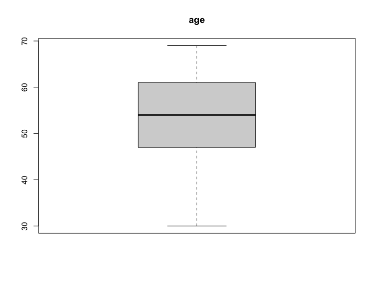
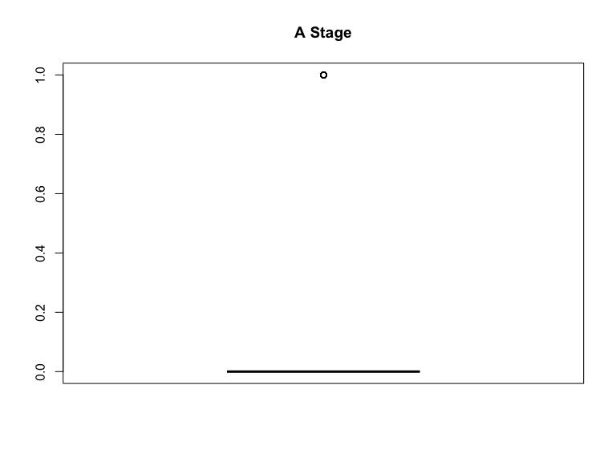
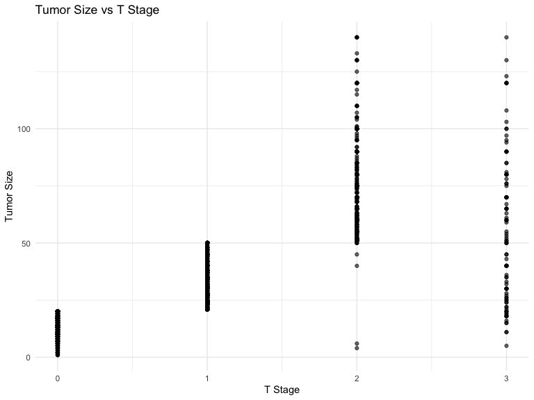

Final Project
================

``` r
library(gtsummary)
library(tidyverse)
```

    ## ── Attaching core tidyverse packages ──────────────────────── tidyverse 2.0.0 ──
    ## ✔ dplyr     1.1.3     ✔ readr     2.1.4
    ## ✔ forcats   1.0.0     ✔ stringr   1.5.0
    ## ✔ ggplot2   3.4.4     ✔ tibble    3.2.1
    ## ✔ lubridate 1.9.2     ✔ tidyr     1.3.0
    ## ✔ purrr     1.0.2     
    ## ── Conflicts ────────────────────────────────────────── tidyverse_conflicts() ──
    ## ✖ dplyr::filter() masks stats::filter()
    ## ✖ dplyr::lag()    masks stats::lag()
    ## ℹ Use the conflicted package (<http://conflicted.r-lib.org/>) to force all conflicts to become errors

``` r
library(car)
```

    ## Loading required package: carData
    ## 
    ## Attaching package: 'car'
    ## 
    ## The following object is masked from 'package:dplyr':
    ## 
    ##     recode
    ## 
    ## The following object is masked from 'package:purrr':
    ## 
    ##     some

``` r
library(caret)
```

    ## Loading required package: lattice
    ## 
    ## Attaching package: 'caret'
    ## 
    ## The following object is masked from 'package:purrr':
    ## 
    ##     lift

``` r
library(corrplot)
```

    ## corrplot 0.92 loaded

``` r
library(glmnet)
```

    ## Loading required package: Matrix
    ## 
    ## Attaching package: 'Matrix'
    ## 
    ## The following objects are masked from 'package:tidyr':
    ## 
    ##     expand, pack, unpack
    ## 
    ## Loaded glmnet 4.1-8

``` r
library(leaps)
library(pROC)
```

    ## Type 'citation("pROC")' for a citation.
    ## 
    ## Attaching package: 'pROC'
    ## 
    ## The following objects are masked from 'package:stats':
    ## 
    ##     cov, smooth, var

``` r
library(broom)
library(patchwork)

set.seed(123)

knitr::opts_chunk$set(
    echo = TRUE,
    warning = FALSE,
    fig.width = 8, 
  fig.height = 6,
  out.width = "90%"
)

options(
  ggplot2.continuous.colour = "viridis",
  ggplot2.continuous.fill = "viridis"
)

scale_colour_discrete = scale_colour_viridis_d
scale_fill_discrete = scale_fill_viridis_d

theme_set(theme_minimal() + theme(legend.position = "bottom"))
```

``` r
data = read_csv("./data/data.csv") |>
  janitor::clean_names()
```

    ## Rows: 4024 Columns: 16
    ## ── Column specification ────────────────────────────────────────────────────────
    ## Delimiter: ","
    ## chr (11): Race, Marital Status, T Stage, N Stage, 6th Stage, differentiate, ...
    ## dbl  (5): Age, Tumor Size, Regional Node Examined, Reginol Node Positive, Su...
    ## 
    ## ℹ Use `spec()` to retrieve the full column specification for this data.
    ## ℹ Specify the column types or set `show_col_types = FALSE` to quiet this message.

``` r
# Convert character to factor for regression analysis
clean_data = data |>
  mutate(
    race = as.numeric(factor(race, levels = c("White", "Black", "Other"))) - 1,
    marital_status = as.numeric(factor(marital_status, levels = c("Married", "Single", "Divorced", "Widowed", "Separated"))) - 1,
    t_stage = as.numeric(factor(t_stage, levels = c("T1", "T2", "T3", "T4"))) - 1,
    n_stage = as.numeric(factor(n_stage, levels = c("N1", "N2", "N3"))) - 1,
    x6th_stage = as.numeric(factor(x6th_stage, levels = c("IIA", "IIB", "IIIA", "IIIB", "IIIC"))) - 1,
    differentiate = as.numeric(factor(differentiate, levels = c("Undifferentiated", "Poorly differentiated", "Moderately differentiated", "Well differentiated"))) - 1,
    grade = as.numeric(factor(grade, levels = c("1", "2", "3", "anaplastic; Grade IV"))),
    a_stage = as.numeric(factor(a_stage, levels = c("Regional", "Distant"))) - 1,
    estrogen_status = as.numeric(factor(estrogen_status, levels = c("Negative", "Positive"))) - 1,
    progesterone_status = as.numeric(factor(progesterone_status, levels = c("Negative", "Positive"))) - 1,
    status = as.numeric(factor(status, levels = c("Dead", "Alive"))) - 1)|>
  rename(regional_node_positive = reginol_node_positive)
```

``` r
clean_data2=clean_data
```

# Pairs plot

# Use `windows` for windows system / `quartz` for macos system

# Use `quartz(width = 12, height = 12)` to open the window

# Use `dev.off()` to close the window

``` r
if (!dir.exists("plots")) {
    dir.create("plots")
}

png("plots/pairs_plot.png", 
    width = 12 * 600, 
    height = 12 * 600, 
    res = 600)

pairs(clean_data)
```

# Corr plot

``` r
png("plots/corr_plot.png", 
    width = 12 * 600, 
    height = 12 * 600, 
    res = 600)

corrplot(cor(clean_data), type = "upper", diag = FALSE)
```

# Plotting boxplot

``` r
plot_boxplot = function(data_vector, main_title, x_label = "") {
  boxplot(data_vector, 
          main = main_title, 
          xlab = x_label, 
          col = "lightblue")
}

png("plots/box_plot.png", 
    width = 12 * 600, 
    height = 12 * 600, 
    res = 600)

par(mar = c(2, 2, 2, 2))
par(mfrow = c(4, 4))


column_names = names(clean_data)
for (col_name in column_names) {
  plot_boxplot(clean_data[[col_name]], 
               main_title = col_name, 
               x_label = col_name)
}


dev.off()
```

    ## quartz_off_screen 
    ##                 2

# plotting histogram

``` r
plot_histogram = 
  function(data_vector, main_title, x_label = "") {
  hist(data_vector, 
       main = main_title, 
       xlab = x_label, 
       col = "blue")
}


png("plots/histogram_plot.png", 
    width = 12 * 600, 
    height = 12 * 600, res = 600)

par(mar = c(2, 2, 2, 2))
par(mfrow = c(4, 4))


column_names = names(clean_data)
for (col_name in column_names) {
  plot_histogram(clean_data[[col_name]], 
                 main_title = col_name, 
                 x_label = col_name)
}

dev.off()
```

    ## quartz_off_screen 
    ##                 2

``` r
boxplot(clean_data$age, main = "age")
```


1.  Age: The age box plot shows a fairly symmetrical distribution with a
    median around 50 years old, and the interquartile range (IQR)
    appears tight, suggesting that half of the values fall within a
    relatively small range. There are no visible outliers, and the
    distribution does not appear to be skewed, which indicates that a
    transformation may not be necessary for age in this dataset.

``` r
boxplot(clean_data$race, main = "race")
```



2.  Race: The race box plot indicates that the majority of the dataset’s
    observations fall into one category, with a few outliers in the
    higher categories. Given that race is a categorical variable, it
    does not require a numerical transformation.

``` r
boxplot(clean_data$marital_status, main = "marital status")
```


3.  Marital Status: The box plot for marital status shows a
    concentration of data in the lower categories with some outliers
    present in the higher categories, it does not require a numerical
    transformation.

``` r
boxplot(clean_data$t_stage, main = "T Stage")
```


4.  T Stage: The boxplot for T Stage suggests that most patients are in
    the early stages (0 and 1), with fewer patients in more advanced
    stages (2 and 3), as indicated by the median and interquartile
    range. There are outliers in stage 3, which might represent more
    severe cases. T Stage is an ordinal variable, representing the size
    and extent of the main tumor, and does not typically require
    numerical transformation.

``` r
boxplot(clean_data$n_stage, main = "N Stage")
```


5.  N Stage: The boxplot for N Stage indicates a distribution that is
    skewed towards the lower stages, with most data points falling in
    stage 0 or 1, and fewer in stage 2. There are no outliers, and the
    spread of the data suggests that most patients have no or minimal
    regional lymph node involvement.

``` r
boxplot(clean_data$x6th_stage, main = "X6th Stage")
```


6.  X6th Stage: The box plot for the x6th stage shows a relatively even
    distribution across the stags with the median at stage 1, indicating
    a moderate level of spread to distant parts of the body. The data
    points are well-contained within the whiskers, suggesting there are
    no outliers and no extreme values that would require transformation.

``` r
boxplot(clean_data$differentiate, main = "differentiate")
```


7.  Differentiate: The box plot for the ‘differentiate’ variable shows
    that the median level of tumor differentiation is around the lower
    middle range, with a fairly symmetrical distribution around this
    median. There are no visible outliers, indicating that there are no
    extreme cases in terms of tumor differentiation. Since
    ‘differentiate’ is likely an ordinal variable representing ordered
    categories of tumor differentiation, it does not require a numerical
    transformation

``` r
boxplot(clean_data$grade, main = "grade")
```


8.  Grade: The box plot for ‘grade’ shows a distribution that is fairly
    centered, with the median around the midpoint of the scale, which
    suggests an even spread of tumor grades in the dataset. The data is
    contained within the whiskers, indicating no outliers, and the
    grades are likely to be an ordinal variable where the numerical
    value indicates a ranking or level of severity. Therefore, no
    transformation is needed.

``` r
boxplot(clean_data$a_stage, main = "A Stage")
```


9.  A Stage: The box plot for ‘A Stage’ suggests that the majority of
    observations are concentrated at the lower end of the scale, with a
    single outlier indicating a case with a higher stage. This variable
    is also likely categorical or ordinal, reflecting stages of cancer,
    and as such, numerical transformation is not appropriate.

``` r
boxplot(clean_data$tumor_size, main = "Tumor Size")
```



10. Tumor Size: The box plot for ‘Tumor Size’ shows a wide range of
    sizes, with a concentration of smaller tumors and several outliers
    indicating much larger tumors. The distribution appears right-skewed
    due to these outliers. Given the skewness and presence of outliers,
    a transformation such as a logarithmic scale could be beneficial to
    normalize the data, which may be especially useful if ‘Tumor Size’
    is used as a predictor in regression analysis.

``` r
boxplot(clean_data$estrogen_status, main = "Estrogen Status")
```


11. Estrogen Status: The box plot for Estrogen Status suggests that it
    is a binary categorical variable, likely indicating the presence (1)
    or absence (0) of estrogen receptors in tumor samples. The plot
    shows that a large majority of the tumors are positive for estrogen
    receptors, with very few negative cases, as indicated by the outlier
    point at zero. As a binary variable, Estrogen Status does not
    require a numerical transformation for analysis.

``` r
boxplot(clean_data$progesterone_status, main = "Progesterone Status")
```


12. Progesterone Status: The box plot for Progesterone Status indicates
    that it is also a binary categorical variable, representing the
    presence (1) or absence (0) of progesterone receptors. Similar to
    the Estrogen Status, the vast majority of the data points indicate a
    positive status for progesterone receptors, with the outlier at zero
    representing the few negative cases. No transformation is needed for
    this type of categorical data.

``` r
boxplot(clean_data$regional_node_examined, main = "Regional Node Examined")
```


13. Regional Node Examined: The box plot for ‘Regional Node Examined’
    displays a right-skewed distribution with a significant number of
    outliers on the higher end, indicating that while most patients had
    a smaller number of nodes examined, there are some patients with a
    much larger number. Given the skewness and presence of outliers, a
    log transformation might be appropriate to normalize the
    distribution, especially if this variable is to be used in
    parametric statistical analyses that assume normality.

``` r
boxplot(clean_data$regional_node_positive, main = "Regional Node Positive")
```


14. Regional Node Positive: The box plot for ‘Regional Node Positive’
    indicates a distribution with a large number of outliers on the
    upper end, reflecting that while most patients have a relatively low
    number of positive regional nodes, there are several patients with a
    significantly higher count. Given the right skewness and the
    presence of many outliers, a log transformation could be appropriate
    to reduce the skewness and diminish the influence of outliers.

``` r
boxplot(clean_data$survival_months, main = "Survival Months")
```


15. Survival Months: The box plot for ‘Survival Months’ shows a
    distribution with a median below the halfway point of the box,
    suggesting a slight skew towards shorter survival times. There are
    outliers on the lower end, representing patients with very short
    survival times. Given the distribution’s skewness and presence of
    outliers, a transformation such as logarithmic or square root might
    help to normalize the data, particularly if ‘Survival Months’ is
    used as a continuous predictor in regression models requiring
    normally distributed residuals.

## Race

``` r
# Bar Plot for Race
p1 = ggplot(clean_data, aes(x = factor(race))) +
  geom_bar(fill = "orange") +
  ggtitle("Race Distribution") +
  xlab("Race") +
  ylab("Count")
```

#### Race Distribution

**The bar chart indicates a significant imbalance in the race
distribution of the patient sample, with the majority of patients being
of the race categorized as ‘o’ (White). Races ‘1’ (Black) and ‘2’
(other) are much less represented, suggesting that the patient data may
not be as diverse in terms of racial demographics.**

## Marital Status

``` r
# Bar Plot for Marital Status
p2 = ggplot(clean_data, aes(x = factor(marital_status))) +
  geom_bar(fill = "orange") +
  ggtitle("Marital Status Distribution") +
  xlab("Marital Status") +
  ylab("Count")
```

### Marital Status

**The bar chart shows that the largest group of patients falls under the
marital status category ‘0’, which is represent married, while the other
categories, which represent single, divorced, widowed, separated, are
less frequent. This suggests that the married patients are more
prevalent in this particular dataset.**

## t_stage

``` r
# Bar Plot for t_stage
p3 = ggplot(clean_data, aes(x = factor(t_stage))) +
  geom_bar(fill = "orange") +
  ggtitle("T Stage Distribution") +
  xlab("T Stage") +
  ylab("Count")
```

## n_stage

``` r
# Bar Plot for n_stage
p4 = ggplot(clean_data, aes(x = factor(n_stage))) +
  geom_bar(fill = "orange") +
  ggtitle("N Stage Distribution") +
  xlab("N Stage") +
  ylab("Count")
```

## x6th_stage

``` r
# Bar Plot for x6th_stage
p5 = ggplot(clean_data, aes(x = factor(x6th_stage))) +
  geom_bar(fill = "orange") +
  ggtitle("x6th Stage Distribution") +
  xlab("x6th Stage") +
  ylab("Count")
```

## Tumor Size and Stage

``` r
# Scatter Plot for Tumor Size and T stage
ggplot(clean_data, aes(x = t_stage, y = tumor_size)) +
  geom_point(alpha = 0.6) +
  ggtitle("Tumor Size vs T Stage") +
  xlab("T Stage") +
  ylab("Tumor Size")
```



**The scatter plot suggests a possible trend where higher T stage
classifications; however, there is considerable variation within each T
stage category. Notably, T stages 1(2) through 3(4) show a wide range of
tumor sizes, with some larger tumors present in earlier stages and
smaller tumors in later stages, indicating that tumor size alone may not
be a definitive indicator of T stage.**

## differentiate

``` r
# Bar Plot for differentiate
p6 = ggplot(clean_data, aes(x = factor(differentiate))) +
  geom_bar(fill = "orange") +
  ggtitle("Diffferentiate Distribution") +
  xlab("Differentiate") +
  ylab("Count")
```

## grade

``` r
# Bar Plot for grade
p7 = ggplot(clean_data, aes(x = factor(grade))) +
  geom_bar(fill = "orange") +
  ggtitle("Grade Distribution") +
  xlab("Grade") +
  ylab("Count")
```

# a_stage

``` r
# Bar Plot for a_stage
p8 = ggplot(clean_data, aes(x = factor(a_stage))) +
  geom_bar(fill = "orange") +
  ggtitle("A Stage Distribution") +
  xlab("A Stage") +
  ylab("Count")
```

## tumor_size

``` r
# Bar Plot for tumor_size
ggplot(clean_data, aes(x = factor(tumor_size))) +
  geom_bar(fill = "orange") +
  ggtitle("Tumor Size Distribution") +
  xlab("Tumor Size") +
  ylab("Count")
```


## Survival Months and Status

``` r
# Boxplot for Survival Months by Status
ggplot(clean_data, aes(x = factor(status), y = survival_months)) +
  geom_boxplot(fill = "purple") +
  ggtitle("Survival Months by Patient Status") +
  xlab("Status (0: Dead, 1: Alive") +
  ylab("Survival Months")
```


**The boxplot displays that patients who are alive(Status 1) have a
wider range and generally higher survival months compared to those who
are dead (Status 0), where the survival time is more concentrated in a
lower range. This suggests a clear distinction in survival months
between the two groups, with patients who are alive experiencing longer
survival peridos post-diagnosis or treatment.**

## estrogen_status

``` r
# Bar Plot for estrogen_sstatus
p9 = ggplot(clean_data, aes(x = factor(estrogen_status))) +
  geom_bar(fill = "orange") +
  ggtitle("Estrogen Status Distribution") +
  xlab("Estrogen Status Stage") +
  ylab("Count")
```

# Progesterone_status

``` r
# Bar Plot for progesterone_status
p10 = ggplot(clean_data, aes(x = factor(progesterone_status))) +
  geom_bar(fill = "orange") +
  ggtitle("Progesterone Status Distribution") +
  xlab("Progesterone Status") +
  ylab("Count")
```

## Status

``` r
# Bar Plot for status
p11 = ggplot(clean_data, aes(x = factor(status))) +
  geom_bar(fill = "orange") +
  ggtitle("Status Distribution") +
  xlab("Status Stage") +
  ylab("Count")
```

## Hormone Status and Stage

``` r
# Bar Plot for Estrogen Status by T Stage
ggplot(clean_data, aes(x = factor(t_stage), fill = factor(estrogen_status))) +
  geom_bar(position = "dodge") +
  ggtitle("Estrogen Status by T Stage") +
  xlab("T Stage") +
  ylab("Count")
```


**The bar chart illustrates that the majority of patients across all T
stages have an estrogen status of “1” , which indicate a positive
hormone receptor sstatus. The prevalence of estrogen-positive status
decreases slightly in higher T stages, but it remains the dominant
category, suggesting a potential correlation between estrogen receptor
positivity and the presence of cancer across different T stages.**

## Regional Node Analysis

``` r
# Scatter Plot for Regional Nodes Examined vs Positive
ggplot(clean_data, aes(x = regional_node_examined, y = regional_node_positive)) +
  geom_point(color = "red", alpha = 0.5) +
  ggtitle("Regional Nodes Examined vs Positive") +
  xlab("Regional Nodes Examined") +
  ylab("Regional Nodes Positive")
```


**The scatter plot reveals a trend where the number of positive regional
nodes increases with the number off nodes examined, up to a point.
However, there is notable variability, especially when fewer nodes are
examined. Beyond a certain number of examined nodes, the count of
positive nodes tot level off, suggesting that examining more nodes does
not always correlate with finding a higher number of positive nodes.**

``` r
ggplot(clean_data, aes(x = differentiate, fill = factor(status))) +
  geom_bar(position = "fill") +
  scale_fill_manual(values = c("0" = "red", "1" = "green"),
                    labels = c("Dead", "Alive")) +
  labs(x = "Differentiation Level",
       y = "Proportion",
       fill = "Status") +
  ggtitle("Patient Status by Tumor Diffferentiation") +
  theme_minimal()
```


**The bar chart indicates that the proportion of deceased patients (red)
is consistent across all levles of tumor differentiation, suggesting
that within this dataset, the differentiation level of the tumor may not
be a strong predictor of patient survival status.**

``` r
ggplot(clean_data, aes(x = factor(differentiate), 
                       y = survival_months, 
                       fill = as.factor(status))) +
  geom_boxplot() +
  scale_fill_manual(values = c("0" = "red", "1" = "green"),
                    labels = c("Dead", "Alive")) +
  labs(x = "Differentiation Level",
       y = "Proportion",
       fill = "Status") +
  ggtitle("Patient Status by Tumor Diffferentiation") +
  theme_minimal()
```


# combine barplot for charactter variables

``` r
p1 + p2 + p3 + p4 + p5 + p6 + p7 + p8 + p9 + p10 + p11
```


# Histogram for numeric variables

``` r
par(mfrow = c(3,2))
hist(data$age, main = "Age")
hist(data$tumor_size, main = "Tumor Size")
hist(data$regional_node_examined, main = "Regional Node Examined")
hist(data$reginol_node_positive, main = "Regional Node Positive")
hist(data$survival_months, main = "Survival Months")
```


# race : age

``` r
# Convert numerical values to factors with appropriate labels
clean_data$race = factor(clean_data$race,
                         levels = c(0, 1, 2),
                         labels = c("White", "Black", "Other"))

clean_data$age = cut(clean_data$age, 
                        breaks = c(-Inf, 30, 50, Inf),
                        labels = c("Under 30", "30-50", "Over 50"),
                        right = FALSE)

clean_data$status = factor(clean_data$status, 
                            levels = c(0, 1),
                            labels = c("Dead", "Alive"))

# Group and summarize the data
summary_data_a = clean_data |>
  group_by(age, race, status) |>
  summarise(count = n(), .groups = "drop")

# Create a bar plot
ggplot(summary_data_a, aes(x = age, y = count, fill = status)) +
  geom_bar(stat = "identity", position = position_dodge()) +
  scale_fill_brewer(palette = "Set1") +
  facet_wrap(~race, scales = "free_y") +
  labs(title = "Age and Death Status by Race", 
       x = "Age", 
       y = "Count") +
  theme_minimal() +
  theme(legend.position = "bottom",
        axis.text = element_text(angle = 45, hjust = 1),
        plot.title = element_text(size = 14, face = "bold"),
        strip.background = element_rect(fill = "lightblue"),
        strip.text.x = element_text(size = 10, face = "bold"))
```


# race: marital status

``` r
# Convert numerical values to factors with appropriate labels


clean_data$marital_status = factor(clean_data$marital_status, 
                                    levels = c(0, 1, 2, 3, 4),
                                    labels = c("Married", "Single", "Divorced", "Widowed", "Seperated"))


# Group and summarize the data
summary_data_b = clean_data |>
  group_by(marital_status, race, status) |>
  summarise(count = n(), .groups = "drop")

# Create a bar plot
ggplot(summary_data_b, aes(x = marital_status, y = count, fill = status)) +
  geom_bar(stat = "identity", position = position_dodge()) +
  scale_fill_brewer(palette = "Set1") +
  facet_wrap(~race, scales = "free_y") +
  labs(title = "Marital Status vs Death Status by Race", 
       x = "Marital Status", 
       y = "Count") +
  theme_minimal() +
  theme(legend.position = "bottom",
        axis.text = element_text(angle = 45, hjust = 1),
        plot.title = element_text(size = 14, face = "bold"),
        strip.background = element_rect(fill = "lightblue"),
        strip.text.x = element_text(size = 10, face = "bold"))
```


The bar chart illustrates the count of individuals by marital status and
their survival status, segmented by race. It’s evident that for the
White and Other race categories, the majority of individuals are married
and alive, while the Black race category has a higher count of single
individuals who are alive. Across all race categories, the number of
deceased individuals is significantly lower than those alive, with the
widowed status showing a higher count of deceased individuals
particularly in the White race category.

``` r
data = data |>
  select(-survival_months)
```

\#Model fitting \#Based on boxplots, transformaiton is necesessary to
reduce outliers \#cube root of tumor size \#log of regional_node_examied
\#log of regional_node_positive \#Figure 1

``` r
proj2 = data |>
tbl_summary(by="status",
  missing_text = "(Missing)", # counts missing values
  statistic = list(all_continuous() ~ "mean={mean} (min={min}, max={max}, sd={sd})",
                   all_categorical() ~ "n={n} (p={p}%)") # stats for categorical
  ) |>
bold_labels()  |>
italicize_levels()


clean_data2$tumor_size= (clean_data$tumor_size)^(1/3)
clean_data2$regional_node_examined = log(clean_data$regional_node_examined)
clean_data2$regional_node_positive = log(clean_data$regional_node_positive)
```

\#Find correlation

``` r
corplot=cor(clean_data2)
corrplot(corplot)
```


``` r
#tumor_size vs t_stage = 0.801
#grade=differentiate =>1
#n_stage = x6th_stage => 0.881
#n_stage = regional positive status =>0.838073333
selected_data = clean_data2 |>
  select(-tumor_size, -grade,-n_stage,-regional_node_positive,-x6th_stage)

corplot=cor(selected_data)
corrplot(corplot)
```


\#Separate training and testing set (80% training 20% testing )

``` r
# Calculate the size of each of the data sets
data_size = nrow(clean_data2)
train_size = floor(0.8 * data_size)

# Create a random sample of row indices for the training set
train_indices = sample(sample(seq_len(data_size), size = train_size))

# Subset the data into training and testing sets
train_set = clean_data2[train_indices, ]
selectedData_train_set = selected_data[train_indices,]
test_set = clean_data2[-train_indices, ]
selectedData_test_set = selected_data[-train_indices, ]
```

# Fit a full model

``` r
selected_train = train_set |>
  select(-tumor_size, -grade,-n_stage,-regional_node_positive,-x6th_stage)

null_model = glm(status ~ 1, family = binomial(link = "logit"), data = selected_train)

full_model=glm(status ~ . , family = binomial(link = "logit"), data = selected_train)

interaction_race_age = glm(status ~ . + race:age, family = binomial(link = "logit"), data = selected_train)

interaction_race_marital_status = glm(status ~ . + race:marital_status,  family = binomial(link = "logit"), data = selected_train)
```

# Check logistic regression assumptions

Binary logistic regression relies on underlying assumptions to be true:

1.The outcome is a binary or dichotomous variable like yes vs no,
positive vs negative, 1 vs 0. 2.There is a linear relationship between
the logit of the outcome(status) and each predictor variables. Recall
that the logit function is logit(p) = log(p/(1-p)), where p is the
probabilities of the outcome. 3.There is no influential values in the
continuous predictors. 4.There is no multicollinearity among the
predictors.

## Checking Linearity of continuous variables to the response

\##HENRY - MAY BE NOT NECESSARY

# Using Forward, BackWard

    ## Start:  AIC=2782.19
    ## status ~ 1
    ## 
    ##                          Df Deviance    AIC
    ## + survival_months         1   2032.8 2036.8
    ## + progesterone_status     1   2684.9 2688.9
    ## + estrogen_status         1   2689.6 2693.6
    ## + differentiate           1   2698.9 2702.9
    ## + t_stage                 1   2705.8 2709.8
    ## + marital_status          1   2758.5 2762.5
    ## + a_stage                 1   2762.0 2766.0
    ## + age                     1   2768.2 2772.2
    ## + regional_node_examined  1   2777.7 2781.7
    ## <none>                        2780.2 2782.2
    ## + race                    1   2780.2 2784.2
    ## 
    ## Step:  AIC=2036.8
    ## status ~ survival_months
    ## 
    ##                          Df Deviance    AIC
    ## + differentiate           1   1974.6 1980.6
    ## + t_stage                 1   1983.5 1989.5
    ## + progesterone_status     1   1990.6 1996.6
    ## + estrogen_status         1   2001.7 2007.7
    ## + age                     1   2015.6 2021.6
    ## + marital_status          1   2020.6 2026.6
    ## + a_stage                 1   2026.7 2032.7
    ## <none>                        2032.8 2036.8
    ## + regional_node_examined  1   2031.7 2037.7
    ## + race                    1   2032.4 2038.4
    ## 
    ## Step:  AIC=1980.58
    ## status ~ survival_months + differentiate
    ## 
    ##                          Df Deviance    AIC
    ## + t_stage                 1   1937.6 1945.6
    ## + progesterone_status     1   1948.7 1956.7
    ## + age                     1   1951.3 1959.3
    ## + estrogen_status         1   1959.7 1967.7
    ## + marital_status          1   1963.2 1971.2
    ## + a_stage                 1   1969.4 1977.4
    ## <none>                        1974.6 1980.6
    ## + race                    1   1973.8 1981.8
    ## + regional_node_examined  1   1974.5 1982.5
    ## 
    ## Step:  AIC=1945.57
    ## status ~ survival_months + differentiate + t_stage
    ## 
    ##                          Df Deviance    AIC
    ## + age                     1   1909.3 1919.3
    ## + progesterone_status     1   1913.2 1923.2
    ## + estrogen_status         1   1924.3 1934.3
    ## + marital_status          1   1926.6 1936.6
    ## <none>                        1937.6 1945.6
    ## + a_stage                 1   1936.6 1946.6
    ## + race                    1   1936.8 1946.8
    ## + regional_node_examined  1   1937.4 1947.4
    ## 
    ## Step:  AIC=1919.26
    ## status ~ survival_months + differentiate + t_stage + age
    ## 
    ##                          Df Deviance    AIC
    ## + progesterone_status     1   1887.4 1899.4
    ## + estrogen_status         1   1893.8 1905.8
    ## + marital_status          1   1902.8 1914.8
    ## <none>                        1909.3 1919.3
    ## + a_stage                 1   1907.5 1919.5
    ## + race                    1   1909.2 1921.2
    ## + regional_node_examined  1   1909.3 1921.3
    ## 
    ## Step:  AIC=1899.44
    ## status ~ survival_months + differentiate + t_stage + age + progesterone_status
    ## 
    ##                          Df Deviance    AIC
    ## + marital_status          1   1881.8 1895.8
    ## + estrogen_status         1   1884.0 1898.0
    ## <none>                        1887.4 1899.4
    ## + a_stage                 1   1885.7 1899.7
    ## + race                    1   1887.4 1901.4
    ## + regional_node_examined  1   1887.4 1901.4
    ## 
    ## Step:  AIC=1895.77
    ## status ~ survival_months + differentiate + t_stage + age + progesterone_status + 
    ##     marital_status
    ## 
    ##                          Df Deviance    AIC
    ## + estrogen_status         1   1878.3 1894.3
    ## <none>                        1881.8 1895.8
    ## + a_stage                 1   1880.0 1896.0
    ## + race                    1   1881.7 1897.7
    ## + regional_node_examined  1   1881.8 1897.8
    ## 
    ## Step:  AIC=1894.3
    ## status ~ survival_months + differentiate + t_stage + age + progesterone_status + 
    ##     marital_status + estrogen_status
    ## 
    ##                          Df Deviance    AIC
    ## <none>                        1878.3 1894.3
    ## + a_stage                 1   1876.6 1894.6
    ## + race                    1   1878.1 1896.1
    ## + regional_node_examined  1   1878.3 1896.3

    ## Start:  AIC=1898.46
    ## status ~ age + race + marital_status + t_stage + differentiate + 
    ##     a_stage + estrogen_status + progesterone_status + regional_node_examined + 
    ##     survival_months
    ## 
    ##                          Df Deviance    AIC
    ## - regional_node_examined  1   1876.5 1896.5
    ## - race                    1   1876.6 1896.6
    ## - a_stage                 1   1878.1 1898.1
    ## <none>                        1876.5 1898.5
    ## - estrogen_status         1   1879.9 1899.9
    ## - marital_status          1   1882.2 1902.2
    ## - progesterone_status     1   1885.7 1905.7
    ## - age                     1   1899.5 1919.5
    ## - differentiate           1   1909.9 1929.9
    ## - t_stage                 1   1910.1 1930.1
    ## - survival_months         1   2522.9 2542.9
    ## 
    ## Step:  AIC=1896.46
    ## status ~ age + race + marital_status + t_stage + differentiate + 
    ##     a_stage + estrogen_status + progesterone_status + survival_months
    ## 
    ##                       Df Deviance    AIC
    ## - race                 1   1876.6 1894.6
    ## - a_stage              1   1878.1 1896.1
    ## <none>                     1876.5 1896.5
    ## - estrogen_status      1   1879.9 1897.9
    ## - marital_status       1   1882.2 1900.2
    ## - progesterone_status  1   1885.8 1903.8
    ## - age                  1   1899.6 1917.6
    ## - differentiate        1   1910.1 1928.1
    ## - t_stage              1   1910.3 1928.3
    ## - survival_months      1   2522.9 2540.9
    ## 
    ## Step:  AIC=1894.63
    ## status ~ age + marital_status + t_stage + differentiate + a_stage + 
    ##     estrogen_status + progesterone_status + survival_months
    ## 
    ##                       Df Deviance    AIC
    ## - a_stage              1   1878.3 1894.3
    ## <none>                     1876.6 1894.6
    ## - estrogen_status      1   1880.0 1896.0
    ## - marital_status       1   1882.3 1898.3
    ## - progesterone_status  1   1886.0 1902.0
    ## - age                  1   1900.4 1916.4
    ## - differentiate        1   1910.2 1926.2
    ## - t_stage              1   1910.6 1926.6
    ## - survival_months      1   2522.9 2538.9
    ## 
    ## Step:  AIC=1894.3
    ## status ~ age + marital_status + t_stage + differentiate + estrogen_status + 
    ##     progesterone_status + survival_months
    ## 
    ##                       Df Deviance    AIC
    ## <none>                     1878.3 1894.3
    ## - estrogen_status      1   1881.8 1895.8
    ## - marital_status       1   1884.0 1898.0
    ## - progesterone_status  1   1887.6 1901.6
    ## - age                  1   1901.5 1915.5
    ## - differentiate        1   1911.5 1925.5
    ## - t_stage              1   1917.2 1931.2
    ## - survival_months      1   2526.1 2540.1

    ## 
    ## Call:
    ## glm(formula = status ~ age + marital_status + t_stage + differentiate + 
    ##     estrogen_status + progesterone_status + survival_months, 
    ##     family = binomial(link = "logit"), data = selected_train)
    ## 
    ## Coefficients:
    ##                      Estimate Std. Error z value Pr(>|z|)    
    ## (Intercept)         -1.768026   0.451305  -3.918 8.94e-05 ***
    ## age                 -0.032670   0.006886  -4.744 2.09e-06 ***
    ## marital_status      -0.137613   0.057121  -2.409  0.01599 *  
    ## t_stage             -0.479770   0.076927  -6.237 4.47e-10 ***
    ## differentiate        0.568043   0.100015   5.680 1.35e-08 ***
    ## estrogen_status      0.459858   0.245832   1.871  0.06140 .  
    ## progesterone_status  0.514404   0.166021   3.098  0.00195 ** 
    ## survival_months      0.063590   0.003054  20.820  < 2e-16 ***
    ## ---
    ## Signif. codes:  0 '***' 0.001 '**' 0.01 '*' 0.05 '.' 0.1 ' ' 1
    ## 
    ## (Dispersion parameter for binomial family taken to be 1)
    ## 
    ##     Null deviance: 2780.2  on 3218  degrees of freedom
    ## Residual deviance: 1878.3  on 3211  degrees of freedom
    ## AIC: 1894.3
    ## 
    ## Number of Fisher Scoring iterations: 6

    ## 
    ## Call:
    ## glm(formula = status ~ survival_months + differentiate + t_stage + 
    ##     age + progesterone_status + marital_status + estrogen_status, 
    ##     family = binomial(link = "logit"), data = selected_train)
    ## 
    ## Coefficients:
    ##                      Estimate Std. Error z value Pr(>|z|)    
    ## (Intercept)         -1.768026   0.451305  -3.918 8.94e-05 ***
    ## survival_months      0.063590   0.003054  20.820  < 2e-16 ***
    ## differentiate        0.568043   0.100015   5.680 1.35e-08 ***
    ## t_stage             -0.479770   0.076927  -6.237 4.47e-10 ***
    ## age                 -0.032670   0.006886  -4.744 2.09e-06 ***
    ## progesterone_status  0.514404   0.166021   3.098  0.00195 ** 
    ## marital_status      -0.137613   0.057121  -2.409  0.01599 *  
    ## estrogen_status      0.459858   0.245832   1.871  0.06140 .  
    ## ---
    ## Signif. codes:  0 '***' 0.001 '**' 0.01 '*' 0.05 '.' 0.1 ' ' 1
    ## 
    ## (Dispersion parameter for binomial family taken to be 1)
    ## 
    ##     Null deviance: 2780.2  on 3218  degrees of freedom
    ## Residual deviance: 1878.3  on 3211  degrees of freedom
    ## AIC: 1894.3
    ## 
    ## Number of Fisher Scoring iterations: 6

    ## Analysis of Deviance Table
    ## 
    ## Model 1: status ~ age + marital_status + t_stage + differentiate + estrogen_status + 
    ##     progesterone_status + survival_months
    ## Model 2: status ~ survival_months + differentiate + t_stage + age + progesterone_status + 
    ##     marital_status + estrogen_status
    ##   Resid. Df Resid. Dev Df Deviance Pr(>Chi)
    ## 1      3211     1878.3                     
    ## 2      3211     1878.3  0        0

    ## Setting levels: control = 0, case = 1

    ## Setting direction: controls < cases

    ## Area under the curve: 0.8372

# Interaction: race \*marital_status

``` r
step_modelF_2 = step(null_model, scope = list(lower = null_model, upper = interaction_race_marital_status), 
                   direction = "forward")
```

    ## Start:  AIC=2782.19
    ## status ~ 1
    ## 
    ##                          Df Deviance    AIC
    ## + survival_months         1   2032.8 2036.8
    ## + progesterone_status     1   2684.9 2688.9
    ## + estrogen_status         1   2689.6 2693.6
    ## + differentiate           1   2698.9 2702.9
    ## + t_stage                 1   2705.8 2709.8
    ## + marital_status          1   2758.5 2762.5
    ## + a_stage                 1   2762.0 2766.0
    ## + age                     1   2768.2 2772.2
    ## + regional_node_examined  1   2777.7 2781.7
    ## <none>                        2780.2 2782.2
    ## + race                    1   2780.2 2784.2
    ## 
    ## Step:  AIC=2036.8
    ## status ~ survival_months
    ## 
    ##                          Df Deviance    AIC
    ## + differentiate           1   1974.6 1980.6
    ## + t_stage                 1   1983.5 1989.5
    ## + progesterone_status     1   1990.6 1996.6
    ## + estrogen_status         1   2001.7 2007.7
    ## + age                     1   2015.6 2021.6
    ## + marital_status          1   2020.6 2026.6
    ## + a_stage                 1   2026.7 2032.7
    ## <none>                        2032.8 2036.8
    ## + regional_node_examined  1   2031.7 2037.7
    ## + race                    1   2032.4 2038.4
    ## 
    ## Step:  AIC=1980.58
    ## status ~ survival_months + differentiate
    ## 
    ##                          Df Deviance    AIC
    ## + t_stage                 1   1937.6 1945.6
    ## + progesterone_status     1   1948.7 1956.7
    ## + age                     1   1951.3 1959.3
    ## + estrogen_status         1   1959.7 1967.7
    ## + marital_status          1   1963.2 1971.2
    ## + a_stage                 1   1969.4 1977.4
    ## <none>                        1974.6 1980.6
    ## + race                    1   1973.8 1981.8
    ## + regional_node_examined  1   1974.5 1982.5
    ## 
    ## Step:  AIC=1945.57
    ## status ~ survival_months + differentiate + t_stage
    ## 
    ##                          Df Deviance    AIC
    ## + age                     1   1909.3 1919.3
    ## + progesterone_status     1   1913.2 1923.2
    ## + estrogen_status         1   1924.3 1934.3
    ## + marital_status          1   1926.6 1936.6
    ## <none>                        1937.6 1945.6
    ## + a_stage                 1   1936.6 1946.6
    ## + race                    1   1936.8 1946.8
    ## + regional_node_examined  1   1937.4 1947.4
    ## 
    ## Step:  AIC=1919.26
    ## status ~ survival_months + differentiate + t_stage + age
    ## 
    ##                          Df Deviance    AIC
    ## + progesterone_status     1   1887.4 1899.4
    ## + estrogen_status         1   1893.8 1905.8
    ## + marital_status          1   1902.8 1914.8
    ## <none>                        1909.3 1919.3
    ## + a_stage                 1   1907.5 1919.5
    ## + race                    1   1909.2 1921.2
    ## + regional_node_examined  1   1909.3 1921.3
    ## 
    ## Step:  AIC=1899.44
    ## status ~ survival_months + differentiate + t_stage + age + progesterone_status
    ## 
    ##                          Df Deviance    AIC
    ## + marital_status          1   1881.8 1895.8
    ## + estrogen_status         1   1884.0 1898.0
    ## <none>                        1887.4 1899.4
    ## + a_stage                 1   1885.7 1899.7
    ## + race                    1   1887.4 1901.4
    ## + regional_node_examined  1   1887.4 1901.4
    ## 
    ## Step:  AIC=1895.77
    ## status ~ survival_months + differentiate + t_stage + age + progesterone_status + 
    ##     marital_status
    ## 
    ##                          Df Deviance    AIC
    ## + estrogen_status         1   1878.3 1894.3
    ## <none>                        1881.8 1895.8
    ## + a_stage                 1   1880.0 1896.0
    ## + race                    1   1881.7 1897.7
    ## + regional_node_examined  1   1881.8 1897.8
    ## 
    ## Step:  AIC=1894.3
    ## status ~ survival_months + differentiate + t_stage + age + progesterone_status + 
    ##     marital_status + estrogen_status
    ## 
    ##                          Df Deviance    AIC
    ## <none>                        1878.3 1894.3
    ## + a_stage                 1   1876.6 1894.6
    ## + race                    1   1878.1 1896.1
    ## + regional_node_examined  1   1878.3 1896.3

``` r
step_model_2 = step(interaction_race_marital_status, direction = "backward")
```

    ## Start:  AIC=1896.59
    ## status ~ age + race + marital_status + t_stage + differentiate + 
    ##     a_stage + estrogen_status + progesterone_status + regional_node_examined + 
    ##     survival_months + race:marital_status
    ## 
    ##                          Df Deviance    AIC
    ## - regional_node_examined  1   1872.6 1894.6
    ## - a_stage                 1   1874.3 1896.3
    ## <none>                        1872.6 1896.6
    ## - estrogen_status         1   1876.0 1898.0
    ## - race:marital_status     1   1876.5 1898.5
    ## - progesterone_status     1   1881.7 1903.7
    ## - age                     1   1895.3 1917.3
    ## - t_stage                 1   1904.9 1926.9
    ## - differentiate           1   1906.2 1928.2
    ## - survival_months         1   2517.5 2539.5
    ## 
    ## Step:  AIC=1894.59
    ## status ~ age + race + marital_status + t_stage + differentiate + 
    ##     a_stage + estrogen_status + progesterone_status + survival_months + 
    ##     race:marital_status
    ## 
    ##                       Df Deviance    AIC
    ## - a_stage              1   1874.3 1894.3
    ## <none>                     1872.6 1894.6
    ## - estrogen_status      1   1876.0 1896.0
    ## - race:marital_status  1   1876.5 1896.5
    ## - progesterone_status  1   1881.7 1901.7
    ## - age                  1   1895.4 1915.4
    ## - t_stage              1   1905.2 1925.2
    ## - differentiate        1   1906.5 1926.5
    ## - survival_months      1   2517.5 2537.5
    ## 
    ## Step:  AIC=1894.35
    ## status ~ age + race + marital_status + t_stage + differentiate + 
    ##     estrogen_status + progesterone_status + survival_months + 
    ##     race:marital_status
    ## 
    ##                       Df Deviance    AIC
    ## <none>                     1874.3 1894.3
    ## - estrogen_status      1   1877.9 1895.9
    ## - race:marital_status  1   1878.1 1896.1
    ## - progesterone_status  1   1883.4 1901.4
    ## - age                  1   1896.5 1914.5
    ## - differentiate        1   1907.9 1925.9
    ## - t_stage              1   1912.0 1930.0
    ## - survival_months      1   2520.9 2538.9

``` r
summary(step_model_2)
```

    ## 
    ## Call:
    ## glm(formula = status ~ age + race + marital_status + t_stage + 
    ##     differentiate + estrogen_status + progesterone_status + survival_months + 
    ##     race:marital_status, family = binomial(link = "logit"), data = selected_train)
    ## 
    ## Coefficients:
    ##                      Estimate Std. Error z value Pr(>|z|)    
    ## (Intercept)         -1.851020   0.459135  -4.032 5.54e-05 ***
    ## age                 -0.032202   0.006932  -4.645 3.40e-06 ***
    ## race                 0.180590   0.131826   1.370  0.17071    
    ## marital_status      -0.089310   0.063057  -1.416  0.15668    
    ## t_stage             -0.473185   0.077128  -6.135 8.51e-10 ***
    ## differentiate        0.571790   0.100163   5.709 1.14e-08 ***
    ## estrogen_status      0.464341   0.247098   1.879  0.06022 .  
    ## progesterone_status  0.508831   0.166358   3.059  0.00222 ** 
    ## survival_months      0.063652   0.003061  20.795  < 2e-16 ***
    ## race:marital_status -0.181720   0.093224  -1.949  0.05126 .  
    ## ---
    ## Signif. codes:  0 '***' 0.001 '**' 0.01 '*' 0.05 '.' 0.1 ' ' 1
    ## 
    ## (Dispersion parameter for binomial family taken to be 1)
    ## 
    ##     Null deviance: 2780.2  on 3218  degrees of freedom
    ## Residual deviance: 1874.4  on 3209  degrees of freedom
    ## AIC: 1894.4
    ## 
    ## Number of Fisher Scoring iterations: 6

``` r
summary(step_modelF_2)
```

    ## 
    ## Call:
    ## glm(formula = status ~ survival_months + differentiate + t_stage + 
    ##     age + progesterone_status + marital_status + estrogen_status, 
    ##     family = binomial(link = "logit"), data = selected_train)
    ## 
    ## Coefficients:
    ##                      Estimate Std. Error z value Pr(>|z|)    
    ## (Intercept)         -1.768026   0.451305  -3.918 8.94e-05 ***
    ## survival_months      0.063590   0.003054  20.820  < 2e-16 ***
    ## differentiate        0.568043   0.100015   5.680 1.35e-08 ***
    ## t_stage             -0.479770   0.076927  -6.237 4.47e-10 ***
    ## age                 -0.032670   0.006886  -4.744 2.09e-06 ***
    ## progesterone_status  0.514404   0.166021   3.098  0.00195 ** 
    ## marital_status      -0.137613   0.057121  -2.409  0.01599 *  
    ## estrogen_status      0.459858   0.245832   1.871  0.06140 .  
    ## ---
    ## Signif. codes:  0 '***' 0.001 '**' 0.01 '*' 0.05 '.' 0.1 ' ' 1
    ## 
    ## (Dispersion parameter for binomial family taken to be 1)
    ## 
    ##     Null deviance: 2780.2  on 3218  degrees of freedom
    ## Residual deviance: 1878.3  on 3211  degrees of freedom
    ## AIC: 1894.3
    ## 
    ## Number of Fisher Scoring iterations: 6

``` r
test_predictions_log_oddsStep_2 = predict(step_modelF_2, newdata  = (test_set),type='response')
test_predictions_probStep_2 = plogis(test_predictions_log_oddsStep_2)
roc_curveStep_2 = roc(response = (test_set$status), predictor = as.numeric(test_predictions_probStep_2))
```

    ## Setting levels: control = 0, case = 1

    ## Setting direction: controls < cases

``` r
auc(roc_curveStep_2)
```

    ## Area under the curve: 0.8372

\#Elastic Net

``` r
# Prepare your data
X <- as.matrix(train_set[, setdiff(names(train_set), "status")])  # Predictor variables
y <- train_set$status  # Response variable

lambda_seq <- 10^seq(-2, 0, by = .001)

# Use cross-validation to find the optimal lambda
cv_object <- cv.glmnet(X, y, family = "binomial", alpha = 0.5, type.measure = "class",nfolds=5, lambda = lambda_seq)

tibble(lambda = cv_object$lambda,
mean_cv_error = cv_object$cvm) %>%
ggplot(aes(x = lambda, y = mean_cv_error)) +
geom_point()
```


``` r
# Best lambda value
best_lambda <- cv_object$lambda.min
# Refit the model using the best lambda
final_model <- glmnet(X, y, family = "binomial", alpha = 0.5, lambda = best_lambda)

test_set2 <- test_set|> select(-status)
test_predictions_log_odds <- predict(final_model, newx = as.matrix(test_set2))

# Convert log-odds to probabilities
test_predictions_probElastic <- plogis(test_predictions_log_odds)
# Create the ROC curve
roc_curve <- roc(response = as.matrix(test_set$status), predictor = as.numeric(test_predictions_probElastic) )
```

    ## Setting levels: control = 0, case = 1

    ## Setting direction: controls < cases

``` r
auc(roc_curve)
```

    ## Area under the curve: 0.8688

\#Elastic net 2 \##Training without full variables

``` r
X2 <- as.matrix(selectedData_train_set[, setdiff(names(selectedData_train_set), "status")])  # Predictor variables
# Use cross-validation to find the optimal lambda
cv_object <- cv.glmnet(X2, y, family = "binomial", alpha = 0.5, type.measure = "class",nfolds=5, lambda = lambda_seq)

tibble(lambda = cv_object$lambda,
mean_cv_error = cv_object$cvm) %>%
ggplot(aes(x = lambda, y = mean_cv_error)) +
geom_point()
```


``` r
# Best lambda value
best_lambda <- cv_object$lambda.min
# Refit the model using the best lambda
final_model2 <- glmnet(X2, y, family = "binomial", alpha = 0.5, lambda = best_lambda)

selectedData_test_set <- selectedData_test_set|> select(-status)
test_predictions_log_odds2 <- predict(final_model, newx = as.matrix(test_set2))

# Convert log-odds to probabilities
test_predictions_probElastic2 <- plogis(test_predictions_log_odds2)
# Create the ROC curve
roc_curvenet2 <- roc(response = (test_set$status), predictor = as.numeric(test_predictions_probElastic2) )
```

    ## Setting levels: control = 0, case = 1

    ## Setting direction: controls < cases

``` r
auc(roc_curvenet2)
```

    ## Area under the curve: 0.8688

``` r
plot(roc_curve, main = "ROC Curve", col = "#1c61b6", lwd = 2)
lines(roc_curveStep,col='yellow')
lines(roc_curvenet2,col='green')
lines(roc_curveStep_2,col='purple')
```


Based on the ROC and AUC, final_model2 is the best prediction.
finalModel has more variables than final_model2 but perform the same as
finalModel2 Logistics regression without Elastic net has less AUC than
final_Model2

Second model diagonstics \#final Model Diagonstics :

``` r
predicted_classes = as.numeric(test_predictions_probElastic2 >sum(clean_data2$status)/nrow(clean_data2))

predicted_classes = as.numeric(test_predictions_probElastic2 >0.5)
predicted.classes = as.factor(test_set$status)

outcome = as.factor(test_set$status)
predicted_classes = factor(predicted_classes, levels = c("0", "1"))
outcome = factor(outcome, levels = c("0", "1"))

conf_matrix = confusionMatrix(predicted_classes, outcome)
conf_matrix
```

    ## Confusion Matrix and Statistics
    ## 
    ##           Reference
    ## Prediction   0   1
    ##          0  49  20
    ##          1  67 669
    ##                                           
    ##                Accuracy : 0.8919          
    ##                  95% CI : (0.8684, 0.9125)
    ##     No Information Rate : 0.8559          
    ##     P-Value [Acc > NIR] : 0.001551        
    ##                                           
    ##                   Kappa : 0.4731          
    ##                                           
    ##  Mcnemar's Test P-Value : 8.151e-07       
    ##                                           
    ##             Sensitivity : 0.42241         
    ##             Specificity : 0.97097         
    ##          Pos Pred Value : 0.71014         
    ##          Neg Pred Value : 0.90897         
    ##              Prevalence : 0.14410         
    ##          Detection Rate : 0.06087         
    ##    Detection Prevalence : 0.08571         
    ##       Balanced Accuracy : 0.69669         
    ##                                           
    ##        'Positive' Class : 0               
    ## 
