Final Project
================

``` r
library(gtsummary)
library(tidyverse)
```

    ## ── Attaching core tidyverse packages ──────────────────────── tidyverse 2.0.0 ──
    ## ✔ dplyr     1.1.3     ✔ readr     2.1.4
    ## ✔ forcats   1.0.0     ✔ stringr   1.5.0
    ## ✔ ggplot2   3.4.4     ✔ tibble    3.2.1
    ## ✔ lubridate 1.9.2     ✔ tidyr     1.3.0
    ## ✔ purrr     1.0.2     
    ## ── Conflicts ────────────────────────────────────────── tidyverse_conflicts() ──
    ## ✖ dplyr::filter() masks stats::filter()
    ## ✖ dplyr::lag()    masks stats::lag()
    ## ℹ Use the conflicted package (<http://conflicted.r-lib.org/>) to force all conflicts to become errors

``` r
library(car)
```

    ## Loading required package: carData
    ## 
    ## Attaching package: 'car'
    ## 
    ## The following object is masked from 'package:dplyr':
    ## 
    ##     recode
    ## 
    ## The following object is masked from 'package:purrr':
    ## 
    ##     some

``` r
library(caret)
```

    ## Loading required package: lattice
    ## 
    ## Attaching package: 'caret'
    ## 
    ## The following object is masked from 'package:purrr':
    ## 
    ##     lift

``` r
library(corrplot)
```

    ## corrplot 0.92 loaded

``` r
library(glmnet)
```

    ## Loading required package: Matrix
    ## 
    ## Attaching package: 'Matrix'
    ## 
    ## The following objects are masked from 'package:tidyr':
    ## 
    ##     expand, pack, unpack
    ## 
    ## Loaded glmnet 4.1-8

``` r
library(leaps)
library(pROC)
```

    ## Type 'citation("pROC")' for a citation.
    ## 
    ## Attaching package: 'pROC'
    ## 
    ## The following objects are masked from 'package:stats':
    ## 
    ##     cov, smooth, var

``` r
library(broom)

set.seed(123)

knitr::opts_chunk$set(
    echo = TRUE,
    warning = FALSE,
    fig.width = 8, 
  fig.height = 6,
  out.width = "90%"
)

options(
  ggplot2.continuous.colour = "viridis",
  ggplot2.continuous.fill = "viridis"
)

scale_colour_discrete = scale_colour_viridis_d
scale_fill_discrete = scale_fill_viridis_d

theme_set(theme_minimal() + theme(legend.position = "bottom"))
```

``` r
data = read_csv("./data/data.csv") |>
  janitor::clean_names()
```

    ## Rows: 4024 Columns: 16
    ## ── Column specification ────────────────────────────────────────────────────────
    ## Delimiter: ","
    ## chr (11): Race, Marital Status, T Stage, N Stage, 6th Stage, differentiate, ...
    ## dbl  (5): Age, Tumor Size, Regional Node Examined, Reginol Node Positive, Su...
    ## 
    ## ℹ Use `spec()` to retrieve the full column specification for this data.
    ## ℹ Specify the column types or set `show_col_types = FALSE` to quiet this message.

``` r
#summary(data)
data = data |>
  select(-survival_months)
#str(data)
```

``` r
# Check for missing data
#colSums(is.na(data))
```

``` r
# Convert character to factor for regression analysis
clean_data = data |>
  mutate(
    race = as.numeric(factor(race, levels = c("White", "Black", "Other"))) - 1,
    marital_status = as.numeric(factor(marital_status, levels = c("Married", "Single", "Divorced", "Widowed", "Separated"))) - 1,
    t_stage = as.numeric(factor(t_stage, levels = c("T1", "T2", "T3", "T4"))) - 1,
    n_stage = as.numeric(factor(n_stage, levels = c("N1", "N2", "N3"))) - 1,
    x6th_stage = as.numeric(factor(x6th_stage, levels = c("IIA", "IIB", "IIIA", "IIIB", "IIIC"))) - 1,
    differentiate = as.numeric(factor(differentiate, levels = c("Undifferentiated", "Poorly differentiated", "Moderately differentiated", "Well differentiated"))) - 1,
    grade = as.numeric(factor(grade, levels = c("1", "2", "3", "anaplastic; Grade IV"))),
    a_stage = as.numeric(factor(a_stage, levels = c("Regional", "Distant"))) - 1,
    estrogen_status = as.numeric(factor(estrogen_status, levels = c("Negative", "Positive"))) - 1,
    progesterone_status = as.numeric(factor(progesterone_status, levels = c("Negative", "Positive"))) - 1,
    status = as.numeric(factor(status, levels = c("Dead", "Alive"))) - 1)|>
  rename(regional_node_positive = reginol_node_positive)
```

\#Model fitting \#Based on boxplots, transformaiton is necesessary to
reduce outliers \#cube root of tumor size \#log of regional_node_examied
\#log of regional_node_positive \#Figure 1

``` r
proj2 = data |>
tbl_summary(by="status",
  missing_text = "(Missing)", # counts missing values
  statistic = list(all_continuous() ~ "mean={mean} (min={min}, max={max}, sd={sd})",
                   all_categorical() ~ "n={n} (p={p}%)") # stats for categorical
  ) |>
bold_labels()  |>
italicize_levels()


clean_data2=clean_data
clean_data2$tumor_size= (clean_data$tumor_size)^(1/3)
clean_data2$regional_node_examined = log(clean_data$regional_node_examined)
clean_data2$regional_node_positive = log(clean_data$regional_node_positive)
```

# plotting histogram

``` r
plot_histogram = 
  function(data_vector, main_title, x_label = "") {
  hist(data_vector, 
       main = main_title, 
       xlab = x_label, 
       col = "blue")
}


png("plots/histogram_plot.png", 
    width = 12 * 600, 
    height = 12 * 600, res = 600)

par(mar = c(2, 2, 2, 2))
par(mfrow = c(4, 4))


column_names = names(clean_data)
for (col_name in column_names) {
  plot_histogram(clean_data[[col_name]], 
                 main_title = col_name, 
                 x_label = col_name)
}

dev.off()
```

    ## quartz_off_screen 
    ##                 2

\#Find correlation

``` r
corplot=cor(clean_data2)
corrplot(corplot)
```

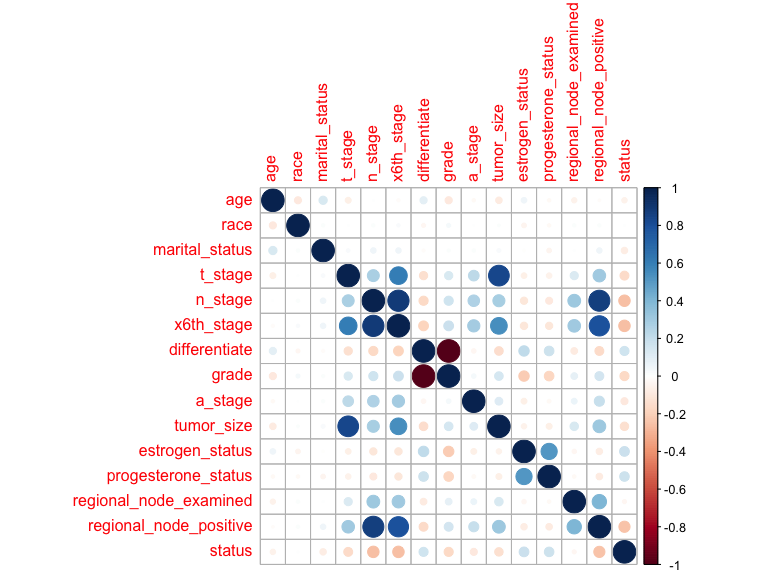

``` r
#tumor_size vs t_stage = 0.801
#grade=differentiate =>1
#n_stage = x6th_stage => 0.881
#n_stage = regional positive status =>0.838073333
selected_data = clean_data2 |>
  select(-tumor_size, -grade,-n_stage,-regional_node_positive,-x6th_stage)

corplot=cor(selected_data)
corrplot(corplot)
```

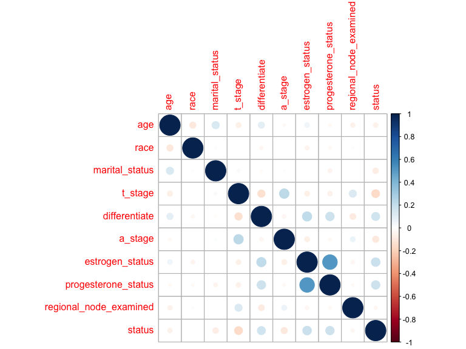

\#Separate training and testing set (80% training 20% testing )

``` r
# Calculate the size of each of the data sets
data_size = nrow(clean_data2)
train_size = floor(0.8 * data_size)

# Create a random sample of row indices for the training set
train_indices = sample(sample(seq_len(data_size), size = train_size))

# Subset the data into training and testing sets
train_set = clean_data2[train_indices, ]
selectedData_train_set = selected_data[train_indices,]
test_set = clean_data2[-train_indices, ]
selectedData_test_set = selected_data[-train_indices, ]
```

# Fit a full model

``` r
selected_train = train_set |>
  select(-tumor_size, -grade,-n_stage,-regional_node_positive,-x6th_stage)

null_model = glm(status ~ 1, family = binomial(link = "logit"), data = selected_train)

full_model = glm(status ~ . , family = binomial(link = "logit"), data = selected_train)

interaction_race_age = glm(status ~ . + race:age, family = binomial(link = "logit"), data = selected_train)

interaction_race_marital_status = glm(status ~ . + race:marital_status,  family = binomial(link = "logit"), data = selected_train)
```

# Check logistic regression assumptions

Binary logistic regression relies on underlying assumptions to be true:

1.The outcome is a binary or dichotomous variable like yes vs no,
positive vs negative, 1 vs 0. 2.There is a linear relationship between
the logit of the outcome(status) and each predictor variables. Recall
that the logit function is logit(p) = log(p/(1-p)), where p is the
probabilities of the outcome. 3.There is no influential values in the
continuous predictors. 4.There is no multicollinearity among the
predictors.

## Checking Linearity of continuous variables to the response

\##HENRY - MAY BE NOT NECESSARY

``` r
# Check linearity assumption using conditional residual plots
crPlots(full_model)
```

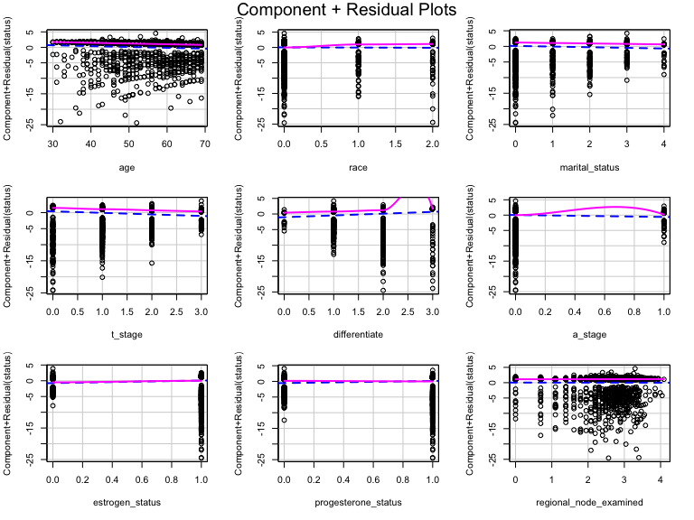

## Checking for Influential Observations:

Cook’s Distance:

``` r
# Calculate Cook's distance for the full model
cooksd = influence.measures(full_model)$cooks
cooksd_1 = influence.measures(interaction_race_age)$cooks
cooksd_2 = influence.measures(interaction_race_age)$cooks

# Identify influential observations
influential_points = which(cooksd > 4 / length(cooksd))
influential_points_1 = which(cooksd > 4 / length(cooksd))
influential_points_2 = which(cooksd > 4 / length(cooksd))

# Display influential points
print(influential_points)
```

    ## integer(0)

``` r
print(influential_points_1)
```

    ## integer(0)

``` r
print(influential_points_2)
```

    ## integer(0)

## Checking for Multicollinearity:

``` r
# Check for multicollinearity using VIF
vif_values = car::vif(full_model)
vif_values_1 = car::vif(interaction_race_age)
```

    ## there are higher-order terms (interactions) in this model
    ## consider setting type = 'predictor'; see ?vif

``` r
vif_values_2 = car::vif(interaction_race_marital_status)
```

    ## there are higher-order terms (interactions) in this model
    ## consider setting type = 'predictor'; see ?vif

``` r
# Display VIF values
print(vif_values)
```

    ##                    age                   race         marital_status 
    ##               1.072175               1.012773               1.028972 
    ##                t_stage          differentiate                a_stage 
    ##               1.106026               1.089339               1.088040 
    ##        estrogen_status    progesterone_status regional_node_examined 
    ##               1.499753               1.445285               1.025804

``` r
print(vif_values_1)
```

    ##                    age                   race         marital_status 
    ##               1.278541              32.256574               1.029654 
    ##                t_stage          differentiate                a_stage 
    ##               1.105782               1.089821               1.089724 
    ##        estrogen_status    progesterone_status regional_node_examined 
    ##               1.499461               1.444624               1.025748 
    ##               age:race 
    ##              31.916031

``` r
print(vif_values_2)
```

    ##                    age                   race         marital_status 
    ##               1.070956               1.553274               1.242372 
    ##                t_stage          differentiate                a_stage 
    ##               1.107242               1.089786               1.088959 
    ##        estrogen_status    progesterone_status regional_node_examined 
    ##               1.498871               1.444383               1.026058 
    ##    race:marital_status 
    ##               1.796694

As a rule of thumb, a VIF value that exceeds 5 or 10 indicates a
problematic amount of collinearity. In our example, there is no
collinearity: all variables have a value of VIF well below 5.

# Using Forward, BackWard

``` r
step_modelF = step(null_model, scope = list(lower = null_model, upper = full_model), 
                   direction = "forward")
```

    ## Start:  AIC=2782.19
    ## status ~ 1
    ## 
    ##                          Df Deviance    AIC
    ## + progesterone_status     1   2684.9 2688.9
    ## + estrogen_status         1   2689.6 2693.6
    ## + differentiate           1   2698.9 2702.9
    ## + t_stage                 1   2705.8 2709.8
    ## + marital_status          1   2758.5 2762.5
    ## + a_stage                 1   2762.0 2766.0
    ## + age                     1   2768.2 2772.2
    ## + regional_node_examined  1   2777.7 2781.7
    ## <none>                        2780.2 2782.2
    ## + race                    1   2780.2 2784.2
    ## 
    ## Step:  AIC=2688.88
    ## status ~ progesterone_status
    ## 
    ##                          Df Deviance    AIC
    ## + t_stage                 1   2620.4 2626.4
    ## + differentiate           1   2632.0 2638.0
    ## + estrogen_status         1   2659.5 2665.5
    ## + marital_status          1   2666.5 2672.5
    ## + a_stage                 1   2668.0 2674.0
    ## + age                     1   2674.2 2680.2
    ## <none>                        2684.9 2688.9
    ## + regional_node_examined  1   2683.0 2689.0
    ## + race                    1   2684.9 2690.9
    ## 
    ## Step:  AIC=2626.4
    ## status ~ progesterone_status + t_stage
    ## 
    ##                          Df Deviance    AIC
    ## + differentiate           1   2578.9 2586.9
    ## + estrogen_status         1   2597.8 2605.8
    ## + marital_status          1   2602.2 2610.2
    ## + age                     1   2605.3 2613.3
    ## + a_stage                 1   2616.4 2624.4
    ## <none>                        2620.4 2626.4
    ## + regional_node_examined  1   2620.2 2628.2
    ## + race                    1   2620.4 2628.4
    ## 
    ## Step:  AIC=2586.92
    ## status ~ progesterone_status + t_stage + differentiate
    ## 
    ##                          Df Deviance    AIC
    ## + age                     1   2557.0 2567.0
    ## + marital_status          1   2560.7 2570.7
    ## + estrogen_status         1   2565.2 2575.2
    ## + a_stage                 1   2575.2 2585.2
    ## <none>                        2578.9 2586.9
    ## + regional_node_examined  1   2578.9 2588.9
    ## + race                    1   2578.9 2588.9
    ## 
    ## Step:  AIC=2567
    ## status ~ progesterone_status + t_stage + differentiate + age
    ## 
    ##                          Df Deviance    AIC
    ## + estrogen_status         1   2539.7 2551.7
    ## + marital_status          1   2544.1 2556.1
    ## + a_stage                 1   2552.8 2564.8
    ## <none>                        2557.0 2567.0
    ## + race                    1   2556.9 2568.9
    ## + regional_node_examined  1   2557.0 2569.0
    ## 
    ## Step:  AIC=2551.74
    ## status ~ progesterone_status + t_stage + differentiate + age + 
    ##     estrogen_status
    ## 
    ##                          Df Deviance    AIC
    ## + marital_status          1   2526.1 2540.1
    ## + a_stage                 1   2536.5 2550.5
    ## <none>                        2539.7 2551.7
    ## + race                    1   2539.7 2553.7
    ## + regional_node_examined  1   2539.7 2553.7
    ## 
    ## Step:  AIC=2540.14
    ## status ~ progesterone_status + t_stage + differentiate + age + 
    ##     estrogen_status + marital_status
    ## 
    ##                          Df Deviance    AIC
    ## + a_stage                 1   2522.9 2538.9
    ## <none>                        2526.1 2540.1
    ## + regional_node_examined  1   2526.1 2542.1
    ## + race                    1   2526.1 2542.1
    ## 
    ## Step:  AIC=2538.89
    ## status ~ progesterone_status + t_stage + differentiate + age + 
    ##     estrogen_status + marital_status + a_stage
    ## 
    ##                          Df Deviance    AIC
    ## <none>                        2522.9 2538.9
    ## + race                    1   2522.9 2540.9
    ## + regional_node_examined  1   2522.9 2540.9

``` r
step_model = step(full_model, direction = "backward")
```

    ## Start:  AIC=2542.89
    ## status ~ age + race + marital_status + t_stage + differentiate + 
    ##     a_stage + estrogen_status + progesterone_status + regional_node_examined
    ## 
    ##                          Df Deviance    AIC
    ## - regional_node_examined  1   2522.9 2540.9
    ## - race                    1   2522.9 2540.9
    ## <none>                        2522.9 2542.9
    ## - a_stage                 1   2526.1 2544.1
    ## - marital_status          1   2536.5 2554.5
    ## - estrogen_status         1   2539.8 2557.8
    ## - progesterone_status     1   2541.6 2559.6
    ## - age                     1   2542.5 2560.5
    ## - differentiate           1   2559.6 2577.6
    ## - t_stage                 1   2567.4 2585.4
    ## 
    ## Step:  AIC=2540.89
    ## status ~ age + race + marital_status + t_stage + differentiate + 
    ##     a_stage + estrogen_status + progesterone_status
    ## 
    ##                       Df Deviance    AIC
    ## - race                 1   2522.9 2538.9
    ## <none>                     2522.9 2540.9
    ## - a_stage              1   2526.1 2542.1
    ## - marital_status       1   2536.5 2552.5
    ## - estrogen_status      1   2539.8 2555.8
    ## - progesterone_status  1   2541.6 2557.6
    ## - age                  1   2542.5 2558.5
    ## - differentiate        1   2559.8 2575.8
    ## - t_stage              1   2567.8 2583.8
    ## 
    ## Step:  AIC=2538.89
    ## status ~ age + marital_status + t_stage + differentiate + a_stage + 
    ##     estrogen_status + progesterone_status
    ## 
    ##                       Df Deviance    AIC
    ## <none>                     2522.9 2538.9
    ## - a_stage              1   2526.1 2540.1
    ## - marital_status       1   2536.5 2550.5
    ## - estrogen_status      1   2539.9 2553.9
    ## - progesterone_status  1   2541.6 2555.6
    ## - age                  1   2542.7 2556.7
    ## - differentiate        1   2559.8 2573.8
    ## - t_stage              1   2567.8 2581.8

``` r
summary(step_model)
```

    ## 
    ## Call:
    ## glm(formula = status ~ age + marital_status + t_stage + differentiate + 
    ##     a_stage + estrogen_status + progesterone_status, family = binomial(link = "logit"), 
    ##     data = selected_train)
    ## 
    ## Coefficients:
    ##                      Estimate Std. Error z value Pr(>|z|)    
    ## (Intercept)          1.570637   0.359045   4.374 1.22e-05 ***
    ## age                 -0.026116   0.005936  -4.400 1.08e-05 ***
    ## marital_status      -0.180202   0.048001  -3.754 0.000174 ***
    ## t_stage             -0.444968   0.066122  -6.729 1.70e-11 ***
    ## differentiate        0.510408   0.084940   6.009 1.87e-09 ***
    ## a_stage             -0.506600   0.275308  -1.840 0.065750 .  
    ## estrogen_status      0.789337   0.190743   4.138 3.50e-05 ***
    ## progesterone_status  0.617193   0.138443   4.458 8.27e-06 ***
    ## ---
    ## Signif. codes:  0 '***' 0.001 '**' 0.01 '*' 0.05 '.' 0.1 ' ' 1
    ## 
    ## (Dispersion parameter for binomial family taken to be 1)
    ## 
    ##     Null deviance: 2780.2  on 3218  degrees of freedom
    ## Residual deviance: 2522.9  on 3211  degrees of freedom
    ## AIC: 2538.9
    ## 
    ## Number of Fisher Scoring iterations: 5

``` r
summary(step_modelF)
```

    ## 
    ## Call:
    ## glm(formula = status ~ progesterone_status + t_stage + differentiate + 
    ##     age + estrogen_status + marital_status + a_stage, family = binomial(link = "logit"), 
    ##     data = selected_train)
    ## 
    ## Coefficients:
    ##                      Estimate Std. Error z value Pr(>|z|)    
    ## (Intercept)          1.570637   0.359045   4.374 1.22e-05 ***
    ## progesterone_status  0.617193   0.138443   4.458 8.27e-06 ***
    ## t_stage             -0.444968   0.066122  -6.729 1.70e-11 ***
    ## differentiate        0.510408   0.084940   6.009 1.87e-09 ***
    ## age                 -0.026116   0.005936  -4.400 1.08e-05 ***
    ## estrogen_status      0.789337   0.190743   4.138 3.50e-05 ***
    ## marital_status      -0.180202   0.048001  -3.754 0.000174 ***
    ## a_stage             -0.506600   0.275308  -1.840 0.065750 .  
    ## ---
    ## Signif. codes:  0 '***' 0.001 '**' 0.01 '*' 0.05 '.' 0.1 ' ' 1
    ## 
    ## (Dispersion parameter for binomial family taken to be 1)
    ## 
    ##     Null deviance: 2780.2  on 3218  degrees of freedom
    ## Residual deviance: 2522.9  on 3211  degrees of freedom
    ## AIC: 2538.9
    ## 
    ## Number of Fisher Scoring iterations: 5

``` r
anova(step_model,step_modelF,test="Chisq")
```

    ## Analysis of Deviance Table
    ## 
    ## Model 1: status ~ age + marital_status + t_stage + differentiate + a_stage + 
    ##     estrogen_status + progesterone_status
    ## Model 2: status ~ progesterone_status + t_stage + differentiate + age + 
    ##     estrogen_status + marital_status + a_stage
    ##   Resid. Df Resid. Dev Df Deviance Pr(>Chi)
    ## 1      3211     2522.9                     
    ## 2      3211     2522.9  0        0

``` r
test_predictions_log_oddsStep = predict(step_model, newdata  = (test_set),type='response')
test_predictions_probStep = plogis(test_predictions_log_oddsStep)
roc_curveStep = roc(response = (test_set$status), predictor = as.numeric(test_predictions_probStep))
```

    ## Setting levels: control = 0, case = 1

    ## Setting direction: controls < cases

``` r
auc(roc_curveStep)
```

    ## Area under the curve: 0.7

# interaction: race + age

``` r
step_modelF_1 = step(null_model, scope = list(lower = null_model, upper = interaction_race_age), 
                   direction = "forward")
```

    ## Start:  AIC=2782.19
    ## status ~ 1
    ## 
    ##                          Df Deviance    AIC
    ## + progesterone_status     1   2684.9 2688.9
    ## + estrogen_status         1   2689.6 2693.6
    ## + differentiate           1   2698.9 2702.9
    ## + t_stage                 1   2705.8 2709.8
    ## + marital_status          1   2758.5 2762.5
    ## + a_stage                 1   2762.0 2766.0
    ## + age                     1   2768.2 2772.2
    ## + regional_node_examined  1   2777.7 2781.7
    ## <none>                        2780.2 2782.2
    ## + race                    1   2780.2 2784.2
    ## 
    ## Step:  AIC=2688.88
    ## status ~ progesterone_status
    ## 
    ##                          Df Deviance    AIC
    ## + t_stage                 1   2620.4 2626.4
    ## + differentiate           1   2632.0 2638.0
    ## + estrogen_status         1   2659.5 2665.5
    ## + marital_status          1   2666.5 2672.5
    ## + a_stage                 1   2668.0 2674.0
    ## + age                     1   2674.2 2680.2
    ## <none>                        2684.9 2688.9
    ## + regional_node_examined  1   2683.0 2689.0
    ## + race                    1   2684.9 2690.9
    ## 
    ## Step:  AIC=2626.4
    ## status ~ progesterone_status + t_stage
    ## 
    ##                          Df Deviance    AIC
    ## + differentiate           1   2578.9 2586.9
    ## + estrogen_status         1   2597.8 2605.8
    ## + marital_status          1   2602.2 2610.2
    ## + age                     1   2605.3 2613.3
    ## + a_stage                 1   2616.4 2624.4
    ## <none>                        2620.4 2626.4
    ## + regional_node_examined  1   2620.2 2628.2
    ## + race                    1   2620.4 2628.4
    ## 
    ## Step:  AIC=2586.92
    ## status ~ progesterone_status + t_stage + differentiate
    ## 
    ##                          Df Deviance    AIC
    ## + age                     1   2557.0 2567.0
    ## + marital_status          1   2560.7 2570.7
    ## + estrogen_status         1   2565.2 2575.2
    ## + a_stage                 1   2575.2 2585.2
    ## <none>                        2578.9 2586.9
    ## + regional_node_examined  1   2578.9 2588.9
    ## + race                    1   2578.9 2588.9
    ## 
    ## Step:  AIC=2567
    ## status ~ progesterone_status + t_stage + differentiate + age
    ## 
    ##                          Df Deviance    AIC
    ## + estrogen_status         1   2539.7 2551.7
    ## + marital_status          1   2544.1 2556.1
    ## + a_stage                 1   2552.8 2564.8
    ## <none>                        2557.0 2567.0
    ## + race                    1   2556.9 2568.9
    ## + regional_node_examined  1   2557.0 2569.0
    ## 
    ## Step:  AIC=2551.74
    ## status ~ progesterone_status + t_stage + differentiate + age + 
    ##     estrogen_status
    ## 
    ##                          Df Deviance    AIC
    ## + marital_status          1   2526.1 2540.1
    ## + a_stage                 1   2536.5 2550.5
    ## <none>                        2539.7 2551.7
    ## + race                    1   2539.7 2553.7
    ## + regional_node_examined  1   2539.7 2553.7
    ## 
    ## Step:  AIC=2540.14
    ## status ~ progesterone_status + t_stage + differentiate + age + 
    ##     estrogen_status + marital_status
    ## 
    ##                          Df Deviance    AIC
    ## + a_stage                 1   2522.9 2538.9
    ## <none>                        2526.1 2540.1
    ## + regional_node_examined  1   2526.1 2542.1
    ## + race                    1   2526.1 2542.1
    ## 
    ## Step:  AIC=2538.89
    ## status ~ progesterone_status + t_stage + differentiate + age + 
    ##     estrogen_status + marital_status + a_stage
    ## 
    ##                          Df Deviance    AIC
    ## <none>                        2522.9 2538.9
    ## + race                    1   2522.9 2540.9
    ## + regional_node_examined  1   2522.9 2540.9

``` r
step_model_1 = step(interaction_race_age, direction = "backward")
```

    ## Start:  AIC=2544.32
    ## status ~ age + race + marital_status + t_stage + differentiate + 
    ##     a_stage + estrogen_status + progesterone_status + regional_node_examined + 
    ##     race:age
    ## 
    ##                          Df Deviance    AIC
    ## - regional_node_examined  1   2522.3 2542.3
    ## - age:race                1   2522.9 2542.9
    ## <none>                        2522.3 2544.3
    ## - a_stage                 1   2525.4 2545.4
    ## - marital_status          1   2536.1 2556.1
    ## - estrogen_status         1   2539.4 2559.4
    ## - progesterone_status     1   2541.1 2561.1
    ## - differentiate           1   2559.2 2579.2
    ## - t_stage                 1   2566.9 2586.9
    ## 
    ## Step:  AIC=2542.32
    ## status ~ age + race + marital_status + t_stage + differentiate + 
    ##     a_stage + estrogen_status + progesterone_status + age:race
    ## 
    ##                       Df Deviance    AIC
    ## - age:race             1   2522.9 2540.9
    ## <none>                     2522.3 2542.3
    ## - a_stage              1   2525.4 2543.4
    ## - marital_status       1   2536.1 2554.1
    ## - estrogen_status      1   2539.4 2557.4
    ## - progesterone_status  1   2541.1 2559.1
    ## - differentiate        1   2559.5 2577.5
    ## - t_stage              1   2567.3 2585.3
    ## 
    ## Step:  AIC=2540.89
    ## status ~ age + race + marital_status + t_stage + differentiate + 
    ##     a_stage + estrogen_status + progesterone_status
    ## 
    ##                       Df Deviance    AIC
    ## - race                 1   2522.9 2538.9
    ## <none>                     2522.9 2540.9
    ## - a_stage              1   2526.1 2542.1
    ## - marital_status       1   2536.5 2552.5
    ## - estrogen_status      1   2539.8 2555.8
    ## - progesterone_status  1   2541.6 2557.6
    ## - age                  1   2542.5 2558.5
    ## - differentiate        1   2559.8 2575.8
    ## - t_stage              1   2567.8 2583.8
    ## 
    ## Step:  AIC=2538.89
    ## status ~ age + marital_status + t_stage + differentiate + a_stage + 
    ##     estrogen_status + progesterone_status
    ## 
    ##                       Df Deviance    AIC
    ## <none>                     2522.9 2538.9
    ## - a_stage              1   2526.1 2540.1
    ## - marital_status       1   2536.5 2550.5
    ## - estrogen_status      1   2539.9 2553.9
    ## - progesterone_status  1   2541.6 2555.6
    ## - age                  1   2542.7 2556.7
    ## - differentiate        1   2559.8 2573.8
    ## - t_stage              1   2567.8 2581.8

``` r
summary(step_model_1)
```

    ## 
    ## Call:
    ## glm(formula = status ~ age + marital_status + t_stage + differentiate + 
    ##     a_stage + estrogen_status + progesterone_status, family = binomial(link = "logit"), 
    ##     data = selected_train)
    ## 
    ## Coefficients:
    ##                      Estimate Std. Error z value Pr(>|z|)    
    ## (Intercept)          1.570637   0.359045   4.374 1.22e-05 ***
    ## age                 -0.026116   0.005936  -4.400 1.08e-05 ***
    ## marital_status      -0.180202   0.048001  -3.754 0.000174 ***
    ## t_stage             -0.444968   0.066122  -6.729 1.70e-11 ***
    ## differentiate        0.510408   0.084940   6.009 1.87e-09 ***
    ## a_stage             -0.506600   0.275308  -1.840 0.065750 .  
    ## estrogen_status      0.789337   0.190743   4.138 3.50e-05 ***
    ## progesterone_status  0.617193   0.138443   4.458 8.27e-06 ***
    ## ---
    ## Signif. codes:  0 '***' 0.001 '**' 0.01 '*' 0.05 '.' 0.1 ' ' 1
    ## 
    ## (Dispersion parameter for binomial family taken to be 1)
    ## 
    ##     Null deviance: 2780.2  on 3218  degrees of freedom
    ## Residual deviance: 2522.9  on 3211  degrees of freedom
    ## AIC: 2538.9
    ## 
    ## Number of Fisher Scoring iterations: 5

``` r
summary(step_modelF_1)
```

    ## 
    ## Call:
    ## glm(formula = status ~ progesterone_status + t_stage + differentiate + 
    ##     age + estrogen_status + marital_status + a_stage, family = binomial(link = "logit"), 
    ##     data = selected_train)
    ## 
    ## Coefficients:
    ##                      Estimate Std. Error z value Pr(>|z|)    
    ## (Intercept)          1.570637   0.359045   4.374 1.22e-05 ***
    ## progesterone_status  0.617193   0.138443   4.458 8.27e-06 ***
    ## t_stage             -0.444968   0.066122  -6.729 1.70e-11 ***
    ## differentiate        0.510408   0.084940   6.009 1.87e-09 ***
    ## age                 -0.026116   0.005936  -4.400 1.08e-05 ***
    ## estrogen_status      0.789337   0.190743   4.138 3.50e-05 ***
    ## marital_status      -0.180202   0.048001  -3.754 0.000174 ***
    ## a_stage             -0.506600   0.275308  -1.840 0.065750 .  
    ## ---
    ## Signif. codes:  0 '***' 0.001 '**' 0.01 '*' 0.05 '.' 0.1 ' ' 1
    ## 
    ## (Dispersion parameter for binomial family taken to be 1)
    ## 
    ##     Null deviance: 2780.2  on 3218  degrees of freedom
    ## Residual deviance: 2522.9  on 3211  degrees of freedom
    ## AIC: 2538.9
    ## 
    ## Number of Fisher Scoring iterations: 5

``` r
anova(step_model_1,step_modelF_1,test="Chisq")
```

    ## Analysis of Deviance Table
    ## 
    ## Model 1: status ~ age + marital_status + t_stage + differentiate + a_stage + 
    ##     estrogen_status + progesterone_status
    ## Model 2: status ~ progesterone_status + t_stage + differentiate + age + 
    ##     estrogen_status + marital_status + a_stage
    ##   Resid. Df Resid. Dev Df Deviance Pr(>Chi)
    ## 1      3211     2522.9                     
    ## 2      3211     2522.9  0        0

``` r
test_predictions_log_oddsStep_1 = predict(step_model_1, newdata  = (test_set),type='response')

test_predictions_probStep_1 = plogis(test_predictions_log_oddsStep_1)

roc_curveStep_1 = roc(response = (test_set$status), predictor = as.numeric(test_predictions_probStep_1))
```

    ## Setting levels: control = 0, case = 1

    ## Setting direction: controls < cases

``` r
auc(roc_curveStep_1)
```

    ## Area under the curve: 0.7

# interaction: race + marital_status

``` r
step_modelF_2 = step(null_model, scope = list(lower = null_model, upper = interaction_race_marital_status), 
                   direction = "forward")
```

    ## Start:  AIC=2782.19
    ## status ~ 1
    ## 
    ##                          Df Deviance    AIC
    ## + progesterone_status     1   2684.9 2688.9
    ## + estrogen_status         1   2689.6 2693.6
    ## + differentiate           1   2698.9 2702.9
    ## + t_stage                 1   2705.8 2709.8
    ## + marital_status          1   2758.5 2762.5
    ## + a_stage                 1   2762.0 2766.0
    ## + age                     1   2768.2 2772.2
    ## + regional_node_examined  1   2777.7 2781.7
    ## <none>                        2780.2 2782.2
    ## + race                    1   2780.2 2784.2
    ## 
    ## Step:  AIC=2688.88
    ## status ~ progesterone_status
    ## 
    ##                          Df Deviance    AIC
    ## + t_stage                 1   2620.4 2626.4
    ## + differentiate           1   2632.0 2638.0
    ## + estrogen_status         1   2659.5 2665.5
    ## + marital_status          1   2666.5 2672.5
    ## + a_stage                 1   2668.0 2674.0
    ## + age                     1   2674.2 2680.2
    ## <none>                        2684.9 2688.9
    ## + regional_node_examined  1   2683.0 2689.0
    ## + race                    1   2684.9 2690.9
    ## 
    ## Step:  AIC=2626.4
    ## status ~ progesterone_status + t_stage
    ## 
    ##                          Df Deviance    AIC
    ## + differentiate           1   2578.9 2586.9
    ## + estrogen_status         1   2597.8 2605.8
    ## + marital_status          1   2602.2 2610.2
    ## + age                     1   2605.3 2613.3
    ## + a_stage                 1   2616.4 2624.4
    ## <none>                        2620.4 2626.4
    ## + regional_node_examined  1   2620.2 2628.2
    ## + race                    1   2620.4 2628.4
    ## 
    ## Step:  AIC=2586.92
    ## status ~ progesterone_status + t_stage + differentiate
    ## 
    ##                          Df Deviance    AIC
    ## + age                     1   2557.0 2567.0
    ## + marital_status          1   2560.7 2570.7
    ## + estrogen_status         1   2565.2 2575.2
    ## + a_stage                 1   2575.2 2585.2
    ## <none>                        2578.9 2586.9
    ## + regional_node_examined  1   2578.9 2588.9
    ## + race                    1   2578.9 2588.9
    ## 
    ## Step:  AIC=2567
    ## status ~ progesterone_status + t_stage + differentiate + age
    ## 
    ##                          Df Deviance    AIC
    ## + estrogen_status         1   2539.7 2551.7
    ## + marital_status          1   2544.1 2556.1
    ## + a_stage                 1   2552.8 2564.8
    ## <none>                        2557.0 2567.0
    ## + race                    1   2556.9 2568.9
    ## + regional_node_examined  1   2557.0 2569.0
    ## 
    ## Step:  AIC=2551.74
    ## status ~ progesterone_status + t_stage + differentiate + age + 
    ##     estrogen_status
    ## 
    ##                          Df Deviance    AIC
    ## + marital_status          1   2526.1 2540.1
    ## + a_stage                 1   2536.5 2550.5
    ## <none>                        2539.7 2551.7
    ## + race                    1   2539.7 2553.7
    ## + regional_node_examined  1   2539.7 2553.7
    ## 
    ## Step:  AIC=2540.14
    ## status ~ progesterone_status + t_stage + differentiate + age + 
    ##     estrogen_status + marital_status
    ## 
    ##                          Df Deviance    AIC
    ## + a_stage                 1   2522.9 2538.9
    ## <none>                        2526.1 2540.1
    ## + regional_node_examined  1   2526.1 2542.1
    ## + race                    1   2526.1 2542.1
    ## 
    ## Step:  AIC=2538.89
    ## status ~ progesterone_status + t_stage + differentiate + age + 
    ##     estrogen_status + marital_status + a_stage
    ## 
    ##                          Df Deviance    AIC
    ## <none>                        2522.9 2538.9
    ## + race                    1   2522.9 2540.9
    ## + regional_node_examined  1   2522.9 2540.9

``` r
step_model_2 = step(interaction_race_marital_status, direction = "backward")
```

    ## Start:  AIC=2539.46
    ## status ~ age + race + marital_status + t_stage + differentiate + 
    ##     a_stage + estrogen_status + progesterone_status + regional_node_examined + 
    ##     race:marital_status
    ## 
    ##                          Df Deviance    AIC
    ## - regional_node_examined  1   2517.5 2537.5
    ## <none>                        2517.5 2539.5
    ## - a_stage                 1   2520.9 2540.9
    ## - race:marital_status     1   2522.9 2542.9
    ## - estrogen_status         1   2534.5 2554.5
    ## - progesterone_status     1   2536.1 2556.1
    ## - age                     1   2536.5 2556.5
    ## - differentiate           1   2554.3 2574.3
    ## - t_stage                 1   2560.6 2580.6
    ## 
    ## Step:  AIC=2537.46
    ## status ~ age + race + marital_status + t_stage + differentiate + 
    ##     a_stage + estrogen_status + progesterone_status + race:marital_status
    ## 
    ##                       Df Deviance    AIC
    ## <none>                     2517.5 2537.5
    ## - a_stage              1   2520.9 2538.9
    ## - race:marital_status  1   2522.9 2540.9
    ## - estrogen_status      1   2534.5 2552.5
    ## - progesterone_status  1   2536.1 2554.1
    ## - age                  1   2536.5 2554.5
    ## - differentiate        1   2554.6 2572.6
    ## - t_stage              1   2561.0 2579.0

``` r
summary(step_model_2)
```

    ## 
    ## Call:
    ## glm(formula = status ~ age + race + marital_status + t_stage + 
    ##     differentiate + a_stage + estrogen_status + progesterone_status + 
    ##     race:marital_status, family = binomial(link = "logit"), data = selected_train)
    ## 
    ## Coefficients:
    ##                      Estimate Std. Error z value Pr(>|z|)    
    ## (Intercept)          1.504256   0.364651   4.125 3.70e-05 ***
    ## age                 -0.025747   0.005962  -4.319 1.57e-05 ***
    ## race                 0.147211   0.113443   1.298   0.1944    
    ## marital_status      -0.130895   0.053038  -2.468   0.0136 *  
    ## t_stage             -0.438824   0.066252  -6.624 3.51e-11 ***
    ## differentiate        0.512156   0.085013   6.024 1.70e-09 ***
    ## a_stage             -0.525599   0.275654  -1.907   0.0566 .  
    ## estrogen_status      0.794240   0.191501   4.147 3.36e-05 ***
    ## progesterone_status  0.617158   0.138682   4.450 8.58e-06 ***
    ## race:marital_status -0.184933   0.079098  -2.338   0.0194 *  
    ## ---
    ## Signif. codes:  0 '***' 0.001 '**' 0.01 '*' 0.05 '.' 0.1 ' ' 1
    ## 
    ## (Dispersion parameter for binomial family taken to be 1)
    ## 
    ##     Null deviance: 2780.2  on 3218  degrees of freedom
    ## Residual deviance: 2517.5  on 3209  degrees of freedom
    ## AIC: 2537.5
    ## 
    ## Number of Fisher Scoring iterations: 5

``` r
summary(step_modelF_2)
```

    ## 
    ## Call:
    ## glm(formula = status ~ progesterone_status + t_stage + differentiate + 
    ##     age + estrogen_status + marital_status + a_stage, family = binomial(link = "logit"), 
    ##     data = selected_train)
    ## 
    ## Coefficients:
    ##                      Estimate Std. Error z value Pr(>|z|)    
    ## (Intercept)          1.570637   0.359045   4.374 1.22e-05 ***
    ## progesterone_status  0.617193   0.138443   4.458 8.27e-06 ***
    ## t_stage             -0.444968   0.066122  -6.729 1.70e-11 ***
    ## differentiate        0.510408   0.084940   6.009 1.87e-09 ***
    ## age                 -0.026116   0.005936  -4.400 1.08e-05 ***
    ## estrogen_status      0.789337   0.190743   4.138 3.50e-05 ***
    ## marital_status      -0.180202   0.048001  -3.754 0.000174 ***
    ## a_stage             -0.506600   0.275308  -1.840 0.065750 .  
    ## ---
    ## Signif. codes:  0 '***' 0.001 '**' 0.01 '*' 0.05 '.' 0.1 ' ' 1
    ## 
    ## (Dispersion parameter for binomial family taken to be 1)
    ## 
    ##     Null deviance: 2780.2  on 3218  degrees of freedom
    ## Residual deviance: 2522.9  on 3211  degrees of freedom
    ## AIC: 2538.9
    ## 
    ## Number of Fisher Scoring iterations: 5

``` r
anova(step_model_2,step_modelF_2,test="Chisq")
```

    ## Analysis of Deviance Table
    ## 
    ## Model 1: status ~ age + race + marital_status + t_stage + differentiate + 
    ##     a_stage + estrogen_status + progesterone_status + race:marital_status
    ## Model 2: status ~ progesterone_status + t_stage + differentiate + age + 
    ##     estrogen_status + marital_status + a_stage
    ##   Resid. Df Resid. Dev Df Deviance Pr(>Chi)  
    ## 1      3209     2517.5                       
    ## 2      3211     2522.9 -2  -5.4288  0.06624 .
    ## ---
    ## Signif. codes:  0 '***' 0.001 '**' 0.01 '*' 0.05 '.' 0.1 ' ' 1

``` r
test_predictions_log_oddsStep_2 = predict(step_model_2, newdata  = (test_set),type='response')

test_predictions_probStep_2 = plogis(test_predictions_log_oddsStep_2)

roc_curveStep_2 = roc(response = (test_set$status), predictor = as.numeric(test_predictions_probStep_2))
```

    ## Setting levels: control = 0, case = 1

    ## Setting direction: controls < cases

``` r
auc(roc_curveStep_2)
```

    ## Area under the curve: 0.6976

``` r
#if (!dir.exists("plots")) {
#    dir.create("plots")
#}
#
#png("plots/pairs_plot.png", 
#    width = 12 * 600, 
#    height = 12 * 600, 
#    res = 600)

#pairs(clean_data)
```

# Corr plot

``` r
#png("plots/corr_plot.png", 
#    width = 12 * 600, 
#    height = 12 * 600, 
#    res = 600)

#corrplot(cor(clean_data), type = "upper", diag = FALSE)
```

\#Elastic Net

``` r
# Prepare your data
X = as.matrix(train_set[, setdiff(names(train_set), "status")])  # Predictor variables
y = train_set$status  # Response variable

lambda_seq = 10^seq(-3, 0, by = .001)

# Use cross-validation to find the optimal lambda
cv_object = cv.glmnet(X, y, family = "binomial", alpha = 0.5, type.measure = "class",nfolds=5, lambda = lambda_seq)

tibble(lambda = cv_object$lambda,
mean_cv_error = cv_object$cvm) |>
ggplot(aes(x = lambda, y = mean_cv_error)) +
geom_point()
```

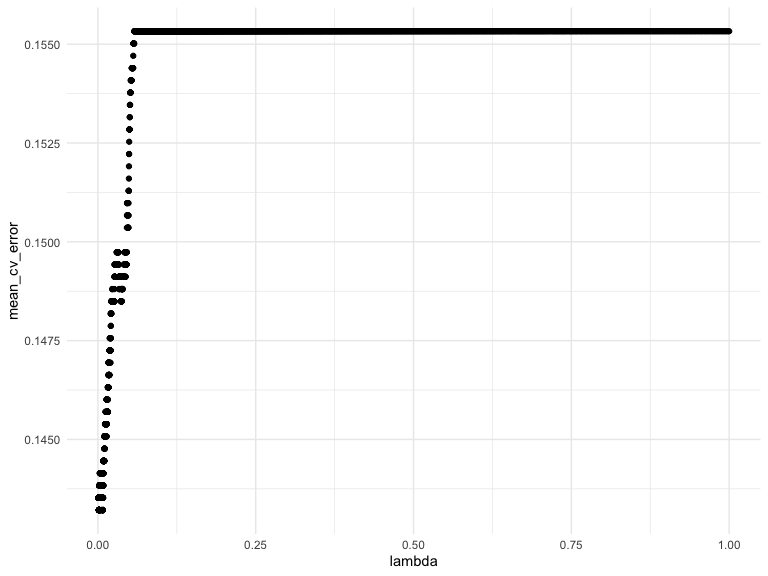

``` r
# Best lambda value
best_lambda <- cv_object$lambda.min
# Refit the model using the best lambda
final_model <- glmnet(X, y, family = "binomial", alpha = 0.5, lambda = best_lambda)

test_set2 <- test_set|> select(-status)
test_predictions_log_odds <- predict(final_model, newx = as.matrix(test_set2))

# Convert log-odds to probabilities
test_predictions_probElastic <- plogis(test_predictions_log_odds)
# Create the ROC curve
roc_curve <- roc(response = as.matrix(test_set$status), predictor = as.numeric(test_predictions_probElastic) )
```

    ## Setting levels: control = 0, case = 1

    ## Setting direction: controls < cases

``` r
auc(roc_curve)
```

    ## Area under the curve: 0.7734

\#Elastic net 2 \##Training without full variables

``` r
X2 <- as.matrix(selectedData_train_set[, setdiff(names(selectedData_train_set), "status")])  # Predictor variables
# Use cross-validation to find the optimal lambda
cv_object <- cv.glmnet(X2, y, family = "binomial", alpha = 0.5, type.measure = "class",nfolds=5, lambda = lambda_seq)

tibble(lambda = cv_object$lambda,
mean_cv_error = cv_object$cvm) %>%
ggplot(aes(x = lambda, y = mean_cv_error)) +
geom_point()
```

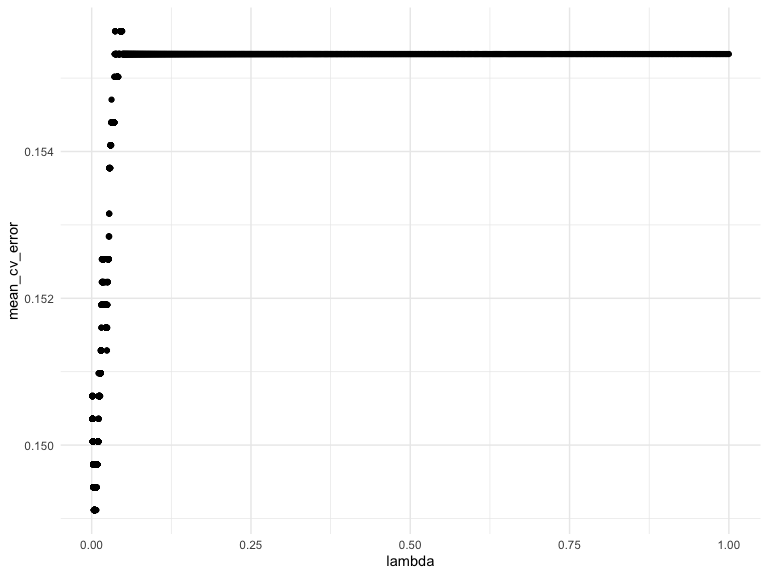

``` r
# Best lambda value
best_lambda <- cv_object$lambda.min
# Refit the model using the best lambda
final_model2 <- glmnet(X2, y, family = "binomial", alpha = 0.5, lambda = best_lambda)

selectedData_test_set <- selectedData_test_set|> select(-status)
test_predictions_log_odds2 <- predict(final_model, newx = as.matrix(test_set2))

# Convert log-odds to probabilities
test_predictions_probElastic2 <- plogis(test_predictions_log_odds2)
# Create the ROC curve
roc_curvenet2 <- roc(response = (test_set$status), predictor = as.numeric(test_predictions_probElastic2) )
```

    ## Setting levels: control = 0, case = 1

    ## Setting direction: controls < cases

``` r
auc(roc_curvenet2)
```

    ## Area under the curve: 0.7734

``` r
plot(roc_curve, main = "ROC Curve", col = "#1c61b6", lwd = 2)
lines(roc_curveStep,col='yellow')
lines(roc_curvenet2,col='green')
```

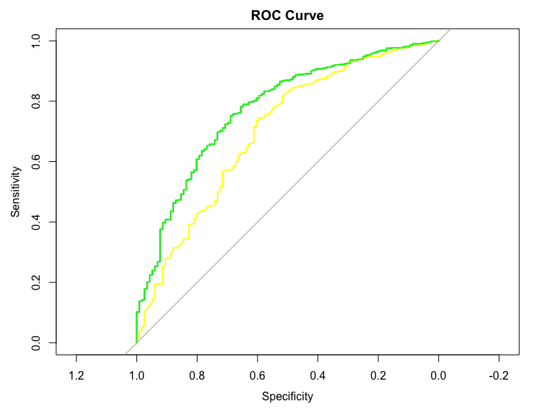

# plotting histogram

## final model diagnostics

1.  Coefficient Path Plot:

``` r
plot(final_model, xvar = "lambda")
```

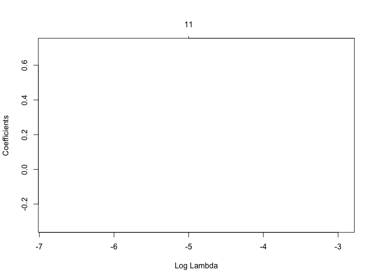
2.Cross-Validation Plot:

``` r
plot(cv_object)
```

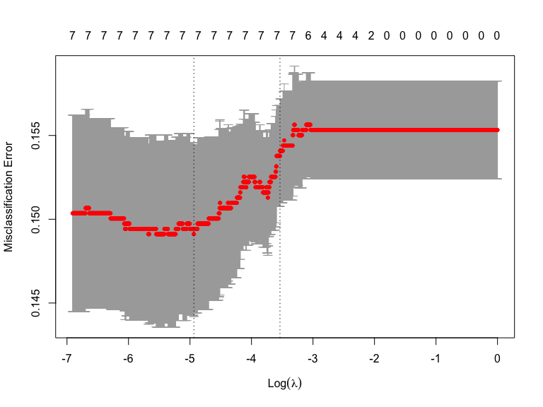
3.Deviance Plot:

``` r
plot(final_model, xvar = "lambda", label = TRUE)
```

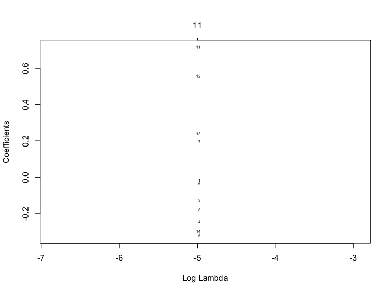
4.Predicted vs. Observed Plot:

``` r
par(mfrow = c(1, 2))
plot(predict(final_model, s = best_lambda, newx = as.matrix(test_set2)), as.numeric(test_set$status), main = "Predicted vs. Observed")
abline(a = 0, b = 1, col = "red")
```

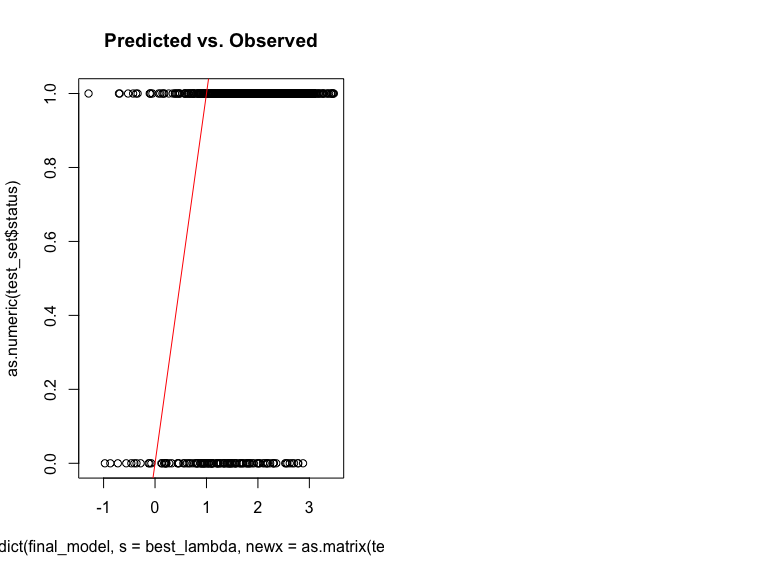
5.Residual Analysis:

``` r
residuals <- as.vector(predict(final_model, newx = as.matrix(test_set2), s = best_lambda, type = "response") - as.numeric(test_set$status))
plot(residuals, main = "Residuals vs. Fitted Values", xlab = "Fitted Values", ylab = "Residuals")
```

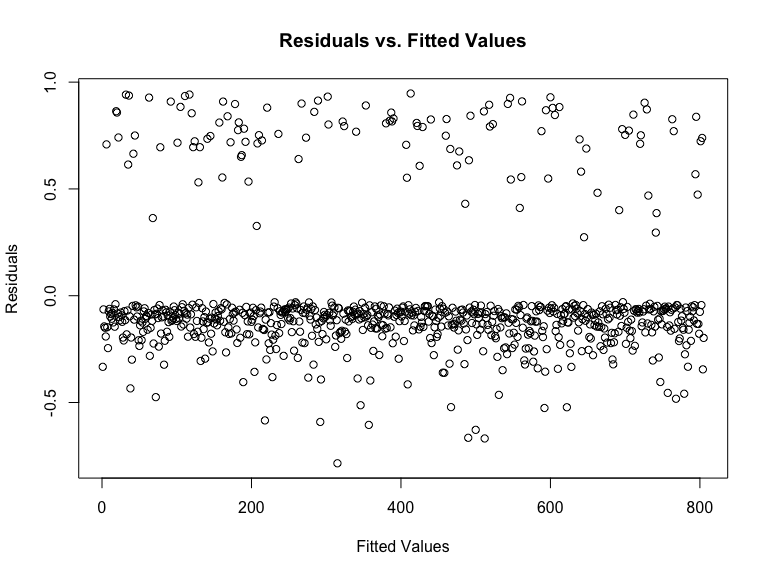

# Assess final model assumptions

Checking for violations of regression model assumptions, influential
observations, and multicollinearity is an essential part of ensuring the
reliability and validity of our logistic regression model.

1.  Checking Linearity Assumption: While glmnet is based on
    regularization and not least squares, the linearity assumption can
    be assessed by examining the relationship between predicted and
    observed values.

``` r
# Assuming 'final_model' is your glmnet logistic regression model
# Plot predicted vs. observed values
plot(predict(final_model, newx = as.matrix(test_set2), s = best_lambda, type = "response"), as.numeric(test_set$status), main = "Predicted vs. Observed")
abline(a = 0, b = 1, col = "red")
```

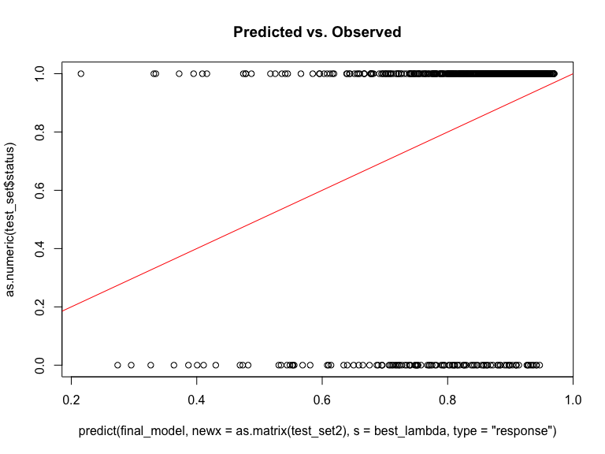

2.  Checking Residuals: \#NOT NEEDED, LOGISTICS regression does not need
    this plot, becasue it’s logistics is none-linear Although there are
    no standard residuals, we can examine the differences between
    predicted and observed values.

``` r
# Assuming 'final_model' is your glmnet logistic regression model
residuals <- as.vector(predict(final_model2, newx = as.matrix(selectedData_test_set), s = best_lambda, type = "response") - as.numeric(test_set$status))
plot(residuals, main = "Residuals vs. Fitted Values",  xlab = "Fitted Values", ylab = "Residuals")
```

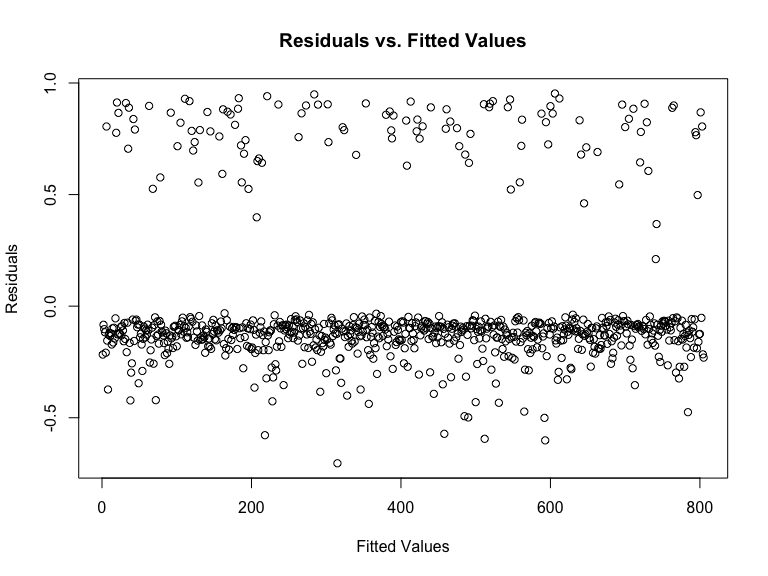

3.  Checking for Multicollinearity: Evaluate multicollinearity using VIF
    (Variance Inflation Factor) to assess the relationships between
    predictors.

``` r
# Extract coefficients from the final_model
coefficients <- as.matrix(coef(final_model2))

# Extract predictors and response
predictors <- coefficients[-1, ]
response <- coefficients[1, ]

# Combine predictors and response into a data frame
model_data <- data.frame(response = response, predictors)

# Calculate correlation matrix
cor_matrix <- cor(predictors, predictors)
```

# !! (Below part is the old version part, I’m not sure if this part should be removed. But you can refence this part!)

### Building a logistic regression model

We start by computing an example of logistic regression model using the
selected_data, for predicting the probability of status test positivity
based on clinical variables.

``` r
# Fit the logistic regression model
model2 <-  glm(status ~., data = selected_data, 
               family = binomial)
# Predict the probability (p) of diabete positivity
probabilities <- predict(model2, type = "response")
predicted.classes <- ifelse(probabilities > 0.5, "Alive", "Dead")
head(predicted.classes)
```

    ##       1       2       3       4       5       6 
    ## "Alive" "Alive" "Alive" "Alive" "Alive" "Alive"

# Check logistic regression assumptions

Binary logistic regression relies on underlying assumptions to be true:

1.The outcome is a binary or dichotomous variable like yes vs no,
positive vs negative, 1 vs 0. \#HENRY, ALREADY MET 2.There is a linear
relationship between the logit of the outcome and each predictor
variables. Recall that the logit function is logit(p) = log(p/(1-p)),
where p is the probabilities of the outcome. \#HENRY- ALREADY MET BUY
FITTING DATA 3.There is no influential values (extreme values or
outliers) in the continuous predictors \# COOKS distant, however, you
did , this is useful 4.There is no high intercorrelations
(i.e. multicollinearity) among the predictors. \#HENRY- ALDAY DID FOR
Selected_data, fitted 3 model. \### Linearity assumption (Not sure with
this part) Here, we’ll check the linear relationship between continuous
predictor variables and the logit of the outcome. This can be done by
visually inspecting the scatter plot between each predictor and the
logit values.

``` r
# Refit the model using the best lambda
final_model <- glmnet(X, y, family = "binomial", alpha = 0.5, lambda = best_lambda)

test_set2 <- test_set|> select(-status)
test_predictions_log_odds <- predict(final_model, newx = as.matrix(test_set2))
# Convert log-odds to probabilities
test_predictions_probElastic <- plogis(test_predictions_log_odds)
```

1.  Remove qualitative variables from the original data frame and bind
    the logit values to the data: \#HENRY - NOT SURE what is this for

``` r
# Select only numeric predictors
mydata <- selected_data %>%
  dplyr::select_if(is.numeric) 
predictors <- colnames(mydata)
# Bind the logit and tidying the data for plot
mydata <- mydata %>%
  mutate(logit = log(probabilities/(1-probabilities))) %>%
  gather(key = "predictors", value = "predictor.value", -logit)
```

2.  Create the scatter plots: \#HENRY - not helpful, this does not
    telling anything

``` r
ggplot(mydata, aes(logit, predictor.value))+
  geom_point(size = 0.5, alpha = 0.5) +
  geom_smooth(method = "loess") + 
  theme_bw() + 
  facet_wrap(~predictors, scales = "free_y")
```

    ## `geom_smooth()` using formula = 'y ~ x'

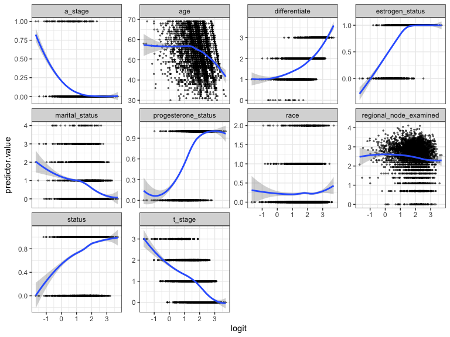
A graphical check of linearity can be performed using a best fit “loess”
line. This is on the probability scale, so it is not going to be
straight. But it should be monotonic - it should only ever go up or
down.

### Influential values

Influential values are extreme individual data points that can alter the
quality of the logistic regression model. \##HENRY - THIS IS GOOD The
most extreme values in the data can be examined by visualizing the
Cook’s distance values. Here we label the top 3 largest values:

``` r
plot(model2, which = 4, id.n = 3)
```

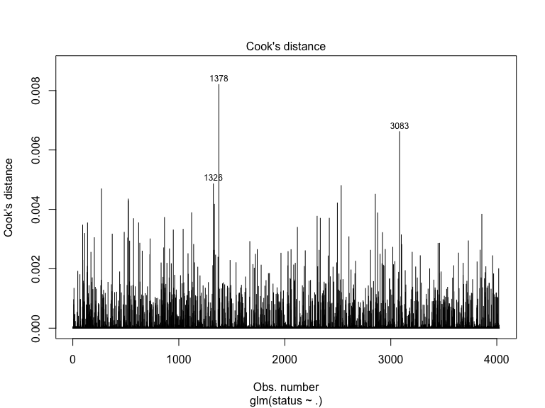
Note that, not all outliers are influential observations. To check
whether the data contains potential influential observations, the
standardized residual error can be inspected. Data points with an
absolute standardized residuals above 3 represent possible outliers and
may deserve closer attention. \#GOOD

``` r
# Extract model results
model.data <- augment(model2) %>% 
  mutate(index = 1:n()) 

# The data for the top 3 largest values, according to the Cook’s distance, can be displayed as follow:
model.data %>% top_n(3, .cooksd)
```

    ## # A tibble: 3 × 17
    ##   status   age  race marital_status t_stage differentiate a_stage
    ##    <dbl> <dbl> <dbl>          <dbl>   <dbl>         <dbl>   <dbl>
    ## 1      0    46     0              0       1             1       1
    ## 2      0    49     1              4       0             3       1
    ## 3      0    49     1              4       1             3       1
    ## # ℹ 10 more variables: estrogen_status <dbl>, progesterone_status <dbl>,
    ## #   regional_node_examined <dbl>, .fitted <dbl>, .resid <dbl>, .hat <dbl>,
    ## #   .sigma <dbl>, .cooksd <dbl>, .std.resid <dbl>, index <int>

``` r
# Plot the standardized residuals:
ggplot(model.data, aes(index, .std.resid)) + 
  geom_point(aes(color = status), alpha = .5) +
  theme_bw()
```


``` r
# Filter potential influential data points with abs(.std.res) > 3:
model.data %>% 
  filter(abs(.std.resid) > 3)
```

    ## # A tibble: 0 × 17
    ## # ℹ 17 variables: status <dbl>, age <dbl>, race <dbl>, marital_status <dbl>,
    ## #   t_stage <dbl>, differentiate <dbl>, a_stage <dbl>, estrogen_status <dbl>,
    ## #   progesterone_status <dbl>, regional_node_examined <dbl>, .fitted <dbl>,
    ## #   .resid <dbl>, .hat <dbl>, .sigma <dbl>, .cooksd <dbl>, .std.resid <dbl>,
    ## #   index <int>

### Multicollinearity

\#NOT NEED, Aldary did that, but ZHANGXUE might need this
Multicollinearity corresponds to a situation where the data contain
highly correlated predictor variables.

Multicollinearity is an important issue in regression analysis and
should be fixed by removing the concerned variables. It can be assessed
using the R function vif(), which computes the variance inflation
factors:

``` r
car::vif(model2)
```

    ##                    age                   race         marital_status 
    ##               1.060718               1.011744               1.022602 
    ##                t_stage          differentiate                a_stage 
    ##               1.095144               1.079869               1.075591 
    ##        estrogen_status    progesterone_status regional_node_examined 
    ##               1.479548               1.433359               1.023084

As a rule of thumb, a VIF value that exceeds 5 or 10 indicates a
problematic amount of collinearity. In our example, there is no
collinearity: all variables have a value of VIF well below 5.
